# Event-Driven System Architecture

## 1. Problem Statement

Traditional relational schemas couple business logic to table structure. Every new entity type, every field change, every relationship modification requires DDL migrations -- `ALTER TABLE`, `CREATE TABLE`, index rebuilds. At scale with multi-tenancy, this becomes:

- **Migration hell**: N tenants x M schema changes = operational risk
- **Rigid entity models**: adding a field to `products` requires deployment
- **Coupled code**: application code mirrors table columns, changes cascade everywhere
- **Lost history**: `UPDATE` overwrites previous state permanently

### What We Want Instead

Entities defined by **data + versioning**, not by typed columns. The schema lives inside JSONB payloads with a `schema_version` field. The Postgres tables are generic containers. Business logic evolves without DDL migrations. Full history via event sourcing.

---

## 2. Domain Model

### Core Entities

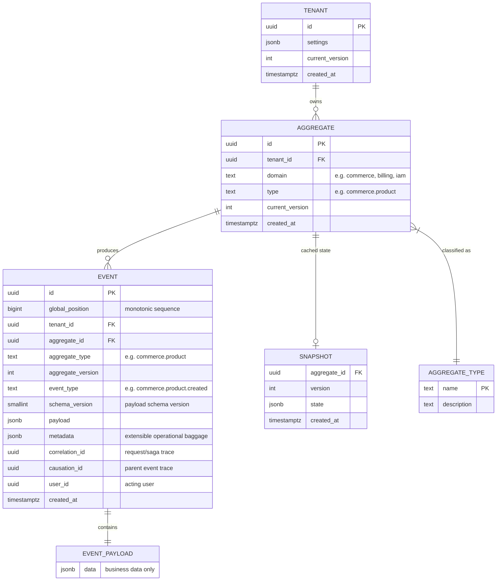

### The Generic Entity Model (no typed columns)

Instead of creating a table per business object:

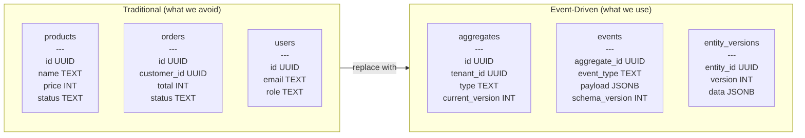

**Key insight**: `type` is data, not schema. Adding a new entity type means inserting a row, not running a migration.

### Namespaced Type System: `<domain>.<type>`

All aggregate types and event types follow a `<domain>.<type>` convention. This creates natural bounded context boundaries at the data level.

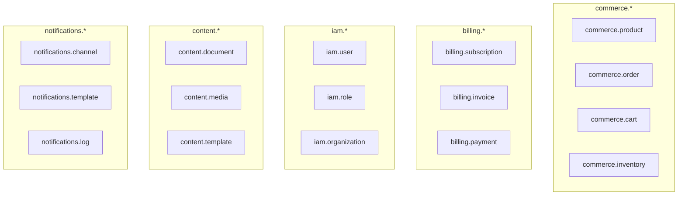

**Type format**: `<domain>.<entity>` for aggregates, `<domain>.<entity>.<action>` for events.

```text
Aggregate types:
  commerce.product
  commerce.order
  billing.subscription
  iam.user

Event types:
  commerce.product.created
  commerce.product.price_updated
  commerce.order.confirmed
  billing.subscription.renewed
  iam.user.role_assigned
```

**Why this matters at scale**:

| Benefit                  | How                                                                                                                          |
| ------------------------ | ---------------------------------------------------------------------------------------------------------------------------- |
| **Service ownership**    | Each service owns a domain prefix. `billing.*` is the billing service's territory.                                           |
| **Projection routing**   | Projection workers subscribe by domain prefix: `commerce.*` worker builds product/order views.                               |
| **Access control**       | Permissions map to domains: `can_read:commerce`, `can_write:billing`.                                                        |
| **Event filtering**      | Query events by domain: `WHERE aggregate_type LIKE 'commerce.%'` uses the B-tree index.                                      |
| **Schema registry**      | Upcasters are grouped by domain. Adding `commerce.wishlist` doesn't touch billing code.                                      |
| **Cross-service events** | When `commerce.order.confirmed` fires, the billing worker reacts by creating `billing.invoice`. Clean event-driven coupling. |

**Validation rule**: types are lowercase, dot-separated, 2-3 segments max.

```text
Valid:    commerce.product
Valid:    iam.user
Invalid:  Product           (no domain prefix)
Invalid:  Commerce.Product  (no uppercase)
Invalid:  a.b.c.d.e         (too deep)
```

**Cross-domain event flow**:

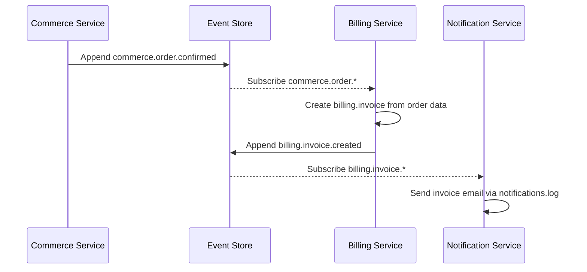

**Index support**:

```sql
-- Efficient domain-level queries via text_pattern_ops
CREATE INDEX idx_events_domain ON events (aggregate_type text_pattern_ops);

-- Query all commerce events:
SELECT * FROM events WHERE aggregate_type LIKE 'commerce.%';

-- Query specific entity:
SELECT * FROM events WHERE aggregate_type = 'commerce.product';
```

The `text_pattern_ops` index supports prefix matching (`LIKE 'prefix%'`) with B-tree efficiency: O(log n + k).

### Payload Schema Versioning

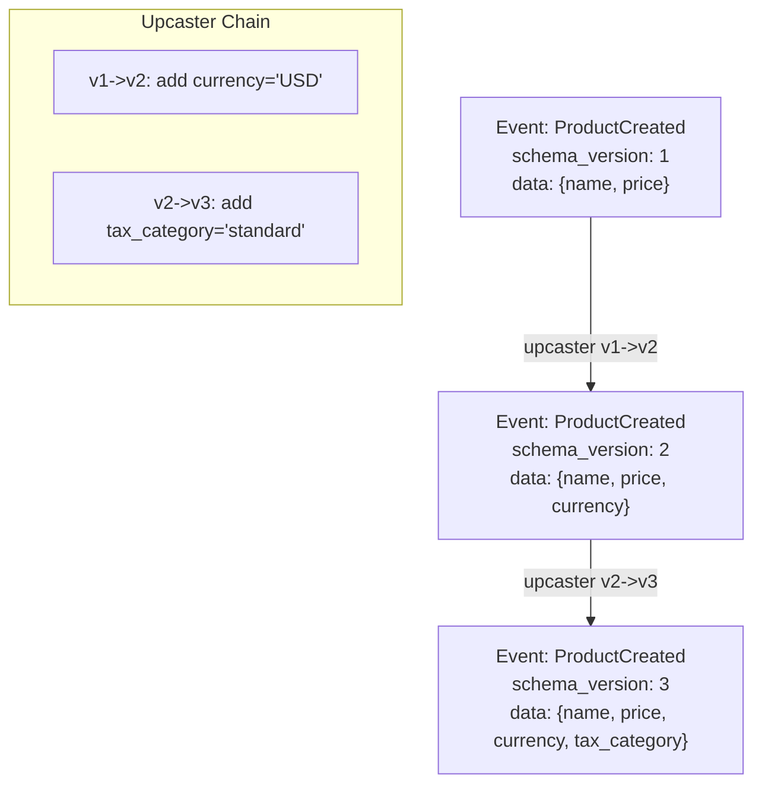

---

## 3. System Behavior

### 3.1 Write Path (Command Side)

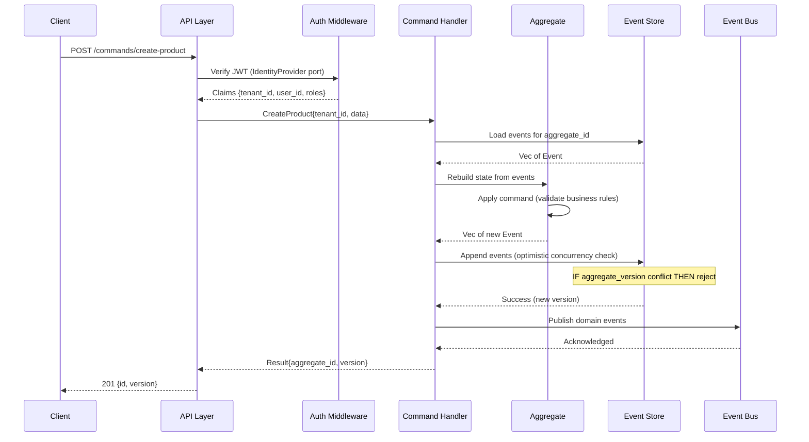

### 3.2 Read Path (Query Side)

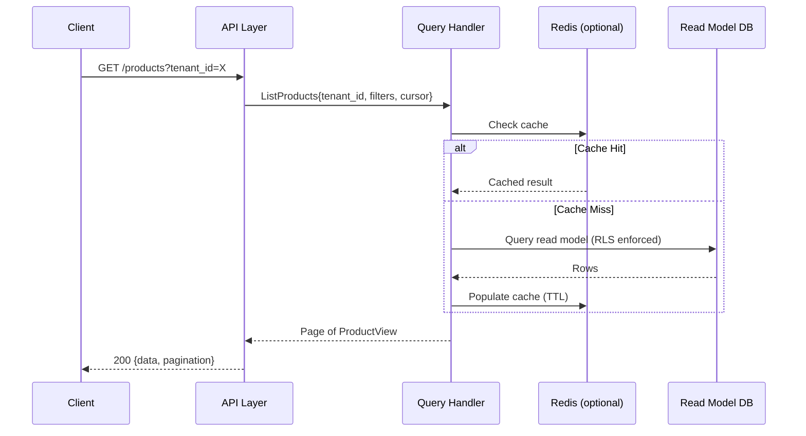

### 3.3 Projection Pipeline

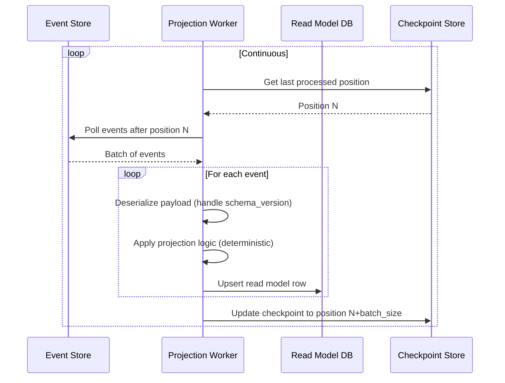

### 3.4 Concurrency Model

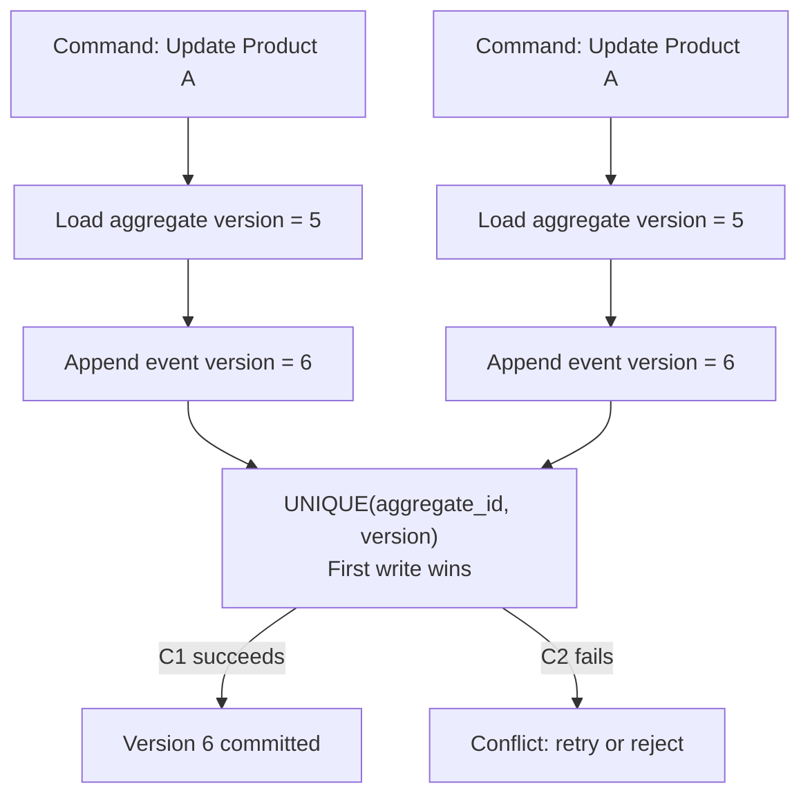

---

## 4. Abstraction Layers

### 4.1 Hexagonal Architecture

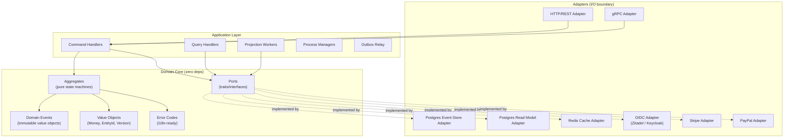

### 4.2 Port Definitions

```mermaid
classDiagram
    class EventStore {
        <<interface>>
        +append(tenant_id, domain, aggregate_id, expected_version, events) Result
        +load_stream(tenant_id, aggregate_id) Vec~Event~
        +load_stream_from(tenant_id, aggregate_id, from_version) Vec~Event~
        +poll_by_domain(domain, after_position, limit) Vec~Event~
        +subscribe(handler) Subscription
    }

    class SnapshotStore {
        <<interface>>
        +load(aggregate_id) Option~Snapshot~
        +save(aggregate_id, version, state) Result
    }

    class ReadModelStore {
        <<interface>>
        +upsert(tenant_id, domain, entity_type, entity_id, data) Result
        +query(tenant_id, entity_type, filters, cursor) Page
        +query_by_domain(tenant_id, domain, filters, cursor) Page
        +find_by_id(tenant_id, entity_type, entity_id) Option~View~
        +delete(tenant_id, entity_type, entity_id) Result
    }

    class IdentityProvider {
        <<interface>>
        +verify_token(token) Result~Claims~
        +get_user(user_id) Result~UserProfile~
        +has_permission(user_id, resource, action) bool
    }

    class PaymentGateway {
        <<interface>>
        +create_charge(amount, customer, metadata) Result~ChargeId~
        +refund(charge_id, amount) Result~RefundId~
        +handle_webhook(payload, signature) Result~PaymentEvent~
    }

    class CachePort {
        <<interface>>
        +get(key) Option~bytes~
        +set(key, value, ttl) Result
        +invalidate(key) Result
    }

    class RelationStore {
        <<interface>>
        +upsert(tenant_id, relation) Result
        +delete(tenant_id, source_id, target_id, relation_type) Result
        +query_forward(tenant_id, source_id, relation_type, cursor) Page~Relation~
        +query_reverse(tenant_id, target_id, relation_type, cursor) Page~Relation~
        +exists(tenant_id, source_id, target_id, relation_type) bool
        +count(tenant_id, target_id, relation_type) u64
    }

    class Translator {
        <<interface>>
        +resolve(code, locale, context) String
    }

    class EncryptionKeyStore {
        <<interface>>
        +create_key(tenant_id, subject_id) Result~KeyId~
        +get_key(subject_id) Option~EncryptionKey~
        +destroy_key(subject_id) Result
    }

    class DeadLetterStore {
        <<interface>>
        +record_failure(event_id, handler, error) Result
        +get_pending(handler, limit) Vec~DeadLetter~
        +mark_resolved(id) Result
        +retry(id) Result
    }

    class ProcessManagerStore {
        <<interface>>
        +load(process_id) Option~ProcessState~
        +save(process_id, state, associations) Result
        +find_by_association(key, value) Vec~ProcessId~
        +find_timed_out(timeout_threshold) Vec~ProcessId~
    }

    class OutboxPublisher {
        <<interface>>
        +publish(tenant_id, integration_event) Result
        +relay_pending(limit) Vec~IntegrationEvent~
        +mark_published(id) Result
    }

    EventStore <|.. PgEventStore : implements
    RelationStore <|.. PgRelationStore : implements
    SnapshotStore <|.. PgSnapshotStore : implements
    ReadModelStore <|.. PgReadModelStore : implements
    IdentityProvider <|.. ZitadelAdapter : implements
    IdentityProvider <|.. KeycloakAdapter : implements
    PaymentGateway <|.. StripeAdapter : implements
    PaymentGateway <|.. PayPalAdapter : implements
    CachePort <|.. RedisAdapter : implements
    CachePort <|.. InMemoryCache : implements
    Translator <|.. FileTranslator : implements
    EncryptionKeyStore <|.. PgEncryptionKeyStore : implements
    DeadLetterStore <|.. PgDeadLetterStore : implements
    ProcessManagerStore <|.. PgProcessManagerStore : implements
    OutboxPublisher <|.. PgOutboxPublisher : implements
```

---

## 5. Data Model (Postgres)

### 5.1 Event Store Schema

```sql
-- Single append-only table: the source of truth
CREATE TABLE events (
    id                UUID PRIMARY KEY DEFAULT gen_random_uuid(),
    global_position   BIGINT NOT NULL,        -- gapless monotonic sequence (assigned in append_events)
    tenant_id         UUID NOT NULL,
    domain            TEXT NOT NULL,           -- bounded context: 'commerce', 'billing', 'iam'
    aggregate_type    TEXT NOT NULL,           -- namespaced: 'commerce.product', 'billing.invoice'
    aggregate_id      UUID NOT NULL,
    aggregate_version INT NOT NULL,
    event_type        TEXT NOT NULL,           -- namespaced: 'commerce.product.created'
    schema_version    SMALLINT NOT NULL DEFAULT 1,  -- PROMOTED: payload schema version for upcaster dispatch
    payload           JSONB NOT NULL,         -- business data (schema_version no longer embedded here)
    metadata          JSONB NOT NULL DEFAULT '{}',  -- extensible operational baggage (headers, trace spans, etc.)
    correlation_id    UUID,                   -- PROMOTED: request/saga trace ID for distributed tracing
    causation_id      UUID,                   -- PROMOTED: parent event ID for causal chain tracing
    user_id           UUID,                   -- PROMOTED: acting user for audit compliance
    created_at        TIMESTAMPTZ NOT NULL DEFAULT now(),

    UNIQUE (aggregate_id, aggregate_version),  -- optimistic concurrency
    UNIQUE (global_position)                   -- total ordering guarantee
);

-- Gapless position counter (singleton row, incremented in append_events transaction)
CREATE TABLE global_position_counter (
    id       INT PRIMARY KEY DEFAULT 1 CHECK (id = 1),
    position BIGINT NOT NULL DEFAULT 0
);
INSERT INTO global_position_counter VALUES (1, 0);

-- Indexes for common access patterns
CREATE INDEX idx_events_stream ON events (tenant_id, aggregate_id, aggregate_version);
CREATE INDEX idx_events_type_prefix ON events (aggregate_type text_pattern_ops); -- LIKE 'commerce.%'

-- Projection polling indexes (use global_position, NOT created_at)
CREATE INDEX idx_events_global_pos ON events (global_position);
CREATE INDEX idx_events_domain_pos ON events (tenant_id, domain, global_position);
CREATE INDEX idx_events_type_pos ON events (tenant_id, aggregate_type, global_position);

-- Tracing & audit indexes (partial -- only index non-null values)
CREATE INDEX idx_events_correlation ON events (correlation_id) WHERE correlation_id IS NOT NULL;
CREATE INDEX idx_events_causation ON events (causation_id) WHERE causation_id IS NOT NULL;
CREATE INDEX idx_events_user ON events (tenant_id, user_id) WHERE user_id IS NOT NULL;
```

**Why promote fields from JSONB to columns?** Production event stores (Marten, Eventide, Axon) all use dedicated columns for fields that need SQL querying. Postgres has **zero statistics** on JSONB key distributions, causing up to 2000x wrong cardinality estimates in the query planner (source: Heap Engineering benchmarks). B-tree on a UUID column: <0.1ms lookup. GIN on JSONB: ~2.8ms best case with `@>` operator, and GIN **cannot** accelerate `->>` extraction queries at all.

**Why `global_position` instead of `created_at` for checkpointing?** Using timestamps for projection ordering is a **correctness bug**: concurrent transactions can commit out of order, and timestamp collisions cause permanently skipped events. Every production event store uses a monotonic position: Marten's `seq_id`, Eventide's `global_position`, Axon's `global_index`.

### 5.2 Aggregate Registry

```sql
-- Identity + version pointer (no mutable business state)
CREATE TABLE aggregates (
    id              UUID PRIMARY KEY,
    tenant_id       UUID NOT NULL,
    domain          TEXT NOT NULL,       -- bounded context: 'commerce', 'billing', 'iam'
    type            TEXT NOT NULL,       -- namespaced: 'commerce.product', 'billing.invoice'
    current_version INT NOT NULL DEFAULT 0,
    created_at      TIMESTAMPTZ NOT NULL DEFAULT now()
);

CREATE INDEX idx_aggregates_tenant ON aggregates (tenant_id, type);
CREATE INDEX idx_aggregates_domain ON aggregates (tenant_id, domain);
CREATE INDEX idx_aggregates_type_prefix ON aggregates (type text_pattern_ops);
```

### 5.3 Snapshots

```sql
CREATE TABLE aggregate_snapshots (
    aggregate_id    UUID NOT NULL REFERENCES aggregates(id),
    version         INT NOT NULL,
    state           JSONB NOT NULL,    -- serialized aggregate state
    created_at      TIMESTAMPTZ NOT NULL DEFAULT now(),

    PRIMARY KEY (aggregate_id, version)
);
```

### 5.4 Generic Read Model (no typed columns)

```sql
-- One table serves ALL entity types for ALL tenants
CREATE TABLE read_entities (
    id              UUID NOT NULL,
    tenant_id       UUID NOT NULL,
    domain          TEXT NOT NULL,       -- bounded context: 'commerce', 'billing', 'iam'
    entity_type     TEXT NOT NULL,       -- namespaced: 'commerce.product', 'billing.invoice'
    data            JSONB NOT NULL,       -- denormalized view
    version         INT NOT NULL,
    updated_at      TIMESTAMPTZ NOT NULL DEFAULT now(),

    PRIMARY KEY (tenant_id, entity_type, id)
);

-- Fast lookups by domain and type
CREATE INDEX idx_read_entities_domain ON read_entities (tenant_id, domain, updated_at DESC);
CREATE INDEX idx_read_entities_type ON read_entities (tenant_id, entity_type, updated_at DESC);
CREATE INDEX idx_read_entities_type_prefix ON read_entities (entity_type text_pattern_ops);

-- GIN index for querying inside JSONB
CREATE INDEX idx_read_entities_data ON read_entities USING GIN (data jsonb_path_ops);
```

### 5.5 Relationship Type Registry

```sql
-- Declares valid relationship types (like aggregate_types, no DDL to add new ones)
-- Inspired by Salesforce MT_Fields relationship metadata and Shopify typed references
CREATE TABLE relationship_types (
    name            TEXT PRIMARY KEY,                   -- 'commerce.contains', 'social.follows'
    description     TEXT,
    source_type     TEXT NOT NULL,                      -- 'commerce.order'
    target_type     TEXT NOT NULL,                      -- 'commerce.line_item'
    directionality  TEXT NOT NULL DEFAULT 'directed'    -- 'directed' | 'bidirectional'
                    CHECK (directionality IN ('directed', 'bidirectional')),
    cardinality     TEXT NOT NULL DEFAULT 'many_to_many' -- 'one_to_one' | 'one_to_many' | 'many_to_many'
                    CHECK (cardinality IN ('one_to_one', 'one_to_many', 'many_to_many')),
    metadata_schema JSONB,                              -- optional JSON Schema for edge metadata validation
    created_at      TIMESTAMPTZ NOT NULL DEFAULT now()
);
```

Adding a new relationship type means inserting a row, not running a migration -- consistent with the generic entity philosophy. The registry enables validation (source/target type checking), discoverability (API clients query valid edges), and cardinality enforcement.

### 5.6 Entity Relations (Graph Edge Table)

```sql
-- Single table for BOTH structural and instance relationships
-- This is a READ MODEL (projection), not source of truth -- always rebuildable from events
-- Inspired by Salesforce MT_Relationships pivot table
CREATE TABLE entity_relations (
    id              UUID PRIMARY KEY DEFAULT gen_random_uuid(),
    tenant_id       UUID NOT NULL,

    -- Classification
    category        TEXT NOT NULL,            -- 'schema' | 'instance'
    domain          TEXT NOT NULL,            -- 'commerce', 'social', 'iam'
    relation_type   TEXT NOT NULL,            -- 'commerce.contains', 'social.follows', 'iam.member_of'

    -- Directed edge: source -> target
    source_id       UUID NOT NULL,
    source_type     TEXT NOT NULL,            -- 'commerce.order', 'iam.user'
    target_id       UUID NOT NULL,
    target_type     TEXT NOT NULL,            -- 'commerce.line_item', 'iam.user'

    -- Relationship properties (varies by relation_type)
    metadata        JSONB NOT NULL DEFAULT '{}',
    -- Examples:
    --   social.follows:     {"notifications": true}
    --   iam.member_of:      {"role": "admin", "valid_from": "...", "valid_until": "..."}
    --   commerce.contains:  {"sort_order": 3, "quantity": 2}

    -- Projection tracking
    version         INT NOT NULL DEFAULT 1,
    created_at      TIMESTAMPTZ NOT NULL DEFAULT now(),
    updated_at      TIMESTAMPTZ NOT NULL DEFAULT now(),

    -- Prevent duplicate edges
    UNIQUE (tenant_id, source_id, target_id, relation_type)
);

-- Forward traversal: "order's line items", "user's following list"
CREATE INDEX idx_rel_forward ON entity_relations (tenant_id, source_id, relation_type, created_at DESC);

-- Reverse traversal: "user's followers", "which orders contain product X"
CREATE INDEX idx_rel_reverse ON entity_relations (tenant_id, target_id, relation_type, created_at DESC);

-- Type-filtered reverse: "find all iam.user followers of X" (excluding bots)
CREATE INDEX idx_rel_reverse_typed ON entity_relations (tenant_id, target_id, relation_type, source_type);

-- Domain-scoped: "all relationships in commerce domain"
CREATE INDEX idx_rel_domain ON entity_relations (tenant_id, domain, relation_type, created_at DESC);

-- Schema-only (partial index, very small -- only type-level definitions)
CREATE INDEX idx_rel_schema ON entity_relations (tenant_id, source_type, relation_type)
    WHERE category = 'schema';

-- Metadata queries: "find relations where role = 'admin'"
CREATE INDEX idx_rel_metadata ON entity_relations USING GIN (metadata jsonb_path_ops);
```

**Two relationship categories in ONE table:**

| Category                    | Example                     | Cardinality           | Owned By            | Event Pattern                   |
| --------------------------- | --------------------------- | --------------------- | ------------------- | ------------------------------- |
| **Schema** (type-level)     | "order contains line_items" | Low (tens per tenant) | Type definition     | Defined once, rarely changes    |
| **Instance** (entity-level) | "user A follows user B"     | High (millions)       | Dedicated aggregate | `social.follow.created/removed` |

One table with a `category` discriminator (not two tables) because: same column structure, same indexes, same RLS policy. Partial index `WHERE category = 'schema'` gives the same selectivity as a separate table.

**Why a separate table instead of JSONB arrays in `read_entities.data`?**

| Operation                        | Relations table + B-tree | JSONB array of IDs                                 |
| -------------------------------- | ------------------------ | -------------------------------------------------- |
| "20 newest followers of user X"  | Index scan, stop at 20   | Unnest full array O(n), sort, limit                |
| "Does A follow B?"               | Point lookup O(log n)    | Containment check O(log n)                         |
| "Follow user B"                  | INSERT one row           | Read full JSONB, append, rewrite entire column     |
| Entity with 1M followers         | 1M rows (~80MB)          | 1M-element array (~40MB per JSONB, destroys TOAST) |
| Reverse query ("who follows X?") | Reverse index scan       | **Impossible** without scanning every entity       |

**Hybrid embedding**: For bounded structural relations (order has <100 line items), embed a denormalized summary in `read_entities.data` AND maintain the full edge in `entity_relations`. The projection worker writes to both atomically. For unbounded social/instance relations (followers), use the relations table exclusively.

**Bidirectional relationships** (friends): Insert TWO rows (A->B and B->A) in the same transaction. This keeps queries uniform -- always query by `source_id`, regardless of directionality. 2x storage is negligible; query simplicity is worth it.

**Relationship events** follow two patterns:

- **Structural** (events on parent aggregate): `commerce.order.line_item_added` -> projection inserts relation row
- **Social/Instance** (dedicated relationship aggregates): `social.follow.created` -> projection inserts forward edge

```text
Relationship event types (following <domain>.<entity>.<action> convention):
  social.follow.created
  social.follow.removed
  social.friendship.accepted
  social.friendship.removed
  iam.membership.granted
  iam.membership.role_changed
  iam.membership.revoked
  commerce.assignment.created     -- product assigned to category
  commerce.assignment.removed
```

### 5.7 Projection Checkpoints

```sql
CREATE TABLE projection_checkpoints (
    projection_name TEXT NOT NULL,       -- e.g. 'commerce_products', 'billing_invoices'
    domain          TEXT NOT NULL,       -- which domain this projection consumes
    last_position   BIGINT NOT NULL DEFAULT 0,
    updated_at      TIMESTAMPTZ NOT NULL DEFAULT now(),

    PRIMARY KEY (projection_name)
);

CREATE INDEX idx_checkpoints_domain ON projection_checkpoints (domain);
```

### 5.6 Multi-Tenancy via RLS

```sql
-- Enable RLS on all tables
ALTER TABLE events ENABLE ROW LEVEL SECURITY;
ALTER TABLE aggregates ENABLE ROW LEVEL SECURITY;
ALTER TABLE read_entities ENABLE ROW LEVEL SECURITY;
ALTER TABLE entity_relations ENABLE ROW LEVEL SECURITY;

-- Policy: tenant can only see their own data
CREATE POLICY tenant_isolation_events ON events
    USING (tenant_id = current_setting('app.tenant_id')::UUID);

CREATE POLICY tenant_isolation_aggregates ON aggregates
    USING (tenant_id = current_setting('app.tenant_id')::UUID);

CREATE POLICY tenant_isolation_reads ON read_entities
    USING (tenant_id = current_setting('app.tenant_id')::UUID);

CREATE POLICY tenant_isolation_relations ON entity_relations
    USING (tenant_id = current_setting('app.tenant_id')::UUID);
```

### 5.7 Entity Relationship Diagram

```mermaid
erDiagram
    events ||--|| aggregates : "belongs to"
    aggregate_snapshots ||--|| aggregates : "caches state of"
    read_entities }|--|| aggregates : "projected from"
    entity_relations }|--|| read_entities : "connects"
    entity_relations }|--|| relationship_types : "typed by"
    projection_checkpoints ||--o{ read_entities : "tracks position for"
    encryption_keys ||--o{ events : "encrypts PII in"
    dead_letter_events }|--|| events : "failed processing of"
    process_managers ||--o{ process_associations : "identified by"
    integration_outbox }|--|| events : "derived from"

    events {
        uuid id PK
        bigint global_position "monotonic sequence"
        uuid tenant_id
        text domain "bounded context"
        text aggregate_type "namespaced type"
        uuid aggregate_id FK
        int aggregate_version
        text event_type "namespaced event"
        smallint schema_version "payload schema version"
        jsonb payload "business data"
        jsonb metadata "extensible operational baggage"
        uuid correlation_id "request/saga trace"
        uuid causation_id "parent event trace"
        uuid user_id "acting user"
        timestamptz created_at
    }

    aggregates {
        uuid id PK
        uuid tenant_id
        text domain "bounded context"
        text type "namespaced type"
        int current_version
        timestamptz created_at
    }

    aggregate_snapshots {
        uuid aggregate_id PK_FK
        int version PK
        jsonb state
        timestamptz created_at
    }

    read_entities {
        uuid id PK
        uuid tenant_id PK
        text domain "bounded context"
        text entity_type PK "namespaced type"
        jsonb data
        int version
        timestamptz updated_at
    }

    entity_relations {
        uuid id PK
        uuid tenant_id
        text category "schema or instance"
        text domain "bounded context"
        text relation_type "namespaced relation"
        uuid source_id "from entity"
        text source_type "from entity type"
        uuid target_id "to entity"
        text target_type "to entity type"
        jsonb metadata "relationship properties"
        int version
        timestamptz created_at
        timestamptz updated_at
    }

    relationship_types {
        text name PK "e.g. commerce.contains"
        text source_type "valid source"
        text target_type "valid target"
        text directionality "directed or bidirectional"
        text cardinality "1:1, 1:N, M:N"
    }

    projection_checkpoints {
        text projection_name PK
        text domain "scoped to bounded context"
        bigint last_position "references global_position"
        timestamptz updated_at
    }

    encryption_keys {
        uuid subject_id PK
        uuid tenant_id
        bytea encryption_key "AES-256"
        text algorithm
        timestamptz created_at
        timestamptz destroyed_at "NULL until erasure"
    }

    dead_letter_events {
        uuid id PK
        uuid event_id
        bigint global_position
        text handler_name "failed projection"
        text error_message
        int retry_count
        text status "pending|exhausted|resolved"
        timestamptz created_at
    }

    process_managers {
        uuid id PK
        uuid tenant_id
        text process_type "order_fulfillment etc"
        text state "current step"
        jsonb data "accumulated context"
        timestamptz started_at
        timestamptz completed_at
    }

    process_associations {
        uuid process_id FK
        text association_key "order_id etc"
        text association_val
    }

    integration_outbox {
        uuid id PK
        uuid tenant_id
        text event_type "integration event"
        smallint schema_version
        jsonb payload "lean public contract"
        uuid correlation_id
        timestamptz created_at
        timestamptz published_at "NULL until relayed"
    }
```

---

## 5.8 Append Function (Optimistic Concurrency)

```sql
-- PL/pgSQL function for atomic event append with version check
-- Similar to Eventide's write_message pattern
-- Now includes gapless global_position and promoted metadata columns
CREATE OR REPLACE FUNCTION append_events(
    p_tenant_id UUID,
    p_aggregate_id UUID,
    p_domain TEXT,            -- bounded context: 'commerce', 'billing', 'iam'
    p_aggregate_type TEXT,    -- namespaced: 'commerce.product'
    p_expected_version INT,
    p_events JSONB  -- array of {event_type, schema_version, payload, metadata, correlation_id, causation_id, user_id}
) RETURNS INT AS $$
DECLARE
    v_current_version INT;
    v_new_version INT;
    v_event JSONB;
    v_global_position BIGINT;
BEGIN
    -- Lock the aggregate row
    SELECT current_version INTO v_current_version
    FROM aggregates
    WHERE id = p_aggregate_id AND tenant_id = p_tenant_id
    FOR UPDATE;

    -- First event for this aggregate
    IF v_current_version IS NULL THEN
        INSERT INTO aggregates (id, tenant_id, domain, type, current_version)
        VALUES (p_aggregate_id, p_tenant_id, p_domain, p_aggregate_type, 0);
        v_current_version := 0;
    END IF;

    -- Optimistic concurrency check
    IF v_current_version != p_expected_version THEN
        RAISE EXCEPTION 'concurrency_conflict: expected %, got %',
            p_expected_version, v_current_version;
    END IF;

    -- Append each event
    v_new_version := v_current_version;
    FOR v_event IN SELECT * FROM jsonb_array_elements(p_events)
    LOOP
        v_new_version := v_new_version + 1;

        -- Gapless global position: increment counter in same transaction
        UPDATE global_position_counter SET position = position + 1
            RETURNING position INTO v_global_position;

        INSERT INTO events (
            global_position, tenant_id, domain, aggregate_type, aggregate_id,
            aggregate_version, event_type, schema_version, payload, metadata,
            correlation_id, causation_id, user_id
        ) VALUES (
            v_global_position, p_tenant_id, p_domain, p_aggregate_type,
            p_aggregate_id, v_new_version,
            v_event->>'event_type',
            COALESCE((v_event->>'schema_version')::SMALLINT, 1),
            v_event->'payload',
            COALESCE(v_event->'metadata', '{}'::JSONB),
            (v_event->>'correlation_id')::UUID,
            (v_event->>'causation_id')::UUID,
            (v_event->>'user_id')::UUID
        );
    END LOOP;

    -- Update version pointer
    UPDATE aggregates SET current_version = v_new_version
    WHERE id = p_aggregate_id;

    RETURN v_new_version;
END;
$$ LANGUAGE plpgsql;
```

**Gapless ordering**: The `global_position_counter` is incremented in the same transaction as event insertion, guaranteeing no gaps. This serializes all writes through a single counter row -- acceptable at <10K events/sec. At higher throughput, switch to `BIGSERIAL` + gap-aware polling with a trailing delay.

---

## 5.9 Aggregate Lifecycle (State Machine)

Every aggregate type follows a state machine. Events drive transitions. Invalid transitions are rejected at the domain layer.

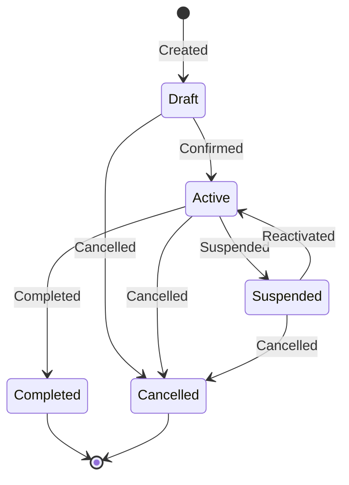

The state machine is enforced in domain code (not in Postgres). The aggregate's `apply(event)` method transitions state. Commands validate against current state before producing events.

---

## 5.10 Projection Types

Three strategies for building read models from events:

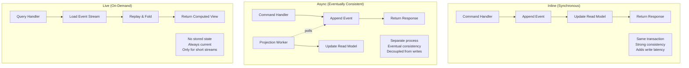

| Type   | Consistency | Write Latency | Read Latency | Use Case                              |
| ------ | ----------- | ------------- | ------------ | ------------------------------------- |
| Inline | Strong      | Higher        | O(1) lookup  | Uniqueness checks, critical counts    |
| Async  | Eventual    | None added    | O(1) lookup  | Most read models, dashboards, lists   |
| Live   | Strong      | None          | O(n) replay  | Short streams, debugging, admin views |

**Default choice: Async** with inline only for invariant enforcement (e.g., unique email check).

### Domain-Scoped Projection Routing

Projection workers subscribe by domain prefix, enforcing SoC at the infrastructure level:

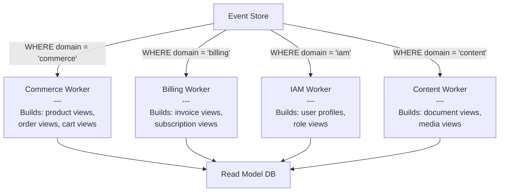

**Query pattern** for domain-scoped polling:

```sql
-- Each worker only consumes events from its domain
-- Uses global_position (NOT created_at) for correct ordering
SELECT * FROM events
WHERE domain = $1                -- e.g. 'commerce'
  AND global_position > $2       -- checkpoint position (from projection_checkpoints.last_position)
ORDER BY global_position ASC
LIMIT $3;                        -- batch size
```

**Cross-domain projections** (e.g., an order view that includes customer name from `iam.user`) subscribe to multiple domains:

```sql
-- Cross-domain worker subscribes to specific types across domains
SELECT * FROM events
WHERE aggregate_type IN ('commerce.order', 'iam.user')
  AND global_position > $1
ORDER BY global_position ASC
LIMIT $2;
```

Each worker maintains its own checkpoint in `projection_checkpoints` with its `domain` column set, enabling independent scaling and restarting per domain.

---

## 5.11 Industry Validation

This architecture follows patterns proven at scale:

| Platform            | Pattern                          | How                                                                                                                            |
| ------------------- | -------------------------------- | ------------------------------------------------------------------------------------------------------------------------------ |
| **Salesforce**      | Schemaless entities via metadata | Universal Data Dictionary (UDD) - fields stored in generic columns, schema defined as metadata rows. No DDL for custom fields. |
| **Marten (.NET)**   | JSONB event store in Postgres    | `mt_events` table with JSONB `data` column. Async daemon for projections. Upcasting via registered transformations.            |
| **Eventide (Ruby)** | PL/pgSQL append function         | `write_message` function handles optimistic concurrency. Messages stored as JSONB.                                             |
| **Shopify**         | Hybrid relational + JSONB        | Core tables for commerce, `metafields` (typed JSONB key-value) for extensibility.                                              |
| **Zitadel**         | Event-sourced IAM                | Full audit trail, time-travel queries, CQRS projections for read-optimized views.                                              |

**Key benchmark**: JSONB with GIN indexes is **15,000x faster** than EAV (Entity-Attribute-Value) joins for dynamic attribute queries, and the database is ~3x smaller (source: coussej.github.io benchmarks).

---

## 6. Schema Evolution Strategy

### 6.1 Payload Versioning

Every event has its schema version as a **promoted column** (not embedded in payload). The payload contains only business data:

```json
-- schema_version = 2 (stored as SMALLINT column on events table)
-- payload:
{
  "name": "Widget Pro",
  "price": 2999,
  "currency": "USD"
}
```

This promotion enables queries like `SELECT * FROM events WHERE event_type = 'commerce.product.created' AND schema_version < 3` for background migration workers, without JSONB parsing.

### 6.2 Upcaster Pipeline

When loading events, an upcaster chain transforms old payloads to current format:

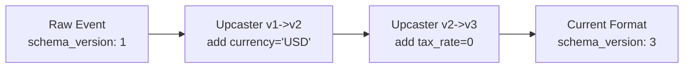

**Rules**:

- Upcasters are pure functions: `(old_payload) -> new_payload`
- They run lazily at read time (no rewriting events)
- Each upcaster handles exactly one version increment
- Upcasters compose: `v1 -> v2 -> v3 -> ... -> current`
- Old events are NEVER mutated in the store

### 6.3 Upcasting Strategies

| Strategy               | When Applied             | Storage Cost        | CPU Cost      | Data Safety        |
| ---------------------- | ------------------------ | ------------------- | ------------- | ------------------ |
| **Lazy (on-read)**     | Every stream load        | None                | Per-read      | Original preserved |
| **Lazy-with-cache**    | First read, then cached  | Snapshot storage    | One-time      | Original preserved |
| **Eager (batch)**      | Background migration job | Rewritten events    | One-time bulk | Risk if in-place   |
| **Copy-and-transform** | New stream created       | 2x during migration | One-time bulk | Original preserved |

**Default choice: Lazy** -- upcasters run at read time. Combined with snapshots, the upcaster chain only processes events since last snapshot.

### 6.4 Breaking Changes (Two-Phase Deployment)

For changes that cannot be handled by additive upcasting:

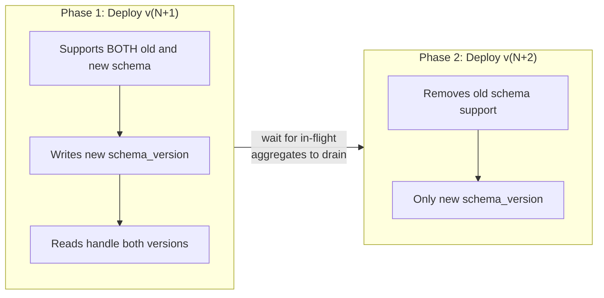

No event rewriting needed. Forward compatibility is maintained by temporal overlap.

### 6.5 When to Add a New Entity Type

No migration needed. Just:

1. Define aggregate behavior in code (command handler + event handlers)
2. Define projection logic for the read model
3. Start emitting events with `aggregate_type = 'new_entity'`

The `aggregates`, `events`, and `read_entities` tables handle it without DDL changes.

### 6.6 Migration Comparison

```mermaid
flowchart TD
    subgraph Traditional["Traditional Schema Change"]
        T1["Write ALTER TABLE migration"] --> T2["Test migration on staging"]
        T2 --> T3["Schedule maintenance window"]
        T3 --> T4["Run migration in production"]
        T4 --> T5["Update application code"]
        T5 --> T6["Deploy application"]
        T6 --> T7["Rollback plan if failure"]
    end

    subgraph EventDriven["Event-Driven Schema Change"]
        E1["Bump schema_version in code"] --> E2["Add upcaster function"]
        E2 --> E3["Update projection logic"]
        E3 --> E4["Deploy application"]
        E4 --> E5["Optional: rebuild projections"]
    end
```

---

## 7. Deployment Architecture

### 7.1 Small Scale

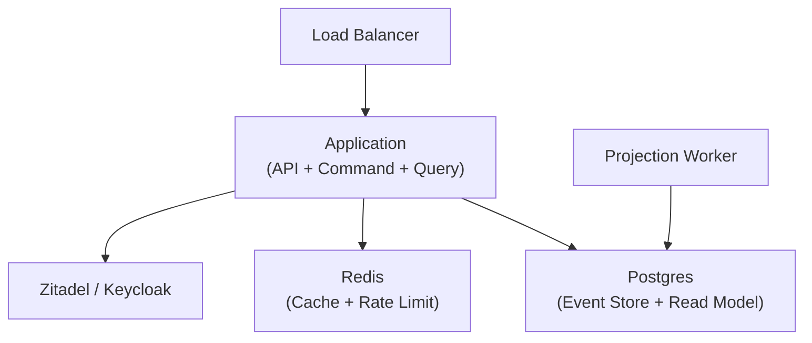

### 7.2 Production Scale

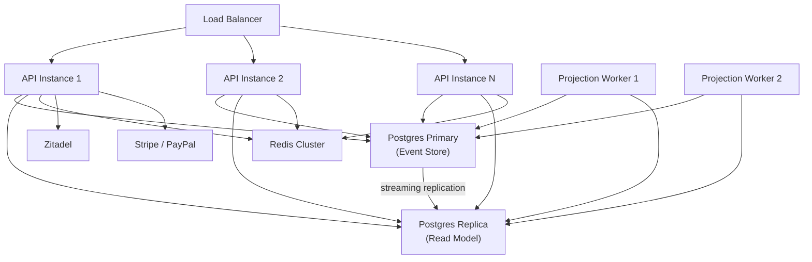

### 7.3 Large Scale

```mermaid
flowchart TD
    LB["Load Balancer"]

    subgraph API_POOL["API Pool"]
        API1["API 1"]
        API2["API 2"]
        APIN["API N"]
    end

    subgraph WRITE_CLUSTER["Write Cluster"]
        PG_ES["Event Store\n(Postgres Primary)"]
        PG_ES_R1["ES Replica 1"]
        PG_ES_R2["ES Replica 2"]
    end

    subgraph READ_CLUSTER["Read Cluster"]
        PG_RM["Read Model Primary"]
        PG_RM_R1["RM Replica 1"]
        PG_RM_R2["RM Replica 2"]
    end

    subgraph PROJECTION_POOL["Projection Workers (domain-scoped)"]
        PW1["Commerce Worker\n(commerce.*)"]
        PW2["Billing Worker\n(billing.*)"]
        PW3["IAM Worker\n(iam.*)"]
        PW4["Analytics Worker\n(cross-domain)"]
    end

    subgraph CACHE["Cache Layer"]
        RC1["Redis 1"]
        RC2["Redis 2"]
        RC3["Redis 3"]
    end

    LB --> API_POOL
    API_POOL -->|"writes"| PG_ES
    API_POOL -->|"reads"| READ_CLUSTER
    API_POOL --> CACHE

    PG_ES -->|"replication"| PG_ES_R1
    PG_ES -->|"replication"| PG_ES_R2

    PROJECTION_POOL -->|"consume events"| WRITE_CLUSTER
    PROJECTION_POOL -->|"update projections"| PG_RM

    PG_RM -->|"replication"| PG_RM_R1
    PG_RM -->|"replication"| PG_RM_R2
```

---

## 8. Failure Model

```mermaid
flowchart TD
    subgraph Failures["Failure Scenarios"]
        F1["Read DB crashes"]
        F2["Redis crashes"]
        F3["Projection Worker crashes"]
        F4["Event Store crashes"]
        F5["Poison event in stream"]
        F6["Outbox relay crashes"]
        F7["Process manager stuck"]
        F8["Encryption key lost"]
    end

    F1 -->|"Recovery"| R1["Rebuild projections\nfrom event store"]
    F2 -->|"Recovery"| R2["Warm cache from\nread model DB"]
    F3 -->|"Recovery"| R3["Restart from last\ncheckpoint position"]
    F4 -->|"CRITICAL"| R4["System unavailable\nOnly irrecoverable dep"]
    F5 -->|"Recovery"| R5["Dead letter queue:\nskip + alert + replay after fix"]
    F6 -->|"Recovery"| R6["Restart relay:\nresumes from last published_at"]
    F7 -->|"Recovery"| R7["Timeout detector:\nalert + manual compensation"]
    F8 -->|"CRITICAL"| R8["Active user data\npermanently unreadable"]

    style F4 fill:#ff6b6b
    style R4 fill:#ff6b6b
    style F8 fill:#ff6b6b
    style R8 fill:#ff6b6b
```

---

## 9. Complexity Analysis

| Operation                    | Data Structure                    | Time Complexity | Notes                      |
| ---------------------------- | --------------------------------- | --------------- | -------------------------- |
| Append event                 | B-tree index on (agg_id, version) | O(log n)        | n = events in stream       |
| Load aggregate stream        | B-tree index scan                 | O(log n + k)    | k = events to read         |
| Load from snapshot           | B-tree PK lookup + stream scan    | O(1) + O(k')    | k' = events since snapshot |
| Rebuild projection           | Full table scan + insert          | O(N)            | N = total events           |
| Query read model (by type)   | B-tree index + GIN                | O(log n + k)    | k = result set             |
| JSONB field lookup           | GIN index                         | O(log n)        | via jsonb_path_ops         |
| Optimistic concurrency check | UNIQUE constraint check           | O(log n)        | n = events per aggregate   |
| Snapshot creation            | Single insert                     | O(1)            | amortized over N events    |

---

## 10. Language Recommendation

```
RECOMMENDATION
==============
Approach: Event-sourced CQRS with generic JSONB entities
Language: Rust (primary) or Go (alternative)
Core abstractions:
  - EventStore trait/interface
  - AggregateRoot trait/interface
  - Projection trait/interface
  - ReadModelStore trait/interface
  - RelationStore trait/interface (entity graph edges)
  - IdentityProvider trait/interface
  - PaymentGateway trait/interface
  - Translator trait/interface (i18n)
  - CachePort trait/interface
  - EncryptionKeyStore trait/interface (GDPR crypto-shredding)
  - DeadLetterStore trait/interface (failed event handling)
  - ProcessManagerStore trait/interface (saga coordination)
  - OutboxPublisher trait/interface (integration event relay)
External deps:
  - sqlx or pgx (DB driver)
  - axum or net/http (HTTP)
  - serde or encoding/json (serialization)
  - OIDC client (auth)
Complexity: O(log n) for all hot paths
Confidence: HIGH

WHY RUST
========
- Typestate pattern enforces valid aggregate state transitions at compile time
- Zero-cost abstractions: trait dispatch is monomorphized
- Ownership model prevents data races in concurrent projection workers
- serde handles JSONB serialization/deserialization with schema_version dispatch
- sqlx provides compile-time SQL verification

WHY NOT GO (as primary)
=======================
- No compile-time enforcement of state machine transitions
- Less type safety for the upcaster pipeline
- Still excellent as secondary language for projection workers or CLI tools

IMPLEMENTATION ORDER
====================
1. Domain types: Aggregate, Event, ValueObjects (zero deps)
2. Ports: EventStore, ReadModelStore, RelationStore, IdentityProvider, PaymentGateway, Translator
3. Event store adapter: Postgres implementation with optimistic concurrency + global_position
4. Command handlers: business logic operating on aggregates
5. Projection workers: event consumers building read models + relation graph
6. Query handlers: read model queries with caching
7. HTTP adapter: REST API wiring
8. IAM adapter: Zitadel/Keycloak OIDC
9. Payment adapter: Stripe/PayPal
10. Process managers: saga coordination for multi-aggregate workflows
11. Dead letter queue: failed event handling with retry + backoff
12. GDPR layer: EncryptionKeyStore + crypto-shredding interceptor
13. Integration events: OutboxPublisher + relay process + ACL translators
14. Observability: OpenTelemetry traces + projection lag metrics + alerting

RISKS AND MITIGATIONS
======================
Risk: Event store becomes bottleneck under extreme write load
  -> Mitigation: Partition by tenant_id, use connection pooling

Risk: Projection lag causes stale reads
  -> Mitigation: Return version in write response, client can poll until projection catches up

Risk: JSONB query performance degrades with large payloads
  -> Mitigation: GIN indexes with jsonb_path_ops, keep read model payloads denormalized and flat

Risk: Upcaster chain becomes long for old events
  -> Mitigation: Periodic snapshot creation reduces replay length
  -> Optional: background worker rewrites old events to current schema (copy, not mutate)

Risk: Schema_version mismatch between writer and reader
  -> Mitigation: Upcasters are pure functions tested independently, version is explicit in every payload
```

---

## 11. Production Readiness

### 11.1 GDPR Compliance: Crypto-Shredding

Events are immutable -- you cannot `DELETE FROM events WHERE user_id = ?`. GDPR Article 17 (Right to Erasure) requires a different approach for event stores.

**Pattern: Crypto-Shredding** (Mathias Verraes, 2019)

Each data subject gets a unique AES-256 encryption key. Sensitive fields in event payloads are encrypted before appending. Deleting the key renders the encrypted fields permanently unreadable, achieving effective erasure without mutating the event stream.

```sql
-- Per-subject encryption keys
CREATE TABLE encryption_keys (
    subject_id      UUID PRIMARY KEY,           -- maps to user_id
    tenant_id       UUID NOT NULL,
    encryption_key  BYTEA NOT NULL,             -- AES-256 key (32 bytes)
    algorithm       TEXT NOT NULL DEFAULT 'AES-256-GCM',
    created_at      TIMESTAMPTZ NOT NULL DEFAULT now(),
    destroyed_at    TIMESTAMPTZ                 -- NULL until erasure request
);

ALTER TABLE encryption_keys ENABLE ROW LEVEL SECURITY;
CREATE POLICY tenant_isolation_keys ON encryption_keys
    USING (tenant_id = current_setting('app.tenant_id')::UUID);
```

**Event payload structure with crypto-shredding:**

```json
{
  "name": "ENC:v1:base64ciphertext...",
  "email": "ENC:v1:base64ciphertext...",
  "plan": "premium",
  "currency": "USD"
}
```

Non-sensitive fields (`plan`, `currency`) remain in cleartext. Sensitive fields are encrypted with the subject's key. The `ENC:v1:` prefix allows the deserializer to detect and route to the decryption pipeline.

**Erasure flow:**

```mermaid
sequenceDiagram
    participant DPO as Data Protection Officer
    participant API as Erasure API
    participant KS as Key Store
    participant PW as Projection Workers
    participant RM as Read Model

    DPO->>API: DELETE /subjects/{user_id}/data
    API->>KS: DELETE FROM encryption_keys WHERE subject_id = $1
    Note over KS: Key destroyed — encrypted fields<br/>in event store are now unreadable
    API->>PW: Trigger re-projection for affected aggregates
    PW->>RM: Rebuild read models (encrypted fields become "[REDACTED]")
    API-->>DPO: 202 Accepted (erasure complete)
```

**Complementary pattern: Forgettable Payloads** (Verraes). Sensitive data never enters the event store at all. Events contain only a reference to a separate `personal_data` table. Deletion is a simple `DELETE` on the personal data table.

```sql
-- Forgettable payload store (deletable, unlike events)
CREATE TABLE personal_data (
    subject_id  UUID NOT NULL,
    tenant_id   UUID NOT NULL,
    data_key    TEXT NOT NULL,              -- 'profile', 'billing_address', etc.
    data        JSONB NOT NULL,
    created_at  TIMESTAMPTZ NOT NULL DEFAULT now(),
    updated_at  TIMESTAMPTZ NOT NULL DEFAULT now(),

    PRIMARY KEY (subject_id, data_key)
);
```

**Which to use:**

| Approach                 | When                                                           | Complexity              | Legal clarity                                                   |
| ------------------------ | -------------------------------------------------------------- | ----------------------- | --------------------------------------------------------------- |
| **Crypto-shredding**     | PII must travel with the event for projection correctness      | Higher (key management) | Medium (encrypted data is still "personal data" per Recital 26) |
| **Forgettable payloads** | PII can be referenced by pointer without affecting projections | Lower (simple DELETE)   | Higher (data is fully deleted)                                  |
| **Both**                 | Defense in depth                                               | Highest                 | Highest                                                         |

**Production references:** Axon Framework's Data Protection Module uses `@SensitiveData` annotations. EventStoreDB/Kurrent publishes reference samples (`kurrent-io/samples/Crypto_Shredding`). Oskar Dudycz documents the full pattern for .NET.

---

### 11.2 Domain Events vs Integration Events

Not all events should cross bounded context boundaries. Internal domain events carry rich, context-specific data. Integration events are public contracts -- lean, stable, and versioned separately.

**The split:**

| Aspect           | Domain Event                         | Integration Event                    |
| ---------------- | ------------------------------------ | ------------------------------------ |
| Scope            | Within a single bounded context      | Crosses bounded context boundaries   |
| Consumers        | Same context's projections, policies | Other services, other teams          |
| Schema ownership | Internal, can change freely          | Public contract, must be versioned   |
| Payload          | Rich, includes internal IDs          | Lean, uses public-facing identifiers |
| Storage          | Event store (immutable, forever)     | Outbox table (ephemeral, relayed)    |

**Example:**

```text
Domain event (internal to commerce):
  commerce.order.line_item_added {
    sku: "SKU-42",
    quantity: 2,
    unit_price_cents: 2999,
    warehouse_bin: "A3-14",        -- internal detail
    pricing_rule_id: "rule-789"    -- internal detail
  }

Integration event (published to billing):
  commerce.order.placed {
    order_id: "ord-123",           -- public identifier
    customer_ref: "cust-456",      -- public identifier
    total_amount_cents: 5998,
    currency: "USD"
    -- no warehouse_bin, no pricing_rule_id
  }
```

**Outbox pattern** (Chris Richardson, "Microservices Patterns"):

Integration events are written to an `outbox` table in the same transaction that appends domain events. A separate relay process publishes them to external consumers.

```sql
CREATE TABLE integration_outbox (
    id              UUID PRIMARY KEY DEFAULT gen_random_uuid(),
    tenant_id       UUID NOT NULL,
    aggregate_type  TEXT NOT NULL,
    aggregate_id    UUID NOT NULL,
    event_type      TEXT NOT NULL,             -- integration event type
    schema_version  SMALLINT NOT NULL DEFAULT 1,
    payload         JSONB NOT NULL,
    correlation_id  UUID,
    created_at      TIMESTAMPTZ NOT NULL DEFAULT now(),
    published_at    TIMESTAMPTZ               -- NULL until relay confirms delivery
);

CREATE INDEX idx_outbox_unpublished ON integration_outbox (created_at)
    WHERE published_at IS NULL;
```

```mermaid
sequenceDiagram
    participant CH as Command Handler
    participant ES as Event Store
    participant OB as Outbox Table
    participant RL as Outbox Relay
    participant EXT as External Consumers

    CH->>ES: Append domain events
    CH->>OB: Write integration event (same transaction)
    Note over ES,OB: Single atomic transaction

    loop Relay process
        RL->>OB: SELECT WHERE published_at IS NULL
        RL->>EXT: Publish to message broker / HTTP
        RL->>OB: UPDATE SET published_at = now()
    end
```

**Why not just expose domain events?** Vaughn Vernon (IDDD Chapter 13): Exposing domain events as integration events couples consumers to your internal model. When you refactor internals, every downstream consumer breaks. The integration event is a **translation boundary** -- a stable public contract.

**In an event-sourced system**, the outbox can be replaced by a **projection** that transforms domain events into integration events. The event store is already the journal -- no separate outbox table is needed if you build an "integration event projector" that publishes lean, public events derived from the domain stream.

---

### 11.3 Idempotency and Deduplication

**Three levels of the deduplication problem:**

**A) Write-side: preventing duplicate appends.**

Already solved by the `UNIQUE (aggregate_id, aggregate_version)` constraint. Two commands producing version 5 for the same aggregate -- first writer wins, second gets a constraint violation. Standard across Marten, EventStoreDB, Message DB, and Prooph.

**B) API-level: preventing duplicate commands from clients.**

Clients may retry after network timeouts. Without deduplication, the retry produces duplicate events.

```sql
CREATE TABLE idempotency_keys (
    key             TEXT NOT NULL,            -- client-provided idempotency key
    tenant_id       UUID NOT NULL,
    aggregate_id    UUID,
    result          JSONB,                    -- cached response
    created_at      TIMESTAMPTZ NOT NULL DEFAULT now(),
    expires_at      TIMESTAMPTZ NOT NULL DEFAULT now() + INTERVAL '24 hours',

    PRIMARY KEY (tenant_id, key)
);

-- TTL cleanup (run periodically)
-- DELETE FROM idempotency_keys WHERE expires_at < now();
```

The command handler checks `idempotency_keys` before executing. If the key exists, return the cached result without re-executing. If not, execute, store the result, and return.

**C) Read-side: preventing duplicate event processing (Inbox Pattern).**

When projection handlers consume events from external sources (integration events, webhooks), duplicates can arrive. The inbox pattern tracks processed message IDs.

```sql
CREATE TABLE handler_inbox (
    message_id      UUID NOT NULL,
    handler_name    TEXT NOT NULL,
    processed_at    TIMESTAMPTZ NOT NULL DEFAULT now(),

    PRIMARY KEY (message_id, handler_name)
);
```

Processing pattern: `INSERT INTO handler_inbox ... ON CONFLICT DO NOTHING`. If rows affected = 1, process the event. If 0 (conflict), skip -- already processed.

**When the inbox is NOT needed:** For internal projection workers consuming from the event store via `global_position` checkpointing, deduplication is implicit. The worker never re-processes events before its checkpoint. Projections just need to be idempotent (use `UPSERT`, not `INSERT`). Marten's Async Daemon uses this approach -- no inbox table, just checkpoints + idempotent projections.

---

### 11.4 Saga and Process Manager

Multi-step business processes that span multiple aggregates require coordination. Two patterns:

**Choreography (Saga):** Decentralized. Each aggregate reacts to events from others. No coordinator.

```mermaid
sequenceDiagram
    participant OS as Order Service
    participant PS as Payment Service
    participant IS as Inventory Service
    participant NS as Notification Service

    OS->>OS: commerce.order.placed
    Note over PS: Reacts to commerce.order.placed
    PS->>PS: billing.payment.charged
    Note over IS: Reacts to billing.payment.charged
    IS->>IS: commerce.inventory.reserved
    Note over NS: Reacts to commerce.inventory.reserved
    NS->>NS: notifications.email.sent

    Note over PS: If payment fails:
    PS->>PS: billing.payment.failed
    Note over OS: Reacts to billing.payment.failed
    OS->>OS: commerce.order.cancelled (compensation)
```

**Orchestration (Process Manager):** A stateful coordinator that tracks progress and sends commands.

```sql
-- Process manager instances (stateful coordinators)
CREATE TABLE process_managers (
    id              UUID PRIMARY KEY,
    tenant_id       UUID NOT NULL,
    process_type    TEXT NOT NULL,           -- 'order_fulfillment', 'subscription_renewal'
    state           TEXT NOT NULL,           -- current step: 'awaiting_payment', 'awaiting_shipment'
    data            JSONB NOT NULL,          -- accumulated context for decision-making
    started_at      TIMESTAMPTZ NOT NULL DEFAULT now(),
    updated_at      TIMESTAMPTZ NOT NULL DEFAULT now(),
    completed_at    TIMESTAMPTZ,
    timed_out_at    TIMESTAMPTZ
);

-- Association table: maps incoming events to process manager instances
CREATE TABLE process_associations (
    process_id      UUID NOT NULL REFERENCES process_managers(id),
    association_key TEXT NOT NULL,           -- 'order_id', 'payment_id'
    association_val TEXT NOT NULL,           -- actual value
    PRIMARY KEY (association_key, association_val)
);

CREATE INDEX idx_process_active ON process_managers (process_type, state)
    WHERE completed_at IS NULL AND timed_out_at IS NULL;

CREATE INDEX idx_process_timeout ON process_managers (updated_at)
    WHERE completed_at IS NULL AND timed_out_at IS NULL;
```

**How it works:**

```mermaid
stateDiagram-v2
    [*] --> AwaitingPayment : order.placed
    AwaitingPayment --> AwaitingInventory : payment.charged
    AwaitingPayment --> Cancelled : payment.failed → send cancel_order command
    AwaitingInventory --> AwaitingShipment : inventory.reserved
    AwaitingInventory --> RefundingPayment : inventory.insufficient → send refund command
    RefundingPayment --> Cancelled : payment.refunded
    AwaitingShipment --> Completed : shipment.dispatched
    Completed --> [*]
    Cancelled --> [*]
```

When an event arrives, the system looks up matching process managers via `process_associations`, loads the state, applies the transition, and emits commands for the next step. Timeouts are detected by a background job scanning `process_managers WHERE updated_at < now() - timeout_interval`.

**When to use which:**

| Criteria        | Choreography                          | Orchestration                      |
| --------------- | ------------------------------------- | ---------------------------------- |
| Number of steps | 2-3                                   | 4+                                 |
| Failure modes   | Simple (each step compensates itself) | Complex (conditional compensation) |
| Visibility      | Hard to trace end-to-end              | Easy (state machine in one place)  |
| Coupling        | Lower                                 | Higher to coordinator              |

**Production reference:** Axon Framework's `@SagaEventHandler` + `SagaStore` (JPA/JDBC). Axon routes events to saga instances via an association table with `(saga_type, association_key, association_value)` lookups.

---

### 11.5 Dead Letter Queue

When a projection handler fails on a specific event (bad data, schema mismatch, handler bug), the system must not block all subsequent events. The dead letter queue captures failed events for later inspection and replay.

```sql
CREATE TABLE dead_letter_events (
    id              UUID PRIMARY KEY DEFAULT gen_random_uuid(),
    tenant_id       UUID,
    event_id        UUID NOT NULL,
    global_position BIGINT NOT NULL,
    stream_id       UUID,
    event_type      TEXT,
    handler_name    TEXT NOT NULL,              -- which projection/handler failed
    error_message   TEXT NOT NULL,
    error_stack     TEXT,
    payload         JSONB,                     -- snapshot of event for debugging
    retry_count     INT NOT NULL DEFAULT 0,
    max_retries     INT NOT NULL DEFAULT 5,
    next_retry_at   TIMESTAMPTZ,               -- exponential backoff
    status          TEXT NOT NULL DEFAULT 'pending'
                    CHECK (status IN ('pending', 'retrying', 'exhausted', 'resolved')),
    created_at      TIMESTAMPTZ NOT NULL DEFAULT now(),
    resolved_at     TIMESTAMPTZ
);

CREATE INDEX idx_dlq_retry ON dead_letter_events (status, next_retry_at)
    WHERE status IN ('pending', 'retrying');
CREATE INDEX idx_dlq_handler ON dead_letter_events (handler_name, status);
```

**Processing strategy:**

```mermaid
flowchart TD
    EVT["Event arrives at handler"]
    EVT --> TRY["Try processing"]
    TRY -->|Success| NEXT["Advance checkpoint"]
    TRY -->|Failure| RETRY{"Retry count < max?"}
    RETRY -->|Yes| BACKOFF["Wait 2^retry_count seconds"]
    BACKOFF --> TRY
    RETRY -->|No| DLQ["Insert into dead_letter_events\nstatus = 'exhausted'"]
    DLQ --> SKIP["Skip event, advance checkpoint"]
    SKIP --> ALERT["Alert: dead letter created"]
```

**Retry formula:** `next_retry_at = now() + (base_delay * 2^retry_count)` with a cap (e.g., max 5 minutes between retries).

**Resolution workflow:** After the handler bug is fixed, an operator can replay dead-lettered events:

```sql
-- Re-queue exhausted events for a specific handler after a fix
UPDATE dead_letter_events
SET status = 'pending', retry_count = 0, next_retry_at = now()
WHERE handler_name = 'commerce_product_projection'
  AND status = 'exhausted';
```

**Production reference:** Marten's Async Daemon writes failed events to `mt_doc_deadletterevent` with full exception details. The daemon skips the poison event and continues processing. Operators inspect via Marten's built-in admin API.

**Critical design decision:** Dead-lettering means the projection has a temporary gap. For projections where gaps are unacceptable (e.g., financial totals), halt the projection entirely and alert instead of skipping.

---

### 11.6 Anti-Corruption Layer

When consuming events from another bounded context, never use the upstream context's event types directly. The Anti-Corruption Layer (ACL) translates foreign events into your context's language.

**Pattern** (Eric Evans, DDD Chapter 14):

```mermaid
flowchart LR
    subgraph Upstream["Shipping Context"]
        SE["ShipmentDispatched\n---\nshipment_id\ncarrier\nweight_kg\ninternal_route_code"]
    end

    subgraph ACL["Anti-Corruption Layer\n(owned by Billing)"]
        TR["Event Translator\n---\nDrops internal_route_code\nRenames shipment_id → delivery_ref\nAdds estimated_cost via rate lookup"]
    end

    subgraph Downstream["Billing Context"]
        BE["BillableDeliveryInitiated\n---\ndelivery_ref\ncarrier_name\nbillable_weight\nestimated_cost"]
    end

    SE --> ACL --> BE
```

**Implementation as a projection:**

The ACL is a specialized projection worker that subscribes to the upstream context's events and publishes translated events into the downstream context.

```text
Upstream event:                         Downstream event:
  shipping.shipment.dispatched    →       billing.delivery.initiated
  shipping.shipment.delivered     →       billing.delivery.completed
  shipping.shipment.returned      →       billing.delivery.reversed

Dropped (not relevant to billing):
  shipping.shipment.route_changed
  shipping.shipment.label_printed
```

**Rules:**

1. The ACL belongs to the **downstream** context. The upstream never changes to accommodate downstream consumers.
2. The downstream never imports the upstream's event types/classes (Vaughn Vernon, IDDD Chapter 13).
3. The ACL filters events (not all upstream events are relevant), renames fields, enriches data (lookups), and drops internal details.

**When NOT to use:** If both contexts are owned by the same team and share a model, a Shared Kernel relationship is simpler. ACLs are for contexts with different models or different team ownership.

---

### 11.7 Observability

**Three pillars for event-sourced systems: metrics, traces, and structured logs.**

**Critical metrics to instrument:**

| Metric                      | Formula                                        | Alert threshold                    |
| --------------------------- | ---------------------------------------------- | ---------------------------------- |
| **Projection lag**          | `max(global_position) - projection_checkpoint` | > N events behind (per projection) |
| **Projection throughput**   | Events processed per second per projection     | Drop below baseline                |
| **Event append latency**    | p50/p95/p99 of `append_events` duration        | p99 > 50ms                         |
| **Event store growth**      | Events appended per minute                     | Anomalous spikes                   |
| **Dead letter count**       | `COUNT(*) WHERE status != 'resolved'`          | > 0                                |
| **Active process managers** | `COUNT(*) WHERE completed_at IS NULL`          | Sustained growth (stuck processes) |
| **Checkpoint drift**        | Max position gap between projections           | Growing divergence                 |

**Distributed tracing with correlation_id:**

The `correlation_id` on the events table connects the entire business flow, even across async boundaries where OpenTelemetry trace context expires.

```mermaid
flowchart TD
    REQ["HTTP Request\ntrace_id: T1\ncorrelation_id: C1"]
    REQ --> CMD["Command Handler\nspan: handle_command"]
    CMD --> EVT["Event appended\ncorrelation_id: C1\ncausation_id: null"]
    EVT --> PROJ["Projection Worker\n(minutes later)\nnew span, links to C1"]
    EVT --> SAGA["Process Manager\nspan: saga_step\ncorrelation_id: C1"]
    SAGA --> EVT2["Event appended\ncorrelation_id: C1\ncausation_id: EVT.id"]
```

Every event carries `correlation_id` (the originating user request) and `causation_id` (the event that triggered this event). This creates a causal DAG that can be visualized regardless of timing.

**Projection health query:**

```sql
-- Dashboard: projection lag per worker
SELECT
    pc.projection_name,
    pc.domain,
    pc.last_position,
    gpc.position AS current_max,
    gpc.position - pc.last_position AS lag
FROM projection_checkpoints pc
CROSS JOIN global_position_counter gpc
ORDER BY lag DESC;
```

**Production references:** Marten 7.10+ exports OpenTelemetry traces and metrics natively (Jeremy Miller). Oskar Dudycz documents full OpenTelemetry setup for event-sourced systems. Prometheus + Grafana is the common observability stack.

---

### 11.8 Testing Strategy

Event-sourced systems enable uniquely powerful testing patterns because all state transitions are explicit as events.

**A) Aggregate testing: Given/When/Then**

Originated in Axon Framework's `AggregateTestFixture`. Tests are pure -- no database, no I/O.

```text
GIVEN: [OrderCreated{id, customer}]                    -- historical events (establish state)
WHEN:  AddLineItem{order_id, sku, qty}                 -- command to execute
THEN:  [LineItemAdded{order_id, sku, qty}]             -- expected new events

GIVEN: [OrderCreated{...}, OrderShipped{...}]          -- order is already shipped
WHEN:  AddLineItem{order_id, sku, qty}                 -- try to modify
THEN:  REJECT with OrderAlreadyShippedException         -- business rule violation
```

**B) Decider pattern testing** (Jeremie Chassaing, adopted by Oskar Dudycz):

A pure-functional alternative. The Decider has three functions:

```text
decide:       (command, state) → events
evolve:       (state, event) → state
initialState: () → state
```

Testing is just calling functions -- no framework needed:

```text
state  = initialState |> evolve(OrderCreated{...})
events = decide(AddLineItem{...}, state)
assert events == [LineItemAdded{...}]
```

**C) Projection testing: Event-in / State-out**

```text
GIVEN: read_entities is empty
WHEN:  ProductCreated{id: "p1", name: "Widget", price: 2999}
THEN:  read_entities contains {id: "p1", type: "commerce.product", data: {name: "Widget", price: 2999}}

WHEN:  ProductPriceUpdated{id: "p1", price: 3999}
THEN:  read_entities["p1"].data.price == 3999
```

Tested with integration tests against a real PostgreSQL instance (Docker). No mocking the database.

**D) Event contract testing:**

Events are the API between write and read sides. Treat their schemas as contracts:

```text
1. Define JSON Schema for each event type and schema_version
2. Validate every appended event against its schema (in tests and optionally at runtime)
3. Upcaster tests: verify that v1 payload → upcaster chain → current schema produces valid output
4. Consumer-driven contracts (Pact) for integration events crossing bounded contexts
```

**E) End-to-end flow testing:**

```text
1. Send command via API
2. Wait for projection to catch up (poll checkpoint until it advances)
3. Query read model
4. Assert the read model reflects the command's effect
```

**Test pyramid for event-sourced systems:**

| Layer           | What                                                       | Speed        | Count              |
| --------------- | ---------------------------------------------------------- | ------------ | ------------------ |
| **Unit**        | Aggregate Given/When/Then, Decider functions, upcasters    | Milliseconds | Many               |
| **Integration** | Projections against real Postgres, event store round-trips | Seconds      | Moderate           |
| **Contract**    | Event schema validation, consumer-driven contracts         | Seconds      | Per event type     |
| **E2E**         | Full command → event → projection → query flow             | Seconds      | Few critical paths |

---

### 11.9 Table Partitioning Strategy

PostgreSQL partitioning splits a large table into smaller physical pieces, improving query performance through partition pruning and enabling easier data lifecycle management.

**When to partition:**

| Event count | Recommendation                                                               |
| ----------- | ---------------------------------------------------------------------------- |
| < 50M       | Single table with proper indexes. Partitioning adds overhead for no gain.    |
| 50M - 500M  | Consider hash partitioning by `tenant_id` for multi-tenant isolation.        |
| 500M+       | Partition by range on `global_position` for time-based lifecycle management. |

**Strategy A: Hash partition by tenant_id (multi-tenant isolation):**

```sql
CREATE TABLE events (
    id                UUID NOT NULL DEFAULT gen_random_uuid(),
    global_position   BIGINT NOT NULL,
    tenant_id         UUID NOT NULL,
    -- ... all other columns ...
    UNIQUE (aggregate_id, aggregate_version),
    UNIQUE (global_position)
) PARTITION BY HASH (tenant_id);

-- Create N partitions (8 is a good starting point for moderate tenant count)
CREATE TABLE events_p0 PARTITION OF events FOR VALUES WITH (MODULUS 8, REMAINDER 0);
CREATE TABLE events_p1 PARTITION OF events FOR VALUES WITH (MODULUS 8, REMAINDER 1);
CREATE TABLE events_p2 PARTITION OF events FOR VALUES WITH (MODULUS 8, REMAINDER 2);
CREATE TABLE events_p3 PARTITION OF events FOR VALUES WITH (MODULUS 8, REMAINDER 3);
CREATE TABLE events_p4 PARTITION OF events FOR VALUES WITH (MODULUS 8, REMAINDER 4);
CREATE TABLE events_p5 PARTITION OF events FOR VALUES WITH (MODULUS 8, REMAINDER 5);
CREATE TABLE events_p6 PARTITION OF events FOR VALUES WITH (MODULUS 8, REMAINDER 6);
CREATE TABLE events_p7 PARTITION OF events FOR VALUES WITH (MODULUS 8, REMAINDER 7);
```

Queries with `WHERE tenant_id = ?` only scan one partition. Marten V7.25+ uses this approach natively.

**Strategy B: Range partition by global_position (archival):**

```sql
CREATE TABLE events (
    -- ... all columns ...
) PARTITION BY RANGE (global_position);

-- Managed by pg_partman for automatic partition creation
CREATE TABLE events_p_0_10m PARTITION OF events
    FOR VALUES FROM (0) TO (10000000);
CREATE TABLE events_p_10m_20m PARTITION OF events
    FOR VALUES FROM (10000000) TO (20000000);
-- pg_partman creates new partitions automatically
```

Enables hot/cold separation: old partitions can be moved to slower storage or marked as read-only tablespace.

**Trade-offs:**

- Cross-partition queries (global ordering across all tenants) become more expensive.
- Schema migrations must be applied to all partitions.
- `UNIQUE` constraints must include the partition key -- `UNIQUE (aggregate_id, aggregate_version)` becomes `UNIQUE (tenant_id, aggregate_id, aggregate_version)` for hash partitioning.
- Use `pg_partman` for automated partition management in production.

**Production reference:** Marten V7.25 added native partitioning support. Jeremy Miller reports significant performance improvements for the async daemon's catch-up queries due to partition pruning.

---

### 11.10 Event Notification Mechanism

Projection workers need to know when new events are available. Three approaches, with the hybrid being the production standard.

**A) Polling (simplest, most reliable):**

```sql
SELECT * FROM events
WHERE global_position > $last_checkpoint
ORDER BY global_position
LIMIT $batch_size;
```

Simple but introduces latency proportional to the polling interval. At 100ms intervals, you get ~100ms latency but 864K queries/day per consumer. Acceptable for most projections.

**B) LISTEN/NOTIFY (low-latency push):**

```sql
CREATE OR REPLACE FUNCTION notify_new_event()
RETURNS TRIGGER AS $$
BEGIN
    PERFORM pg_notify('new_events', NEW.global_position::text);
    RETURN NEW;
END;
$$ LANGUAGE plpgsql;

CREATE TRIGGER trg_notify_event
    AFTER INSERT ON events
    FOR EACH ROW EXECUTE FUNCTION notify_new_event();
```

Consumer side: `LISTEN new_events;` then poll when notified.

**Critical limitations** (documented by Recall.ai, 2025):

1. **NOTIFY acquires a global lock on `pg_notify_queue` during COMMIT**, serializing concurrent writers under high throughput.
2. **Notifications are ephemeral** -- if the listener disconnects (network, restart, PgBouncer), all notifications during the outage are lost permanently.
3. **Incompatible with PgBouncer transaction pooling mode** (the most common mode).
4. Only works on the PostgreSQL primary -- does not scale with read replicas.

**C) Hybrid: LISTEN/NOTIFY as hint + polling as catch-all (production pattern):**

```mermaid
flowchart TD
    subgraph Writer["Write Path"]
        APP["append_events()"] --> TRG["AFTER INSERT trigger"]
        TRG --> NOTIFY["pg_notify('new_events', position)"]
    end

    subgraph Consumer["Projection Worker"]
        LISTEN["LISTEN new_events"]
        POLL["Poll loop (fallback interval: 1s)"]

        LISTEN -->|"notification received"| WAKE["Wake immediately"]
        POLL -->|"interval elapsed"| WAKE
        WAKE --> FETCH["SELECT FROM events WHERE global_position > checkpoint"]
        FETCH --> PROCESS["Process batch"]
        PROCESS --> CHECKPOINT["Update checkpoint"]
        CHECKPOINT --> POLL
    end

    NOTIFY -.->|"best-effort hint"| LISTEN
```

The polling loop runs regardless of LISTEN/NOTIFY. LISTEN/NOTIFY merely interrupts the sleep between polls, reducing latency from `polling_interval` to near-zero when notifications are received. If LISTEN/NOTIFY fails (disconnect, PgBouncer issue), the system degrades gracefully to polling-only -- no events are lost.

**This is the pattern used by Eventide/Message DB** (the reference event store for PostgreSQL). Consumers poll using `get_category_messages(category, position, batch_size)`. LISTEN/NOTIFY is an optional optimization to break out of the sleep early.

**When NOT to use LISTEN/NOTIFY at all:**

- PgBouncer in transaction pooling mode (the common configuration)
- Write throughput > ~1000 TPS (the NOTIFY lock becomes a bottleneck)
- In these cases, pure polling with 100-500ms intervals is preferred
