# Event-Driven System Architecture — Abstraction-First Design

> **Design philosophy**: The architecture is defined by **ports** (abstract trait contracts), not by implementations. Infrastructure — databases, caches, auth providers, payment gateways — lives exclusively in adapters that implement port traits. **Rust is the sole implementation language.** Python-style pseudocode appears in this document only for readability when explaining contracts.

---

## 1. Problem Statement

Traditional relational schemas couple business logic to table structure. Every new entity type, every field change, every relationship modification requires DDL migrations. At scale with multi-tenancy, this becomes:

- **Migration hell**: N tenants × M schema changes = operational risk
- **Rigid entity models**: adding a field requires deployment
- **Coupled code**: application code mirrors storage columns, changes cascade everywhere
- **Lost history**: mutable updates overwrite previous state permanently
- **Vendor lock-in**: architecture is welded to specific databases and services

### What We Want Instead

Entities defined by **data + versioning**, not by typed columns. Business logic evolves without storage migrations. Full history via event sourcing. **Zero infrastructure dependencies in domain code** — every external system is accessed through an abstract port trait.

---

## 2. Architecture: Ports & Adapters in Rust

Everything is Rust. Port contracts are `trait` definitions. Adapters are `struct` implementations. The composition root wires adapters to ports via dependency injection (`Arc<dyn Trait>`).

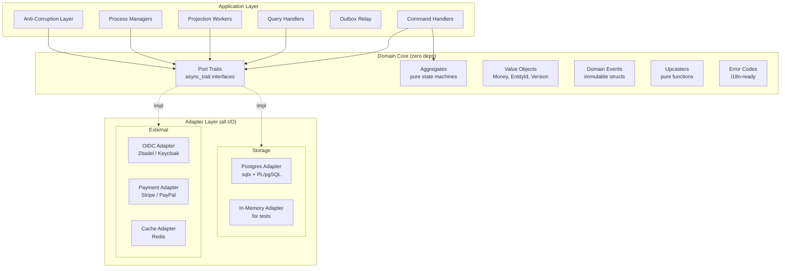

### Why Rust

| Concern            | How Rust Handles It                                                   |
| ------------------ | --------------------------------------------------------------------- |
| **Port contracts** | `#[async_trait] trait` — compile-time enforcement, zero-cost dispatch |
| **State machines** | Typestate pattern — invalid transitions are compile errors            |
| **Concurrency**    | Ownership model prevents data races in projection workers             |
| **Serialization**  | `serde` handles JSONB ↔ struct with `schema_version` dispatch         |
| **SQL safety**     | `sqlx` provides compile-time query verification                       |
| **Performance**    | <1ms event append, high-throughput projection polling                 |
| **Testing**        | In-memory adapter structs implement same traits as production         |

---

## 2.1 Industry-Validated Patterns (Research Findings)

The abstractions in this architecture are not invented — they are distilled from mature, production-proven frameworks. This section documents what works, what leaks, and what to avoid, drawn from six production event sourcing systems.

### Pattern 1: The Decider (Jérémie Chassaing, 2021)

The most important abstraction pattern for event-sourced aggregates. Adopted by Oskar Dudycz, Emmett, delta-base, and Jet's Equinox.

**Core definition** (F# original, language-agnostic):

```
Decider<Command, Event, State> = {
    decide:       (command, state) → events[]       // business rules
    evolve:       (state, event)   → state           // pure state transition
    initialState: ()               → state           // starting point
    isTerminal:   (state)          → bool            // lifecycle completion
}
```

**Why this outperforms traditional OOP aggregates**:

| Aspect                  | Traditional Aggregate                       | Decider                                                       |
| ----------------------- | ------------------------------------------- | ------------------------------------------------------------- |
| Side effects            | Methods mutate internal state + emit events | `decide` is pure: returns events, mutates nothing             |
| Testing                 | Requires framework, mocking, setup          | Call functions directly: `decide(cmd, state)` → assert events |
| Composition             | Aggregates don't compose                    | Deciders compose: two deciders merge into one                 |
| Infrastructure coupling | Often mixed with persistence                | Zero I/O — `decide` and `evolve` are pure functions           |
| Error handling          | Exceptions from deep inside methods         | Explicit: `Result<Vec<Event>, DomainError>`                   |

**Rust mapping**: `decide` → method returning `Result<Vec<EventEnvelope>, DomainError>`. `evolve` → `fn apply(&mut self, event)`. `isTerminal` → typestate pattern makes terminal states compile-time unreachable.

> **Source**: [Functional Event Sourcing Decider](https://thinkbeforecoding.com/post/2021/12/17/functional-event-sourcing-decider) — Jérémie Chassaing

### Pattern 2: The cqrs-es Aggregate Trait (Rust, Production)

The most mature Rust event sourcing library. Its trait design is the closest validated reference for our port definitions.

```rust
// From cqrs-es v0.5.0 — the proven Rust abstraction
pub trait Aggregate: Default + Serialize + DeserializeOwned + Sync + Send {
    type Command;
    type Event: DomainEvent;
    type Error: Error;
    type Services: Send + Sync;   // injected dependencies (ports!)

    const TYPE: &'static str;     // aggregate type identifier

    fn handle(
        &mut self,
        command: Self::Command,
        service: &Self::Services,  // ← ports injected here
        sink: &EventSink<Self>,    // ← event emission channel
    ) -> impl Future<Output = Result<(), Self::Error>> + Send;

    fn apply(&mut self, event: Self::Event);  // pure state transition
}
```

**Key design decisions validated in production**:

- `Services` associated type = dependency injection of ports without trait objects. The aggregate doesn't know what's behind `Services`, only the method signatures it needs.
- `apply()` is synchronous and pure — "No business logic should be placed here."
- `handle()` is async — it may need to call external services via ports.
- `EventSink` decouples event emission from return values — events are pushed, not returned.
- `Default` bound = aggregates have a natural initial state.
- `Serialize + DeserializeOwned` bounds = snapshots are built-in at the type level.

> **Source**: [cqrs-es docs.rs](https://docs.rs/cqrs-es/latest/cqrs_es/trait.Aggregate.html), [GitHub: serverlesstechnology/cqrs](https://github.com/serverlesstechnology/cqrs)

### Pattern 3: Axon Framework Upcaster Chain (Java, 10+ years production)

The most battle-tested upcasting abstraction. Our upcaster pipeline should mirror this pattern.

```java
// Core interface — processes streams of event representations
interface Upcaster {
    Stream<IntermediateEventRepresentation> upcast(
        Stream<IntermediateEventRepresentation> events
    );
}

// One-to-one transformation (most common case)
abstract class SingleEventUpcaster extends Upcaster {
    protected abstract boolean canUpcast(IntermediateEventRepresentation event);
    protected abstract IntermediateEventRepresentation doUpcast(
        IntermediateEventRepresentation event
    );
}

// One-to-many transformation (split one event into multiple)
abstract class EventMultiUpcaster extends Upcaster {
    protected abstract boolean canUpcast(IntermediateEventRepresentation event);
    protected abstract Stream<IntermediateEventRepresentation> doUpcast(
        IntermediateEventRepresentation event
    );
}
```

**Critical insight**: Axon's `IntermediateEventRepresentation` gives upcasters access to event metadata (type, revision) without deserializing the payload. Upcasters transform the raw serialized form, avoiding the need to maintain old event type definitions. Our Rust upcasters should operate on `JsonValue`, not on deserialized structs.

**Chain ordering**: Upcasters compose in sequence. Each upcaster's output feeds the next. Registration order = execution order. Spring's `@Order` annotation controls priority.

> **Source**: [Axon Framework Event Versioning](https://docs.axoniq.io/axon-framework-reference/4.11/events/event-versioning/)

### Pattern 4: Message DB / Eventide (PostgreSQL, Pure SQL)

The reference implementation of an event store as pure Postgres functions. Our `PgEventStore` adapter should follow this proven interface.

```sql
-- The complete Message DB API (4 core functions):

write_message(
    id varchar,               -- client-generated message ID
    stream_name varchar,       -- 'account-123' (entity stream) or 'account' (category)
    type varchar,              -- event type name
    data jsonb,                -- event payload
    metadata jsonb DEFAULT NULL,
    expected_version bigint DEFAULT NULL  -- optimistic concurrency
)

get_stream_messages(
    stream_name varchar,       -- entity stream: 'account-123'
    position bigint DEFAULT 0, -- start position within stream
    batch_size bigint DEFAULT 1000,
    condition varchar DEFAULT NULL  -- optional SQL WHERE clause
)

get_category_messages(
    category_name varchar,     -- category: 'account' (all account-* streams)
    position bigint DEFAULT 0, -- global position for checkpointing
    batch_size bigint DEFAULT 1000,
    correlation varchar DEFAULT NULL,         -- pub/sub filtering
    consumer_group_member bigint DEFAULT NULL, -- competing consumers
    consumer_group_size bigint DEFAULT NULL,
    condition varchar DEFAULT NULL
)

get_last_stream_message(
    stream_name varchar,
    type varchar DEFAULT NULL  -- optionally filter by type
)
```

**Key validated patterns**:

- **Stream naming convention**: `{category}-{id}` (e.g., `account-abc123`). Category = aggregate type. This enables category-level subscriptions without extra indexes.
- **Consumer groups built into the SQL function** — no external message broker needed. `consumer_group_member` and `consumer_group_size` enable competing consumers at the database level.
- **`expected_version`** parameter = optimistic concurrency in one function call.
- **Correlation filtering** built into `get_category_messages` — pub/sub routing at the query level.

**Handler pattern** (Eventide Ruby):

```
Handler = {
    dependencies: [write, store],       // injected ports
    category:     "account",            // stream category
    handle:       (message) → void      // process message, write results
}
```

Handlers are callable objects. They declare dependencies (writer, entity store), a category, and handler blocks per message type. The consumer dispatches messages to matching handler blocks by type name matching.

> **Source**: [Message DB Server Functions](http://docs.eventide-project.org/user-guide/message-db/server-functions.html), [Eventide Handlers](http://docs.eventide-project.org/user-guide/handlers.html)

### Pattern 5: Marten Async Daemon (C#/.NET, Production at Scale)

The most sophisticated projection infrastructure. Our projection worker design should learn from this.

**Architecture**:

- Runs as `IHostedService` — no external infrastructure beyond Postgres
- **Solo mode**: single-node, auto-start
- **HotCold mode**: multi-node with built-in leader election (one projection per node)
- Tracks a **high water mark** — the furthest safely-processable event sequence
- Each projection maintains its own checkpoint (sequence position)
- Events processed **in order** across all registered async projections

**Error handling** (three configurable policies):

| Policy                    | Default (continuous) | Default (rebuild) | Purpose                           |
| ------------------------- | -------------------- | ----------------- | --------------------------------- |
| `SkipApplyErrors`         | true                 | false             | Ignore projection code failures   |
| `SkipSerializationErrors` | true                 | false             | Overlook deserialization failures |
| `SkipUnknownEvents`       | true                 | false             | Bypass unrecognized event types   |

- Failed events go to a `DeadLetterEvent` table for later analysis
- Shard pauses on failure unless skipping is enabled

**Projection types** (proven taxonomy):

| Type             | When                             | Consistency | Example                       |
| ---------------- | -------------------------------- | ----------- | ----------------------------- |
| **Inline**       | Same transaction as event append | Strong      | Uniqueness checks, counters   |
| **Async**        | Background daemon                | Eventual    | Most read models, dashboards  |
| **Live**         | On-demand replay                 | Strong      | Short streams, debugging      |
| **Aggregate**    | Single-stream fold               | Both        | Order total, entity state     |
| **Multi-stream** | Cross-stream grouping            | Eventual    | User activity across entities |
| **Flat table**   | Denormalized rows                | Eventual    | Reporting, analytics          |

**Rebuild capability**: `daemon.RebuildProjectionAsync("ProjectionName")` — full re-projection from event store. Also available via CLI: `dotnet run -- projections --rebuild`.

**Health monitoring**: OpenTelemetry integration, `WaitForNonStaleProjectionDataAsync()` for tests, `IProjectionCoordinator` for progress tracking.

> **Source**: [Marten Async Daemon](https://martendb.io/events/projections/async-daemon.html), [Oskar Dudycz: Projections in Marten Explained](https://event-driven.io/en/projections_in_marten_explained/)

### Pattern 6: EventStoreDB/Kurrent Subscriptions

Two subscription models proven in production across thousands of deployments.

| Model          | State Management           | Delivery                                      | Use Case                                    |
| -------------- | -------------------------- | --------------------------------------------- | ------------------------------------------- |
| **Catch-up**   | Client-managed checkpoints | Exactly-once (if same-transaction checkpoint) | Read model projections                      |
| **Persistent** | Server-managed state       | At-least-once with ACK/NACK                   | Competing consumers, distributed processing |

**Catch-up subscription** (our primary model):

```
subscribe_to_stream_from(
    stream_name,              // or $all for global
    last_checkpoint: Position, // client tracks this
    settings: CatchUpSubscriptionSettings,
    event_handler: fn(event),
    live_processing_started: fn(),  // signals caught up to head
    subscription_dropped: fn(reason),
)
```

**Best practice**: Store checkpoint in the same transaction as the projection write. This achieves exactly-once semantics without an inbox pattern.

**Persistent subscription**:

- Server maintains position per consumer group
- Consumer group strategies: `RoundRobin` (load balance), `DispatchToSingle` (HA failover), `Pinned` (category-based ordering)
- ACK/NACK model for at-least-once delivery

> **Source**: [Kurrent Subscriptions](https://docs.kurrent.io/clients/tcp/dotnet/21.2/subscriptions), [Kurrent Guide to Event Stores](https://www.kurrent.io/guide-to-event-stores)

### Production Lessons Learned (What Went Wrong)

Compiled from production post-mortems and practitioner blog posts:

**1. Don't expose internal events as integration events** (Vaughn Vernon, Chris Kiehl)

Raw event subscriptions between services create coupling worse than shared databases. Every internal refactor breaks downstream consumers. **Mitigation**: Our `OutboxPublisher` port + Anti-Corruption Layer pattern. Domain events stay internal; integration events are separate lean contracts.

**2. Keep streams short — design for bounded lifecycles** (Oskar Dudycz)

Streams that grow indefinitely (e.g., a product that accumulates events forever) cause replay performance degradation. **Mitigation**: Design aggregates with natural lifecycle boundaries (Draft → Active → Completed). Use the "close the books" pattern: periodic lifecycle completion events that cap stream length. Only add snapshots when measured replay time > 100ms.

**3. Materialization lag causes UX problems** (Chris Kiehl)

After writes, clients query the read model and get stale data (404 for just-created entities, deleted items still visible). **Mitigation**: Return `{aggregate_id, version}` from writes. Client polls read model until `version >= expected_version`. Our architecture already includes this in the write path response.

**4. Projection maintenance scales linearly with event types** (Chris Kiehl)

Each new event type requires updating N projections. Adding, modifying, or removing an event type means spreading knowledge to every affected projection. **Mitigation**: Domain-scoped projection workers (our design). Each worker owns one domain. Cross-domain projections are explicit and few.

**5. Build a replay debugging tool on day one** (Michał Ostruszka, SoftwareMill)

The most valuable production tool: replay an aggregate's event stream up to a specific point to inspect intermediate state. Uses the same `evolve` function as production. **Mitigation**: Our `Decider` pattern makes this trivial — `events.iter().fold(initial_state(), evolve)` works in tests, debugging, and production identically.

**6. Don't snapshot prematurely** (Kurrent, Oskar Dudycz)

Snapshots add write amplification and versioning complexity. Most streams have < 100 events. **Mitigation**: Measure first. Snapshot only when measured replay time exceeds threshold. Store snapshots in a separate stream/table with retention policies.

> **Sources**: [Event Sourcing is Hard](https://chriskiehl.com/article/event-sourcing-is-hard), [Should You Always Keep Streams Short?](https://event-driven.io/en/should_you_always_keep_streams_short/), [Things I Wish I Knew](https://softwaremill.com/things-i-wish-i-knew-when-i-started-with-event-sourcing-part-1/), [Snapshots in Event Sourcing](https://www.kurrent.io/blog/snapshots-in-event-sourcing)

---

## 3. Domain Model (Technology-Free)

### Core Entities

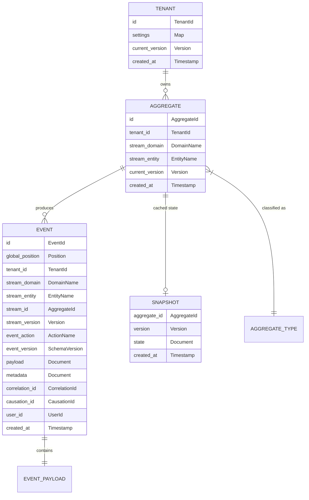

> **Note**: No `UUID`, `JSONB`, `TEXT`, `BIGINT` — these are abstract value types backed by ISO/RFC standards. `TenantId`, `AggregateId`, `EventId` = UUIDv7 (RFC 9562). `Timestamp` = RFC 3339 UTC. `Money` = integer cents + ISO 4217 currency. The adapter layer maps them to storage-specific types.

### Value Objects (Domain Vocabulary)

Every value type references an ISO or RFC standard. No ad-hoc formats.

```
TenantId        — UUIDv7 (RFC 9562) — time-ordered for index locality
AggregateId     — UUIDv7 (RFC 9562) — time-ordered for index locality
EventId         — UUIDv7 (RFC 9562) — time-ordered, globally unique, 48-bit ms timestamp + 62-bit random
Position        — monotonic, gapless, totally ordered i64
Version         — non-negative i32, starts at 0
SchemaVersion   — positive i16, starts at 1
DomainName      — lowercase ASCII string, single segment ("commerce", "billing", "iam")
EntityName      — lowercase ASCII string, single segment ("product", "order", "invoice")
ActionName      — lowercase ASCII string, single segment ("created", "updated", "paid")
AggregateType   — composite: "<domain>.<entity>" — reconstructed at app layer, never stored as one column
EventType       — composite: "<domain>.<entity>.<action>" — reconstructed at app layer, never stored as one column
Document        — schema-free key-value structure (maps to JSONB, DynamoDB Map, etc.)
Timestamp       — RFC 3339 (profile of ISO 8601) — always UTC, millisecond precision
                  Format: "2026-03-12T14:30:45.123Z" — the trailing "Z" is mandatory (no local offsets)
                  Rust type: chrono::DateTime<Utc>
CorrelationId   — optional UUIDv7 (RFC 9562), traces request/saga across boundaries
CausationId     — optional UUIDv7 (RFC 9562), traces parent event in causal chain
Money           — amount (integer cents, never floating point) + ISO 4217 currency code (e.g. "USD", "EUR")
CountryCode     — ISO 3166-1 alpha-2 (e.g. "US", "GB", "DE") — when needed in domain payloads
LanguageCode    — ISO 639-1 (e.g. "en", "fr", "de") — when needed for i18n
```

### ISO/RFC Compliance Matrix

| Value Type      | Standard        | Format Example                | Why This Standard                                                        |
| --------------- | --------------- | ----------------------------- | ------------------------------------------------------------------------ |
| **Identifiers** | RFC 9562 UUIDv7 | `019532a0-b73c-7def-8c1a-...` | Time-ordered → 2-5x faster DB inserts vs UUIDv4, no B-tree fragmentation |
| **Timestamps**  | RFC 3339 (UTC)  | `2026-03-12T14:30:45.123Z`    | Strict ISO 8601 profile, mandatory timezone, unambiguous parsing         |
| **Currency**    | ISO 4217        | `USD`, `EUR`, `GBP`           | 3-letter alpha, universally recognized by payment gateways               |
| **Country**     | ISO 3166-1 α-2  | `US`, `GB`, `DE`              | 2-letter code, used by shipping/tax/compliance systems                   |
| **Language**    | ISO 639-1       | `en`, `fr`, `de`              | 2-letter code, standard for i18n/l10n                                    |

**Critical rules**:

1. **All timestamps are UTC. No exceptions.** Local time conversion happens exclusively at the presentation layer (API response serialization, UI rendering). The event store, read models, projections, and all internal communication use UTC.
2. **UUIDv7 over UUIDv4** for all entity identifiers (events, aggregates, tenants). UUIDv7 embeds a millisecond Unix timestamp in the high bits, giving natural temporal ordering without sacrificing uniqueness. Use UUIDv4 only for security tokens (API keys, session IDs) where predictability is a concern.
3. **Money is always integer cents** (or smallest currency unit). Never `f64`. `$12.99` is stored as `1299i64` with currency `"USD"` (ISO 4217). This eliminates floating-point rounding errors across all adapters.
4. **RFC 3339 mandates the `Z` suffix** for UTC. Never store `+00:00` — use `Z`. This ensures byte-level consistency for indexing and equality checks across adapters.

### Namespaced Type System

```
Format:    <domain>.<entity>           — for aggregate types
           <domain>.<entity>.<action>  — for event types

Validation: lowercase, dot-separated, 2-3 segments max

Valid:     commerce.product
           commerce.product.created
           billing.invoice.paid

Invalid:   Product              (no domain prefix)
           Commerce.Product     (uppercase)
           a.b.c.d.e            (too deep)
```

**Why namespacing matters at the abstract level**:

| Benefit                | How                                                                        |
| ---------------------- | -------------------------------------------------------------------------- |
| **Service ownership**  | Each service owns a domain prefix                                          |
| **Projection routing** | Workers subscribe by domain prefix                                         |
| **Access control**     | Permissions map to domains: `can_read:commerce`                            |
| **Event filtering**    | Port exposes `poll_by_domain(domain, after_position)`                      |
| **Schema registry**    | Upcasters grouped by domain                                                |
| **Cross-service flow** | `commerce.order.confirmed` → billing reacts with `billing.invoice.created` |

---

## 4. Port Definitions (Trait Contracts)

Ports define WHAT the system can do. They contain zero infrastructure knowledge. Each is an `#[async_trait]` trait. In-memory test adapters and production adapters both implement the same traits.

> Python-style pseudocode is shown in comments for readability — the actual code is Rust.

```rust
// ─── Value Objects ───────────────────────────────────────────────

pub struct EventEnvelope {
    pub event_action: String,         // "created" — just the action (SOC: domain/entity come from stream)
    pub schema_version: i16,          // payload schema version for upcaster dispatch
    pub payload: JsonValue,           // business data only
    pub metadata: JsonValue,          // extensible operational baggage
    pub correlation_id: Option<Uuid>, // UUIDv7 (RFC 9562)
    pub causation_id: Option<Uuid>,   // UUIDv7 (RFC 9562)
    pub user_id: Option<Uuid>,        // UUIDv7 (RFC 9562)
}

pub struct StoredEvent {
    pub id: Uuid,                     // UUIDv7 (RFC 9562) — time-ordered
    pub global_position: i64,
    pub tenant_id: Uuid,              // UUIDv7 (RFC 9562)
    pub stream_domain: String,        // "commerce" — bounded context (SOC)
    pub stream_entity: String,        // "product" — aggregate type (SOC)
    pub stream_id: Uuid,              // UUIDv7 (RFC 9562) — aggregate instance
    pub stream_version: i32,
    pub event_action: String,         // "created" — what happened (SOC)
    pub event_version: i16,           // schema version for upcaster dispatch
    pub payload: JsonValue,
    pub metadata: JsonValue,
    pub correlation_id: Option<Uuid>, // UUIDv7 (RFC 9562)
    pub causation_id: Option<Uuid>,   // UUIDv7 (RFC 9562)
    pub user_id: Option<Uuid>,        // UUIDv7 (RFC 9562)
    pub created_at: DateTime<Utc>,    // RFC 3339 UTC — "2026-03-12T14:30:45.123Z"
}

impl StoredEvent {
    /// Reconstruct fully-qualified names when needed (logging, display, debugging).
    pub fn qualified_event_type(&self) -> String {
        format!("{}.{}.{}", self.stream_domain, self.stream_entity, self.event_action)
    }
    pub fn qualified_aggregate_type(&self) -> String {
        format!("{}.{}", self.stream_domain, self.stream_entity)
    }
}

pub struct Snapshot {
    pub aggregate_id: Uuid,           // UUIDv7 (RFC 9562)
    pub version: i32,
    pub state: JsonValue,
    pub created_at: DateTime<Utc>,    // RFC 3339 UTC
}

pub struct Page<T> {
    pub items: Vec<T>,
    pub next_cursor: Option<String>,
    pub has_more: bool,
}

pub struct Relation {
    pub id: Uuid,                     // UUIDv7 (RFC 9562)
    pub tenant_id: Uuid,              // UUIDv7 (RFC 9562)
    pub category: String,             // "schema" | "instance"
    pub domain: String,
    pub relation_type: String,        // "commerce.contains", "social.follows"
    pub source_id: Uuid,              // UUIDv7 (RFC 9562)
    pub source_type: String,
    pub target_id: Uuid,              // UUIDv7 (RFC 9562)
    pub target_type: String,
    pub metadata: JsonValue,
    pub version: i32,
    pub created_at: DateTime<Utc>,    // RFC 3339 UTC
    pub updated_at: DateTime<Utc>,    // RFC 3339 UTC
}

/// Minimal token claims — extracted from OIDC ID/access token.
/// Does NOT embed permission lists. Permissions are resolved at request time
/// via the AuthorizationPolicy port (token lookup pattern).
pub struct Principal {
    pub sub: Uuid,                    // UUIDv7 (RFC 9562) — user identity
    pub tenant_id: Uuid,              // UUIDv7 (RFC 9562) — tenant context from token
    pub tenant_role: TenantRole,      // coarse-grained role within tenant
    pub iss: String,                  // OIDC issuer URL
    pub iat: i64,                     // issued-at (Unix seconds)
    pub exp: i64,                     // expiration (Unix seconds)
}

/// Tenant-level RBAC hierarchy — strict superset ordering.
/// Owner ⊃ Admin ⊃ Manager ⊃ Editor ⊃ Viewer ⊃ Guest
#[derive(Debug, Clone, PartialEq, Eq, PartialOrd, Ord)]
pub enum TenantRole {
    Guest,                            // limited read on public resources
    Viewer,                           // read-only
    Editor,                           // read + write on assigned resources
    Manager,                          // Editor + manage team members
    Admin,                            // Manager + manage users/roles
    Owner,                            // Admin + billing, tenant settings, deletion
}

/// Authorization decision returned by AuthorizationPolicy port.
pub enum Decision {
    Allow,
    Deny { reason: String },
}

/// A resource being accessed — used by AuthorizationPolicy::check().
pub enum Resource {
    Aggregate { domain: String, entity: String, id: Uuid },
    ReadModel { domain: String, entity: String, id: Option<Uuid> },
    Domain { name: String },
    Tenant { id: Uuid },
}

/// An action being performed on a resource.
#[derive(Debug, Clone)]
pub enum Action {
    Read,
    Write,
    Delete,
    ManageMembers,
    ManageRoles,
    Export,
    Custom(String),
}

pub struct DeadLetter {
    pub id: Uuid,                     // UUIDv7 (RFC 9562)
    pub event_id: Uuid,               // UUIDv7 (RFC 9562)
    pub global_position: i64,
    pub handler_name: String,
    pub error_message: String,
    pub retry_count: i32,
    pub status: String,               // "pending" | "retrying" | "exhausted" | "resolved"
    pub created_at: DateTime<Utc>,    // RFC 3339 UTC
}

pub struct ProcessState {
    pub id: Uuid,                     // UUIDv7 (RFC 9562)
    pub tenant_id: Uuid,              // UUIDv7 (RFC 9562)
    pub process_type: String,
    pub state: String,
    pub data: JsonValue,
    pub started_at: DateTime<Utc>,    // RFC 3339 UTC
    pub updated_at: DateTime<Utc>,    // RFC 3339 UTC
    pub completed_at: Option<DateTime<Utc>>, // RFC 3339 UTC
}

pub type Result<T> = std::result::Result<T, DomainError>;


// ─── Port: Event Store ───────────────────────────────────────────
// Append-only event journal. The single source of truth.
//
// Invariants:
//   - Events are immutable once appended
//   - Global position is monotonic and gapless
//   - Optimistic concurrency via expected_version check
//   - One writer wins per (aggregate_id, version) pair

#[async_trait]
pub trait EventStore: Send + Sync {
    /// Atomically append events to an aggregate stream.
    /// Returns new aggregate version after append.
    /// Fails with ConcurrencyConflict if current version != expected_version.
    /// SOC: domain and entity are separate parameters, not combined.
    async fn append(
        &self,
        tenant_id: Uuid, stream_id: Uuid,
        stream_domain: &str, stream_entity: &str,
        expected_version: i32,
        events: &[EventEnvelope],
    ) -> Result<i32>;

    /// Load all events for an aggregate, ordered by version.
    async fn load_stream(
        &self, tenant_id: Uuid, stream_id: Uuid,
    ) -> Result<Vec<StoredEvent>>;

    /// Load events for an aggregate starting from a specific version.
    async fn load_stream_from(
        &self, tenant_id: Uuid, stream_id: Uuid, from_version: i32,
    ) -> Result<Vec<StoredEvent>>;

    /// Poll events after a global position (global catch-up subscription).
    async fn poll_global(
        &self, after_position: i64, limit: i32,
    ) -> Result<Vec<StoredEvent>>;

    /// Poll by bounded context — equality match on stream_domain.
    async fn poll_by_domain(
        &self, domain: &str, after_position: i64, limit: i32,
    ) -> Result<Vec<StoredEvent>>;

    /// Poll by entity type within a domain.
    async fn poll_by_entity(
        &self, domain: &str, entity: &str, after_position: i64, limit: i32,
    ) -> Result<Vec<StoredEvent>>;

    /// Poll by specific event action across all entities.
    async fn poll_by_action(
        &self, action: &str, after_position: i64, limit: i32,
    ) -> Result<Vec<StoredEvent>>;
}


// ─── Port: Snapshot Store ────────────────────────────────────────
// Caches aggregate state to avoid full event replay.

#[async_trait]
pub trait SnapshotStore: Send + Sync {
    async fn load(&self, aggregate_id: Uuid) -> Result<Option<Snapshot>>;
    async fn save(&self, aggregate_id: Uuid, version: i32, state: JsonValue) -> Result<()>;
}


// ─── Port: Read Model Store ─────────────────────────────────────
// Generic document store keyed by (tenant, domain, entity, id).
// No typed columns — entity structure lives in the document.
// Adding a new entity type means writing a new projection, not a migration.
// SOC: domain and entity are separate parameters.

#[async_trait]
pub trait ReadModelStore: Send + Sync {
    async fn upsert(
        &self, tenant_id: Uuid, domain: &str, entity: &str,
        entity_id: Uuid, data: JsonValue, version: i32,
    ) -> Result<()>;

    async fn find_by_id(
        &self, tenant_id: Uuid, domain: &str, entity: &str, entity_id: Uuid,
    ) -> Result<Option<JsonValue>>;

    async fn query(
        &self, tenant_id: Uuid, domain: &str, entity: &str,
        filters: Option<JsonValue>, cursor: Option<&str>, limit: i32,
    ) -> Result<Page<JsonValue>>;

    async fn query_by_domain(
        &self, tenant_id: Uuid, domain: &str,
        filters: Option<JsonValue>, cursor: Option<&str>, limit: i32,
    ) -> Result<Page<JsonValue>>;

    async fn delete(
        &self, tenant_id: Uuid, domain: &str, entity: &str, entity_id: Uuid,
    ) -> Result<()>;
}


// ─── Port: Relation Store ────────────────────────────────────────
// Graph edge table for entity relationships.
// Supports structural (order→line_items) and instance (user→follows→user).
// This is a READ MODEL — always rebuildable from events.

#[async_trait]
pub trait RelationStore: Send + Sync {
    async fn upsert(&self, tenant_id: Uuid, relation: &Relation) -> Result<()>;
    async fn delete(
        &self, tenant_id: Uuid, source_id: Uuid, target_id: Uuid, relation_type: &str,
    ) -> Result<()>;
    async fn query_forward(
        &self, tenant_id: Uuid, source_id: Uuid, relation_type: &str,
        cursor: Option<&str>, limit: i32,
    ) -> Result<Page<Relation>>;
    async fn query_reverse(
        &self, tenant_id: Uuid, target_id: Uuid, relation_type: &str,
        cursor: Option<&str>, limit: i32,
    ) -> Result<Page<Relation>>;
    async fn exists(
        &self, tenant_id: Uuid, source_id: Uuid, target_id: Uuid, relation_type: &str,
    ) -> Result<bool>;
    async fn count(
        &self, tenant_id: Uuid, target_id: Uuid, relation_type: &str,
    ) -> Result<u64>;
}


// ─── Port: Identity Provider (Authentication) ──────────────────
// RESPONSIBILITY: "Who are you? Prove it."
// Validates tokens, resolves user identity. No authorization logic.
// Abstracts over OIDC providers (Zitadel, Keycloak, Auth0, etc.)
//
// Adapters: ZitadelAdapter, KeycloakAdapter, Auth0Adapter, FakeIdentityProvider (tests)

#[async_trait]
pub trait IdentityProvider: Send + Sync {
    /// Validate token signature, check expiration/revocation, extract Principal.
    /// On failure: reject request (401 Unauthorized).
    async fn verify_token(&self, token: &str) -> Result<Principal>;

    /// Fetch user profile (display name, email, etc.) from the IdP.
    async fn get_user_info(&self, user_id: Uuid) -> Result<JsonValue>;
}


// ─── Port: Authorization Policy (Authorization) ────────────────
// RESPONSIBILITY: "What are you allowed to do?"
// Evaluates permissions given principal + action + resource.
// Separate from IdentityProvider because authentication ≠ authorization:
//   - Different lifecycles (token expiry vs permission changes)
//   - Different caching strategies (long TTL vs short TTL)
//   - Different external tools (Keycloak vs Cerbos/Cedar/OpenFGA)
//   - Different failure modes (both deny-by-default)
//
// Adapters: CerbosAdapter, CedarAdapter, OpenFGAAdapter, InMemoryPolicy (tests)
//
// Pattern: Two-Level Authorization
//   Level 1 — Tenant Role (RBAC): coarse-grained, from Principal.tenant_role
//   Level 2 — Resource Relationships (ReBAC): fine-grained, owner/editor/viewer
//   Combined via PBAC (Policy-Based Access Control)

#[async_trait]
pub trait AuthorizationPolicy: Send + Sync {
    /// Check if principal can perform action on resource.
    /// Called in application layer (command/query handlers) BEFORE aggregate interaction.
    /// Aggregates never call this — they enforce business invariants only.
    async fn check(
        &self,
        principal: &Principal,
        action: &Action,
        resource: &Resource,
    ) -> Result<Decision>;

    /// List what actions principal can perform on a resource type.
    /// Used by UI to show/hide controls.
    async fn list_permissions(
        &self,
        principal: &Principal,
        resource: &Resource,
    ) -> Result<Vec<Action>>;
}


// ─── Port: Payment Gateway ──────────────────────────────────────
// Abstracts over payment processors (Stripe, PayPal, Adyen, etc.)

#[async_trait]
pub trait PaymentGateway: Send + Sync {
    /// Returns charge reference ID.
    async fn create_charge(
        &self, amount_cents: i64, currency: &str, customer_ref: &str,
        metadata: Option<JsonValue>,
    ) -> Result<String>;
    /// Full or partial refund. Returns refund reference ID.
    async fn refund(&self, charge_ref: &str, amount_cents: Option<i64>) -> Result<String>;
    /// Verify and parse webhook. Returns normalized payment event.
    async fn handle_webhook(&self, payload: &[u8], signature: &str) -> Result<JsonValue>;
}


// ─── Port: Cache ────────────────────────────────────────────────
// Abstracts over Redis, Memcached, in-memory, etc.

#[async_trait]
pub trait Cache: Send + Sync {
    async fn get(&self, key: &str) -> Result<Option<Vec<u8>>>;
    async fn set(&self, key: &str, value: &[u8], ttl_seconds: Option<u64>) -> Result<()>;
    async fn invalidate(&self, key: &str) -> Result<()>;
}


// ─── Port: Encryption Key Store ─────────────────────────────────
// Per-subject encryption keys for GDPR crypto-shredding.
// Destroying a key renders all encrypted PII permanently unreadable.

#[async_trait]
pub trait EncryptionKeyStore: Send + Sync {
    async fn create_key(&self, tenant_id: Uuid, subject_id: Uuid) -> Result<String>;
    async fn get_key(&self, subject_id: Uuid) -> Result<Option<Vec<u8>>>;
    async fn destroy_key(&self, subject_id: Uuid) -> Result<()>;
}


// ─── Port: Dead Letter Store ────────────────────────────────────
// Captures poison events for inspection, retry, and resolution.

#[async_trait]
pub trait DeadLetterStore: Send + Sync {
    async fn record_failure(
        &self, event_id: Uuid, global_position: i64,
        handler_name: &str, error_message: &str, error_stack: Option<&str>,
    ) -> Result<()>;
    async fn get_pending(&self, handler_name: &str, limit: i32) -> Result<Vec<DeadLetter>>;
    async fn mark_resolved(&self, dead_letter_id: Uuid) -> Result<()>;
    async fn retry(&self, dead_letter_id: Uuid) -> Result<()>;
}


// ─── Port: Process Manager Store ────────────────────────────────
// Stateful saga/process manager coordination.

#[async_trait]
pub trait ProcessManagerStore: Send + Sync {
    async fn load(&self, process_id: Uuid) -> Result<Option<ProcessState>>;
    async fn save(
        &self, process_id: Uuid, state: &ProcessState,
        associations: Option<&HashMap<String, String>>,
    ) -> Result<()>;
    async fn find_by_association(&self, key: &str, value: &str) -> Result<Vec<Uuid>>;
    async fn find_timed_out(&self, timeout_seconds: u64) -> Result<Vec<Uuid>>;
}


// ─── Port: Outbox Publisher ──────────────────────────────────────
// Writes integration events to an outbox table in the SAME transaction
// as the domain event append. The outbox is the "staging area" for
// events that need to cross the Rust core boundary.
//
// Integration events are lean public contracts (CloudEvents envelope +
// Protobuf payload). They are NOT the same as domain events.

#[async_trait]
pub trait OutboxPublisher: Send + Sync {
    /// Write an integration event to the outbox (same DB transaction as event append).
    async fn publish(
        &self, tenant_id: Uuid,
        domain: &str, entity: &str, action: &str,
        schema_version: i16,
        payload: JsonValue, correlation_id: Option<Uuid>,
    ) -> Result<()>;
}


// ─── Port: Event Relay ──────────────────────────────────────────
// Background worker that reads from the outbox and publishes to an
// external message broker (Kafka, NATS, Redis Streams).
// Polyglot consumers subscribe to the broker, not to the Rust core directly.
//
// Adapters: KafkaRelayAdapter, NatsRelayAdapter, RedisStreamsRelayAdapter
//
// Guarantees:
//   - At-least-once delivery (idempotent relay via outbox event ID)
//   - Ordered per aggregate (partition key = stream_id)
//   - Resumable on crash (tracks last relayed position)

#[async_trait]
pub trait EventRelay: Send + Sync {
    /// Relay pending outbox events to the broker. Returns count relayed.
    async fn relay_pending(&self, limit: i32) -> Result<i32>;
    /// Health check — is the broker reachable?
    async fn health(&self) -> Result<bool>;
}


// ─── Port: Event Notifier ───────────────────────────────────────
// Best-effort HINT for new events (optional optimization).
// Abstracts over: Postgres LISTEN/NOTIFY, Redis Pub/Sub, etc.
// A NoOp implementation is valid — system degrades to polling-only.

#[async_trait]
pub trait EventNotifier: Send + Sync {
    async fn notify(&self, position: i64) -> Result<()>;
    async fn subscribe(&self) -> Result<()>;
}


// ─── Port: Tenant Isolation ─────────────────────────────────────
// Enforces tenant boundary at the infrastructure level.
// Abstracts over: Postgres RLS, application-level WHERE, schema-per-tenant.

#[async_trait]
pub trait TenantIsolation: Send + Sync {
    async fn set_tenant_context(&self, tenant_id: Uuid) -> Result<()>;
    async fn clear_tenant_context(&self) -> Result<()>;
}


// ─── Port: Checkpoint Store ─────────────────────────────────────
// Tracks projection worker progress through the event stream.

#[async_trait]
pub trait CheckpointStore: Send + Sync {
    async fn get_position(&self, projection_name: &str) -> Result<i64>;
    async fn save_position(&self, projection_name: &str, position: i64) -> Result<()>;
}


// ─── Port: Translator ───────────────────────────────────────────
// i18n resolution for error messages and user-facing text.

pub trait Translator: Send + Sync {
    fn resolve(&self, code: &str, locale: &str, context: Option<&JsonValue>) -> String;
}
```

---

## 5. Adapter Registry (Implementation Mapping)

Each port can be satisfied by multiple adapters. The composition root wires the chosen adapter to each port.

```mermaid
flowchart TD
    subgraph Ports["Ports (Trait Contracts)"]
        ES_P[EventStore]
        RM_P[ReadModelStore]
        RS_P[RelationStore]
        IP_P[IdentityProvider]
        AZ_P[AuthorizationPolicy]
        PG_P[PaymentGateway]
        CA_P[Cache]
        TI_P[TenantIsolation]
        EN_P[EventNotifier]
        EK_P[EncryptionKeyStore]
        DL_P[DeadLetterStore]
        PM_P[ProcessManagerStore]
        OB_P[OutboxPublisher]
        ER_P[EventRelay]
        CP_P[CheckpointStore]
        TR_P[TypeRegistry]
    end

    subgraph Adapters_Prod["Production Adapters"]
        PG_ES[PgEventStore\nsqlx + PL/pgSQL]
        PG_RM[PgReadModelStore\nJSONB + GIN]
        PG_RS[PgRelationStore\nB-tree fwd/rev]
        ZIT[ZitadelAdapter\nOIDC + gRPC]
        KC[KeycloakAdapter\nOIDC + REST]
        CERBOS[CerbosAdapter\nHTTP/gRPC]
        CEDAR[CedarAdapter\nSDK]
        OFGA[OpenFGAAdapter\ngRPC]
        STR[StripeAdapter\nConnect API]
        PP[PayPalAdapter\nREST API]
        RED[RedisCache\nRedis Cluster]
        RLS[PgTenantIsolation\nSET app.tenant_id]
        LN[PgEventNotifier\nLISTEN/NOTIFY]
        KAFKA_R[KafkaRelayAdapter]
        NATS_R[NatsRelayAdapter]
    end

    subgraph Adapters_Test["Test Adapters"]
        MEM_ES[InMemoryEventStore]
        MEM_RM[InMemoryReadModel]
        MEM_RS[InMemoryRelationStore]
        FAKE_IP[FakeIdentityProvider]
        MEM_AZ[InMemoryPolicy]
        FAKE_PG[FakePaymentGateway]
        MEM_CA[InMemoryCache]
        NOOP_TI[NoOpTenantIsolation]
        NOOP_EN[NoOpEventNotifier]
        MEM_ER[InMemoryRelay]
    end

    ES_P -.-> PG_ES
    ES_P -.-> MEM_ES
    RM_P -.-> PG_RM
    RM_P -.-> MEM_RM
    RS_P -.-> PG_RS
    RS_P -.-> MEM_RS
    IP_P -.-> ZIT
    IP_P -.-> KC
    IP_P -.-> FAKE_IP
    AZ_P -.-> CERBOS
    AZ_P -.-> CEDAR
    AZ_P -.-> OFGA
    AZ_P -.-> MEM_AZ
    PG_P -.-> STR
    PG_P -.-> PP
    PG_P -.-> FAKE_PG
    CA_P -.-> RED
    CA_P -.-> MEM_CA
    TI_P -.-> RLS
    TI_P -.-> NOOP_TI
    EN_P -.-> LN
    EN_P -.-> NOOP_EN
    ER_P -.-> KAFKA_R
    ER_P -.-> NATS_R
    ER_P -.-> MEM_ER
```

### Adapter Capability Matrix

| Port                    | Postgres Adapter                                           | DynamoDB Adapter (future)                       | In-Memory Adapter (tests)                         |
| ----------------------- | ---------------------------------------------------------- | ----------------------------------------------- | ------------------------------------------------- |
| **EventStore**          | PL/pgSQL atomic append, gapless counter, UNIQUE constraint | Conditional writes on version, DynamoDB Streams | `HashMap<Uuid, Vec<Event>>`, simple version check |
| **ReadModelStore**      | JSONB + GIN indexes, equality on SOC columns               | Single-table design, GSI for type queries       | Nested `HashMap`, linear scan for filters         |
| **IdentityProvider**    | N/A (external: Zitadel, Keycloak via OIDC)                 | N/A (same external OIDC providers)              | `FakeIdentityProvider` returns preset Principal   |
| **AuthorizationPolicy** | N/A (external: Cerbos, Cedar, OpenFGA)                     | N/A (same external engines)                     | `InMemoryPolicy` with configurable RBAC rules     |
| **TenantIsolation**     | RLS policies via `SET app.tenant_id`                       | Partition key = tenant_id, implicit isolation   | `tenant_id` filter in every method                |
| **EventNotifier**       | LISTEN/NOTIFY trigger on events table                      | DynamoDB Streams + Lambda trigger               | `tokio::sync::Notify` signal                      |
| **Cache**               | N/A                                                        | DAX                                             | `HashMap` with TTL via `Instant`                  |

> **Key point**: The domain and application layers are identical regardless of which adapter column you choose. Switching from Postgres to DynamoDB means writing new adapters — zero domain code changes.

---

## 6. System Behavior (Technology-Free Flows)

### 6.1 Write Path (Command Side)

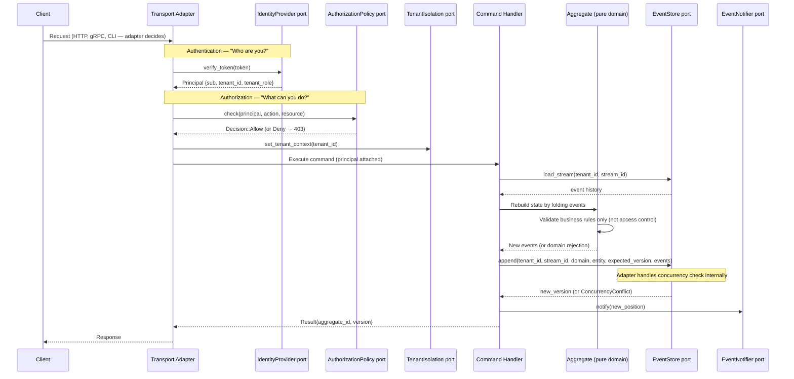

### 6.2 Read Path (Query Side)

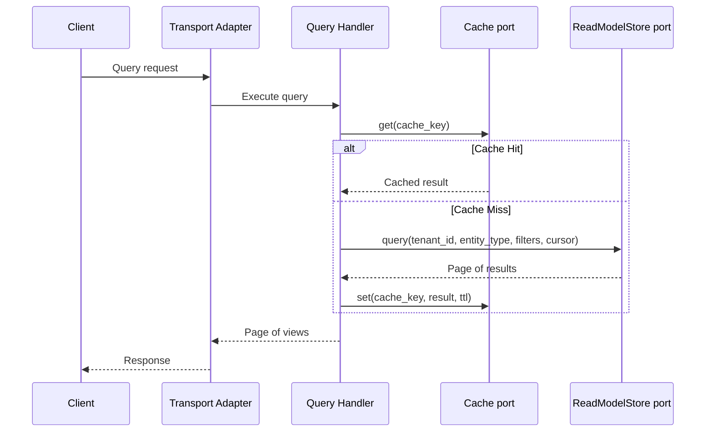

### 6.3 Projection Pipeline

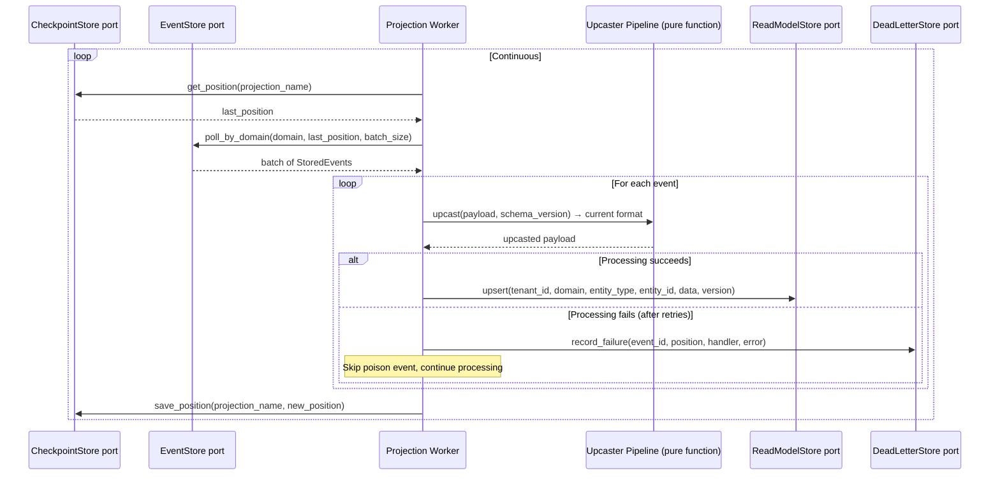

### 6.4 Concurrency Model (Abstract)

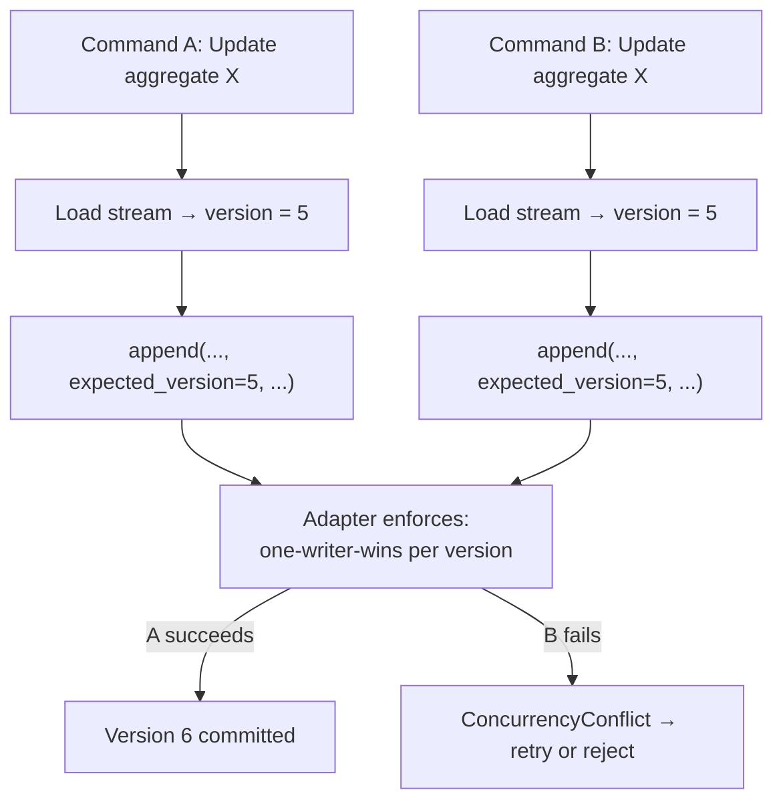

> **Implementation note**: How the adapter enforces this varies:
>
> - Postgres: `UNIQUE(aggregate_id, aggregate_version)` constraint
> - DynamoDB: conditional write `attribute_not_exists(version)`
> - In-memory: version comparison under `Mutex`

---

## 6.3 Access Control Architecture

### The Separation: Authentication ≠ Authorization

These are distinct concerns with different lifecycles, caching strategies, failure modes, and external tooling. The architecture enforces this via **two separate ports**.

| Aspect              | IdentityProvider Port           | AuthorizationPolicy Port              |
| ------------------- | ------------------------------- | ------------------------------------- |
| **Question**        | "Who are you?"                  | "What can you do?"                    |
| **Input**           | Bearer token                    | Principal + Action + Resource         |
| **Output**          | `Principal` (identity)          | `Decision` (Allow / Deny)             |
| **External tool**   | Zitadel, Keycloak, Auth0 (OIDC) | Cerbos, Cedar, OpenFGA, SpiceDB       |
| **Cache TTL**       | Long (token lifetime, hours)    | Short (permission freshness, minutes) |
| **Failure default** | Deny (401 Unauthorized)         | Deny (403 Forbidden)                  |
| **HTTP error**      | 401                             | 403                                   |
| **Spec**            | OAuth 2.0 / OIDC                | RFC 9396 Rich Authorization Requests  |

### Why Not Embed Permissions in Tokens

The flat `roles: Vec<String>, permissions: Vec<String>` pattern is a known anti-pattern:

| Problem                 | Consequence                                           |
| ----------------------- | ----------------------------------------------------- |
| **No tenant context**   | "admin" of which tenant?                              |
| **No resource binding** | "read:docs" reads ALL docs system-wide                |
| **Stale on revocation** | Permission revoked but token still valid until expiry |
| **Token bloat**         | Every permission in every request, growing over time  |
| **Not delegatable**     | Can't express "admin delegated to me for resource X"  |

**Instead**: Token carries minimal identity (`sub`, `tenant_id`, `tenant_role`). Fresh permissions are resolved per-request via the `AuthorizationPolicy` port (**token lookup pattern**).

### Authorization Model: PBAC (RBAC + ReBAC)

The architecture uses **Policy-Based Access Control**, composing two proven models:

```
Level 1 — Tenant Role (RBAC): Who are you within this tenant?
─────────────────────────────────────────────────────────────
    Owner  ⊃  Admin  ⊃  Manager  ⊃  Editor  ⊃  Viewer  ⊃  Guest
      │         │          │           │          │          │
      │         │          │           │          │          └─ Read public resources
      │         │          │           │          └─ Read all tenant resources
      │         │          │           └─ Read + Write on assigned resources
      │         │          └─ Editor + Manage team members
      │         └─ Manager + Manage users/roles, view audit
      └─ Admin + Billing, tenant settings, tenant deletion

Level 2 — Resource Relationships (ReBAC): What's your relationship to this resource?
─────────────────────────────────────────────────────────────
    Resource ownership (direct):
        User A is owner of Document X → full control
        User B is editor of Document X → read + write
        User C is viewer of Document X → read only

    Inheritance (transitive):
        User D is member of Team Y
        Team Y has "editor" on Folder Z
        Document X is in Folder Z
        → User D can edit Document X (via Team Y → Folder Z → Document X)
```

### Where Authorization Lives (Layer Boundaries)

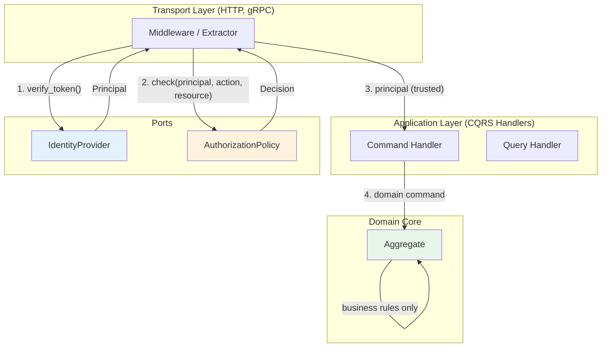

**Rule**: Aggregates **never** call `AuthorizationPolicy`. They enforce **business invariants** only.

| Layer           | Checks                        | Example                            | Error Type            |
| --------------- | ----------------------------- | ---------------------------------- | --------------------- |
| **Transport**   | Authentication (token valid?) | Invalid JWT → 401                  | `AuthenticationError` |
| **Application** | Authorization (allowed?)      | No write access → 403              | `AuthorizationError`  |
| **Domain**      | Business invariants           | Can't cancel already-shipped order | `DomainError`         |

### Command Handler Pattern (Authorization Before Aggregate)

```rust
// Application layer — authorization is checked HERE, not in the aggregate.
pub struct CreateOrderHandler {
    event_store: Arc<dyn EventStore>,
    authz: Arc<dyn AuthorizationPolicy>,
}

impl CreateOrderHandler {
    pub async fn execute(
        &self, principal: &Principal, cmd: CreateOrder,
    ) -> Result<CommandResult> {
        // 1. Authorization check (infrastructure concern)
        let resource = Resource::Domain {
            name: cmd.domain.clone(),
        };
        match self.authz.check(principal, &Action::Write, &resource).await? {
            Decision::Allow => {},
            Decision::Deny { reason } => return Err(AuthorizationError::Forbidden(reason).into()),
        }

        // 2. Load aggregate (domain concern)
        let events = self.event_store
            .load_stream(principal.tenant_id, cmd.aggregate_id)
            .await?;
        let mut order = Order::default();
        for e in &events { order.apply(e); }

        // 3. Execute domain logic — aggregate checks BUSINESS RULES only
        //    e.g. "items cannot be empty", "total must be positive"
        //    NOT "does user have permission" — that was handled above
        let new_events = order.decide(cmd)?;

        // 4. Persist
        let version = self.event_store.append(
            principal.tenant_id, cmd.aggregate_id,
            &cmd.domain, &cmd.entity,
            order.version, &new_events,
        ).await?;

        Ok(CommandResult { aggregate_id: cmd.aggregate_id, version })
    }
}
```

### Domain vs Authorization: What Goes Where

```rust
// ✅ CORRECT: Business invariant in aggregate
impl Order {
    pub fn cancel(&mut self) -> Result<Vec<EventEnvelope>, DomainError> {
        // Business rule: shipped orders cannot be cancelled
        if self.state == OrderState::Shipped {
            return Err(DomainError::InvalidStateTransition {
                from: "shipped", to: "cancelled",
            });
        }
        Ok(vec![EventEnvelope { event_action: "cancelled".into(), .. }])
    }
}

// ✅ CORRECT: Authorization in command handler (before aggregate)
async fn handle_cancel_order(
    principal: &Principal, cmd: CancelOrder,
    authz: &dyn AuthorizationPolicy, es: &dyn EventStore,
) -> Result<()> {
    authz.check(principal, &Action::Write, &Resource::Aggregate {
        domain: "commerce".into(), entity: "order".into(), id: cmd.order_id,
    }).await?;
    // ... then load aggregate and call order.cancel()
}

// ❌ WRONG: Authorization check inside aggregate
impl Order {
    pub fn cancel(&mut self, user_id: Uuid) -> Result<...> {
        if !self.has_permission(user_id, "cancel") {  // ← NEVER DO THIS
            return Err(Error::Unauthorized);
        }
    }
}
```

### Events and Authorization Context

Events record **who acted** (authentication context), not **whether they were authorized** (infrastructure concern):

```rust
// ✅ CORRECT: Event records the actor
pub struct OrderCancelledEvent {
    pub order_id: Uuid,
    pub cancelled_by: Uuid,           // who did it (from Principal.sub)
    pub reason: Option<String>,       // domain context
    // Don't store: "had_role: admin" or "was_authorized: true"
}

// ✅ CORRECT: Permission changes ARE domain events (when permission is a domain concept)
pub struct MemberInvitedEvent {
    pub team_id: Uuid,
    pub invitee_id: Uuid,
    pub role: TenantRole,             // domain-relevant: what role was granted
    pub invited_by: Uuid,             // who made the decision
}
```

### Adapter Mapping

| Port                    | Adapter                | Tool                             | Protocol       |
| ----------------------- | ---------------------- | -------------------------------- | -------------- |
| **IdentityProvider**    | `ZitadelAdapter`       | Zitadel                          | OIDC + gRPC    |
| **IdentityProvider**    | `KeycloakAdapter`      | Keycloak                         | OIDC + REST    |
| **IdentityProvider**    | `Auth0Adapter`         | Auth0                            | OIDC + REST    |
| **IdentityProvider**    | `FakeIdentityProvider` | Tests                            | In-memory      |
| **AuthorizationPolicy** | `CerbosAdapter`        | Cerbos                           | HTTP / gRPC    |
| **AuthorizationPolicy** | `CedarAdapter`         | Cedar / AWS Verified Permissions | SDK            |
| **AuthorizationPolicy** | `OpenFGAAdapter`       | OpenFGA                          | gRPC           |
| **AuthorizationPolicy** | `SpiceDBAdapter`       | SpiceDB (Zanzibar)               | gRPC           |
| **AuthorizationPolicy** | `InMemoryPolicy`       | Tests                            | In-memory RBAC |

### Choosing an Authorization Engine

| Engine      | Model     | Best For                                             | Inspired By     |
| ----------- | --------- | ---------------------------------------------------- | --------------- |
| **OpenFGA** | ReBAC     | Document sharing, team hierarchies, collaboration    | Google Zanzibar |
| **SpiceDB** | ReBAC     | Complex relationship graphs, enterprise scale        | Google Zanzibar |
| **Cedar**   | ABAC/PBAC | Policy-as-code, AWS integration, formal verification | AWS             |
| **Cerbos**  | RBAC+ABAC | Lightweight, YAML policies, quick start              | —               |

**Recommendation**: Start with **Cerbos** (simplest, YAML policies, works everywhere). Migrate to **OpenFGA** or **Cedar** if relationship-based or attribute-based complexity grows.

### Permission Caching Strategy

```
┌─────────────────────────────────────────────────────────┐
│ Request arrives with Bearer token                       │
│                                                         │
│ 1. Identity cache (long TTL, token lifetime):           │
│    Cache::get("token:{hash}") → Principal              │
│    Miss? → IdentityProvider::verify_token()             │
│                                                         │
│ 2. Permission cache (short TTL, 5-10 min):              │
│    Cache::get("perm:{user}:{action}:{resource}") → bool│
│    Miss? → AuthorizationPolicy::check()                │
│                                                         │
│ 3. On permission change event:                          │
│    Invalidate cache entries for affected user/resource  │
└─────────────────────────────────────────────────────────┘
```

Both caches use the existing `Cache` port — no new infrastructure. TTLs are adapter configuration, not domain concern.

---

## 7. Schema Evolution Strategy

### Payload Versioning

Every event carries `schema_version` as a first-class field (not embedded in payload). The payload contains only business data:

```json
// schema_version = 2 (stored alongside event, not inside payload)
{
  "name": "Widget Pro",
  "price": 2999,
  "currency": "USD"
}
```

### Upcaster Pipeline (Pure Functions)

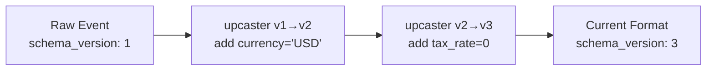

**Rules**:

- Upcasters are **pure functions**: `(payload, from_version) → payload`
- They run lazily at read time (no rewriting stored events)
- Each upcaster handles exactly one version increment
- Upcasters compose: `v1 → v2 → v3 → ... → current`
- Old events are NEVER mutated in storage

**Rust implementation**:

```rust
// upcasters.rs — Pure functions, no I/O, fully testable
// SOC: upcaster key is (domain, entity, action, version) — each segment independent.

/// Key: (domain, entity, action, from_version) → transform function
type Upcaster = fn(JsonValue) -> JsonValue;
type UpcasterKey = (String, String, String, i16); // (domain, entity, action, from_version)

pub struct UpcasterRegistry {
    registry: HashMap<UpcasterKey, Upcaster>,
}

impl UpcasterRegistry {
    pub fn register(
        &mut self, domain: &str, entity: &str, action: &str,
        from_version: i16, upcaster: Upcaster,
    ) {
        self.registry.insert(
            (domain.into(), entity.into(), action.into(), from_version),
            upcaster,
        );
    }

    /// Apply upcaster chain from stored version to current version.
    pub fn upcast(
        &self, domain: &str, entity: &str, action: &str,
        payload: JsonValue, from_version: i16, to_version: i16,
    ) -> Result<JsonValue> {
        let mut current = payload;
        for v in from_version..to_version {
            let key = (domain.into(), entity.into(), action.into(), v);
            let upcaster = self.registry
                .get(&key)
                .ok_or_else(|| DomainError::MissingUpcaster {
                    domain: domain.into(), entity: entity.into(),
                    action: action.into(), from: v, to: v + 1,
                })?;
            current = upcaster(current);
        }
        Ok(current)
    }
}

// Example upcasters — pure functions:
fn product_created_v1_to_v2(mut payload: JsonValue) -> JsonValue {
    payload["currency"] = json!("USD");
    payload
}

fn product_created_v2_to_v3(mut payload: JsonValue) -> JsonValue {
    payload["tax_rate"] = json!(0);
    payload
}
```

### Upcasting Strategies

| Strategy               | When Applied              | Storage Cost        | CPU Cost      | Data Safety        |
| ---------------------- | ------------------------- | ------------------- | ------------- | ------------------ |
| **Lazy (on-read)**     | Every stream load         | None                | Per-read      | Original preserved |
| **Lazy-with-cache**    | First read, then snapshot | Snapshot storage    | One-time      | Original preserved |
| **Eager (batch)**      | Background migration job  | Rewritten events    | One-time bulk | Risk if in-place   |
| **Copy-and-transform** | New stream created        | 2x during migration | One-time bulk | Original preserved |

**Default choice: Lazy** — combined with snapshots, the upcaster chain only processes events since last snapshot.

---

## 8. Aggregate Design (Pure Domain, Zero Dependencies)

### State Machine (Technology-Free)

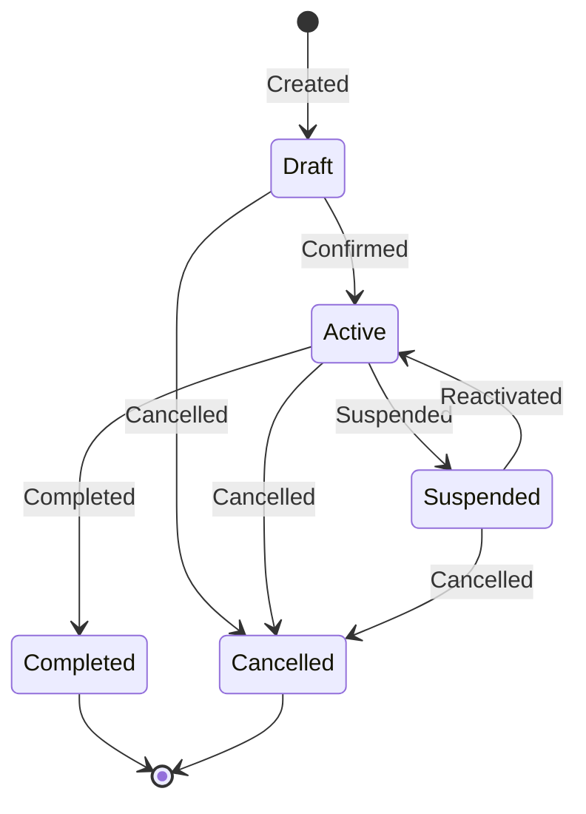

### Decider Pattern (Pure Functions)

The core aggregate logic is three pure functions — no async, no I/O, no framework:

```
Pseudocode (for readability):
  decide:        (command, state) → events     — business rule validation
  evolve:        (state, event)  → state       — pure state transition
  initial_state: ()              → state       — starting point
```

### Rust Implementation: Typestate Enforcement

```rust
// domain/aggregate.rs — Compile-time state machine via typestate pattern

// Marker types — zero-size, exist only for the type system
pub struct Draft;
pub struct Active;
pub struct Suspended;
pub struct Completed;
pub struct Cancelled;

// Aggregate parameterized by state marker
pub struct Order<S> {
    id: Uuid,
    tenant_id: Uuid,
    version: i32,
    data: serde_json::Value,
    _state: std::marker::PhantomData<S>,
}

// Only Draft orders can be confirmed — compile error otherwise
impl Order<Draft> {
    pub fn confirm(self) -> (Order<Active>, Vec<EventEnvelope>) {
        // Returns new typed state + events to append
    }
    pub fn cancel(self, reason: &str) -> (Order<Cancelled>, Vec<EventEnvelope>) { ... }
}

// Only Active orders can be suspended/completed/cancelled
impl Order<Active> {
    pub fn suspend(self, reason: &str) -> (Order<Suspended>, Vec<EventEnvelope>) { ... }
    pub fn complete(self) -> (Order<Completed>, Vec<EventEnvelope>) { ... }
    pub fn cancel(self, reason: &str) -> (Order<Cancelled>, Vec<EventEnvelope>) { ... }
}

// Only Suspended orders can be reactivated
impl Order<Suspended> {
    pub fn reactivate(self) -> (Order<Active>, Vec<EventEnvelope>) { ... }
    pub fn cancel(self, reason: &str) -> (Order<Cancelled>, Vec<EventEnvelope>) { ... }
}
```

> **Key advantage**: Invalid state transitions (e.g. confirming a cancelled order) are caught at **compile time**, not runtime.

---

## 9. Hexagonal Architecture (Complete Wiring)

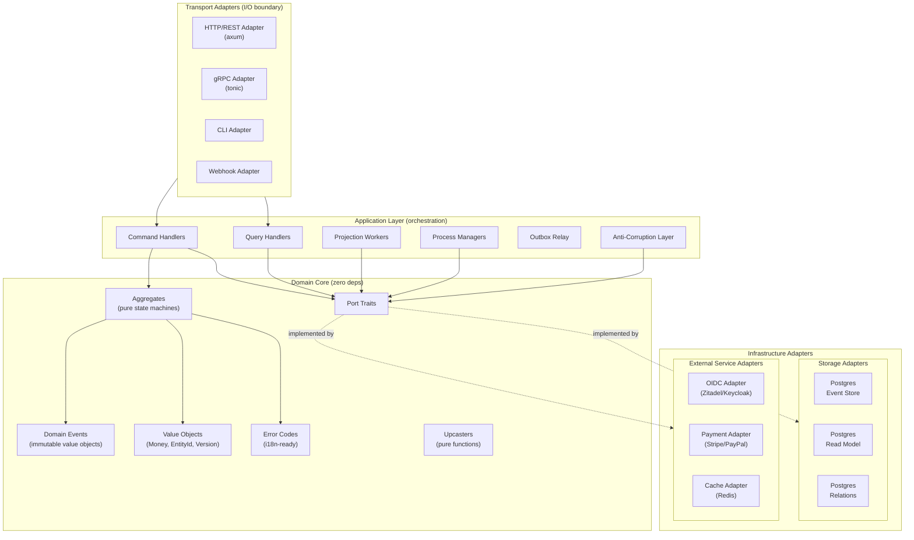

### Composition Root

```rust
// main.rs — The ONLY place that knows about concrete implementations.

#[tokio::main]
async fn main() {
    let config = Config::from_env();
    let pool = PgPool::connect(&config.database_url).await.unwrap();

    // Concrete adapters, injected as trait objects
    let event_store: Arc<dyn EventStore> = Arc::new(PgEventStore::new(pool.clone()));
    let read_model: Arc<dyn ReadModelStore> = Arc::new(PgReadModelStore::new(pool.clone()));
    let relations: Arc<dyn RelationStore> = Arc::new(PgRelationStore::new(pool.clone()));
    let identity: Arc<dyn IdentityProvider> = Arc::new(ZitadelAdapter::new(&config.oidc));
    let authz: Arc<dyn AuthorizationPolicy> = Arc::new(CerbosAdapter::new(&config.cerbos_url));
    let cache: Arc<dyn Cache> = Arc::new(RedisAdapter::new(&config.redis_url));
    let checkpoints: Arc<dyn CheckpointStore> = Arc::new(PgCheckpointStore::new(pool.clone()));

    // Application wiring — only trait objects, never concrete types
    let command_bus = CommandBus::new(event_store.clone(), identity.clone(), authz.clone());
    let query_bus = QueryBus::new(read_model.clone(), cache.clone(), authz.clone());

    // Start projection workers and HTTP server
    tokio::spawn(projection_worker(
        event_store.clone(), read_model.clone(), checkpoints.clone(),
    ));
    serve_http(command_bus, query_bus).await;
}
```

---

## 10. Storage Abstraction (How Postgres Details Hide Behind Ports)

The original design has extensive Postgres-specific SQL. Here's how each feature maps to the abstract port:

| Postgres-Specific Feature              | Abstract Port Capability                             | What the Adapter Hides                               |
| -------------------------------------- | ---------------------------------------------------- | ---------------------------------------------------- |
| `PL/pgSQL append_events()` function    | `EventStore::append()`                               | Atomic append with gapless position counter          |
| `UNIQUE(aggregate_id, version)`        | `EventStore::append()` returns `ConcurrencyConflict` | How concurrency is enforced                          |
| `JSONB` column + `GIN jsonb_path_ops`  | `ReadModelStore::query(filters)`                     | How document queries are indexed                     |
| `text_pattern_ops` index               | No longer needed — SOC columns use equality matches  | How prefix matching is optimized (eliminated by SOC) |
| `RLS` policies via `SET app.tenant_id` | `TenantIsolation::set_tenant_context()`              | How tenant data is isolated                          |
| `LISTEN/NOTIFY` trigger                | `EventNotifier::notify()` / `::subscribe()`          | How event availability is signaled                   |
| `global_position_counter` singleton    | `EventStore::append()` returns position              | How monotonic ordering is achieved                   |
| `BIGINT global_position`               | `StoredEvent.global_position: i64`                   | Storage type of the position                         |
| Table partitioning (hash/range)        | Transparent to port consumers                        | How data is physically organized                     |

### Adapter Example (Hidden from Domain)

```rust
// adapters/postgres/event_store.rs — Postgres-specific, implements EventStore trait

pub struct PgEventStore {
    pool: PgPool,
}

#[async_trait]
impl EventStore for PgEventStore {
    async fn append(
        &self, tenant_id: Uuid, stream_id: Uuid,
        stream_domain: &str, stream_entity: &str,
        expected_version: i32, events: &[EventEnvelope],
    ) -> Result<i32> {
        // Calls PL/pgSQL append_events() function internally.
        // Domain layer never sees this SQL.
        // SOC: domain and entity are separate columns in the DB.
        let events_json = serde_json::to_value(events)?;
        let new_version: i32 = sqlx::query_scalar(
            "SELECT append_events($1, $2, $3, $4, $5, $6)"
        )
        .bind(tenant_id).bind(stream_id).bind(stream_domain)
        .bind(stream_entity).bind(expected_version).bind(events_json)
        .fetch_one(&self.pool).await
        .map_err(|e| match e { /* map constraint violation to ConcurrencyConflict */ })?;
        Ok(new_version)
    }

    async fn poll_by_domain(
        &self, domain: &str, after_position: i64, limit: i32,
    ) -> Result<Vec<StoredEvent>> {
        // Equality match on stream_domain — no text_pattern_ops needed.
        let rows = sqlx::query_as::<_, StoredEventRow>(
            "SELECT * FROM events WHERE stream_domain = $1 AND global_position > $2
             ORDER BY global_position ASC LIMIT $3"
        )
        .bind(domain).bind(after_position).bind(limit)
        .fetch_all(&self.pool).await?;
        Ok(rows.into_iter().map(Into::into).collect())
    }

    async fn poll_by_entity(
        &self, domain: &str, entity: &str, after_position: i64, limit: i32,
    ) -> Result<Vec<StoredEvent>> {
        let rows = sqlx::query_as::<_, StoredEventRow>(
            "SELECT * FROM events WHERE stream_domain = $1 AND stream_entity = $2
             AND global_position > $3 ORDER BY global_position ASC LIMIT $4"
        )
        .bind(domain).bind(entity).bind(after_position).bind(limit)
        .fetch_all(&self.pool).await?;
        Ok(rows.into_iter().map(Into::into).collect())
    }
}
```

---

## 10.1 Storage Column Design — Separation of Concerns

### The Problem with Composite Type Strings

Storing `event_type = "commerce.product.created"` as a single string conflates three independent concerns:

1. **Domain** — which bounded context owns this event
2. **Entity** — which aggregate type produced it
3. **Action** — what happened

If "commerce" is renamed to "shop", every row in the event store must be rewritten — or the code must maintain a growing list of aliases. The same applies if an entity is renamed (`product` → `listing`). This violates SOC: one rename forces changes across unrelated responsibilities.

### Industry Approaches Compared

| System                    | Stream/Category Naming         | Type Columns                                | Rename Strategy                                                          |
| ------------------------- | ------------------------------ | ------------------------------------------- | ------------------------------------------------------------------------ |
| **Marten**                | `stream_id` (string)           | `type` (alias) + `mt_dotnet_type` (CLR FQN) | `Events.MapEventType<T>("alias")` — decouples stored name from code type |
| **Eventide / Message DB** | `{category}-{id}` stream       | Type embedded in message body               | `category` parsed from stream_id via `get_category()` function           |
| **EventStoreDB**          | `{type}-{id}` stream           | `eventType` on each event                   | Event migration: emit to new streams. No in-place rename                 |
| **SoftwareMill**          | `stream_id` only               | None — type lives inside JSON payload       | No rename problem (payload is opaque)                                    |
| **Kspeakman (Postgres)**  | Stream table has `Type` column | Event table has separate `Type` column      | Stream type ≠ event type — explicitly separated                          |
| **Axon Framework**        | Aggregate type + identifier    | `payloadType` on events                     | `EventUpcaster` chain transforms types during deserialization            |

### Key Insight: Stream Type ≠ Event Type

Kspeakman's design makes this explicit: the **stream** (aggregate) has a type ("Order"), and each **event** in that stream has its own type ("OrderPlaced", "OrderShipped"). These are different concepts with different lifecycles:

- Stream type changes when you restructure aggregates (rare)
- Event type changes when you rename domain actions (never — events are immutable facts)
- Domain changes when you reorganize bounded contexts (very rare)

### SOC Column Design (Recommended)

Split the composite namespace into **independent, single-responsibility columns**:

```
EVENT TABLE (abstract schema)
─────────────────────────────────────────────────────
Column              Responsibility          Example Value
─────────────────────────────────────────────────────
id                  Identity                uuid
global_position     Ordering                8042
tenant_id           Isolation               uuid

stream_domain       Bounded context owner   "commerce"
stream_entity       Aggregate type          "product"
stream_id           Aggregate instance      uuid
stream_version      Optimistic concurrency  3

event_action        What happened           "created"
event_version       Payload schema version  2
payload             Business data           { ... }
metadata            Operational baggage     { ... }

correlation_id      Request tracing         uuid | null
causation_id        Causal chain            uuid | null
user_id             Actor                   uuid | null
created_at          Audit timestamp         utc datetime
─────────────────────────────────────────────────────
```

**Why this works**:

| SOC Benefit                  | How                                                                    |
| ---------------------------- | ---------------------------------------------------------------------- |
| **Rename domain**            | Update `stream_domain` column via type map — no payload changes        |
| **Rename entity**            | Update `stream_entity` via type map — events and actions unchanged     |
| **Rename action**            | Never needed — events are immutable historical facts                   |
| **Projection routing**       | `WHERE stream_domain = 'commerce'` — no prefix parsing                 |
| **Cross-entity queries**     | `WHERE stream_entity = 'product'` — no string splitting                |
| **Index efficiency**         | Equality on short columns instead of `LIKE 'commerce.%'`               |
| **Composite reconstruction** | `format!("{}.{}.{}", domain, entity, action)` when needed at app layer |

### Type Alias Registry (Rename Safety)

Events are immutable facts — you never rewrite them. But code types evolve. A **type alias registry** provides indirection between stored identifiers and runtime types:

```rust
// ─── Type Mapping Port ──────────────────────────────────────────

/// Resolves stored type identifiers ↔ runtime type names.
/// Handles renames without rewriting event history.
#[async_trait]
pub trait TypeRegistry: Send + Sync {
    /// Given a stored (domain, entity, action), resolve to current runtime type name.
    /// Returns None if no alias mapping exists (identity mapping assumed).
    fn resolve_event_type(
        &self,
        stored_domain: &str,
        stored_entity: &str,
        stored_action: &str,
    ) -> Option<ResolvedType>;

    /// Given a stored (domain, entity), resolve to current aggregate type name.
    fn resolve_aggregate_type(
        &self,
        stored_domain: &str,
        stored_entity: &str,
    ) -> Option<ResolvedAggregate>;

    /// Register an alias: old stored name → current runtime name.
    fn register_event_alias(
        &mut self,
        old_domain: &str, old_entity: &str, old_action: &str,
        new_domain: &str, new_entity: &str, new_action: &str,
    );

    fn register_domain_alias(&mut self, old_domain: &str, new_domain: &str);
    fn register_entity_alias(&mut self, old_domain: &str, old_entity: &str, new_entity: &str);
}

pub struct ResolvedType {
    pub domain: String,
    pub entity: String,
    pub action: String,
}

pub struct ResolvedAggregate {
    pub domain: String,
    pub entity: String,
}
```

```rust
// ─── In-Memory Implementation (composition root) ───────────────

pub struct InMemoryTypeRegistry {
    domain_aliases: HashMap<String, String>,                       // "commerce" → "shop"
    entity_aliases: HashMap<(String, String), String>,             // ("commerce","product") → "listing"
    event_aliases: HashMap<(String, String, String), (String, String, String)>,
}

impl InMemoryTypeRegistry {
    pub fn new() -> Self {
        let mut reg = Self::default();
        // Register historical renames:
        reg.register_domain_alias("commerce", "shop");
        reg.register_entity_alias("shop", "product", "listing");
        reg
    }
}
```

**How rename flows work**:

```
1. Domain "commerce" renamed to "shop"
   ─────────────────────────────────────
   Old events:  stream_domain="commerce", stream_entity="product", event_action="created"
   TypeRegistry: resolve("commerce", "product", "created") → ("shop", "listing", "created")

   New events:  stream_domain="shop", stream_entity="listing", event_action="created"
   TypeRegistry: resolve("shop", "listing", "created") → identity (no alias)

   Projection query: uses TypeRegistry to accept BOTH old and new names.
   No event rewriting. No migration. Zero downtime.

2. Projection workers use resolved types for routing:
   ─────────────────────────────────────
   Worker subscribes to domain="shop"
   → TypeRegistry tells it to ALSO poll domain="commerce" (old alias)
   → Both old and new events are processed correctly
```

### Updated StoredEvent and EventEnvelope

With SOC columns, the Rust value objects become:

```rust
pub struct EventEnvelope {
    pub event_action: String,         // "created" (just the action, not fully qualified)
    pub schema_version: i16,
    pub payload: JsonValue,
    pub metadata: JsonValue,
    pub correlation_id: Option<Uuid>,
    pub causation_id: Option<Uuid>,
    pub user_id: Option<Uuid>,
}

pub struct StoredEvent {
    pub id: Uuid,
    pub global_position: i64,
    pub tenant_id: Uuid,
    pub stream_domain: String,        // "commerce"
    pub stream_entity: String,        // "product"
    pub stream_id: Uuid,              // aggregate instance
    pub stream_version: i32,
    pub event_action: String,         // "created"
    pub event_version: i16,           // schema version for upcaster dispatch
    pub payload: JsonValue,
    pub metadata: JsonValue,
    pub correlation_id: Option<Uuid>,
    pub causation_id: Option<Uuid>,
    pub user_id: Option<Uuid>,
    pub created_at: DateTime<Utc>,
}

impl StoredEvent {
    /// Reconstruct the fully-qualified event type for display/logging.
    pub fn qualified_event_type(&self) -> String {
        format!("{}.{}.{}", self.stream_domain, self.stream_entity, self.event_action)
    }

    /// Reconstruct the aggregate type.
    pub fn qualified_aggregate_type(&self) -> String {
        format!("{}.{}", self.stream_domain, self.stream_entity)
    }
}
```

### Updated EventStore Trait (SOC-Aware)

```rust
#[async_trait]
pub trait EventStore: Send + Sync {
    async fn append(
        &self,
        tenant_id: Uuid,
        stream_id: Uuid,
        stream_domain: &str,
        stream_entity: &str,
        expected_version: i32,
        events: &[EventEnvelope],
    ) -> Result<i32>;

    async fn load_stream(
        &self, tenant_id: Uuid, stream_id: Uuid,
    ) -> Result<Vec<StoredEvent>>;

    async fn load_stream_from(
        &self, tenant_id: Uuid, stream_id: Uuid, from_version: i32,
    ) -> Result<Vec<StoredEvent>>;

    /// Poll all events across all domains (global subscription).
    async fn poll_global(
        &self, after_position: i64, limit: i32,
    ) -> Result<Vec<StoredEvent>>;

    /// Poll by bounded context — equality match, no prefix parsing.
    async fn poll_by_domain(
        &self, domain: &str, after_position: i64, limit: i32,
    ) -> Result<Vec<StoredEvent>>;

    /// Poll by entity type within a domain.
    async fn poll_by_entity(
        &self, domain: &str, entity: &str, after_position: i64, limit: i32,
    ) -> Result<Vec<StoredEvent>>;

    /// Poll by specific event action across all entities.
    async fn poll_by_action(
        &self, action: &str, after_position: i64, limit: i32,
    ) -> Result<Vec<StoredEvent>>;
}
```

### Indexing Strategy (Adapter Concern)

The SOC column design enables efficient indexes without `text_pattern_ops` hacks:

```
Adapter-level indexes (hidden behind EventStore trait):
─────────────────────────────────────────────────────
(tenant_id, stream_id, stream_version)  — unique, concurrency control
(tenant_id, stream_domain, global_position)  — domain subscription polling
(tenant_id, stream_domain, stream_entity, global_position)  — entity-level polling
(global_position)  — global catch-up subscription
```

Equality matches on short string columns (`stream_domain = 'commerce'`) outperform prefix matching (`aggregate_type LIKE 'commerce.%'`) on every storage engine.

---

## 11. Production Readiness (Abstract Patterns)

### 11.1 GDPR Compliance: Crypto-Shredding

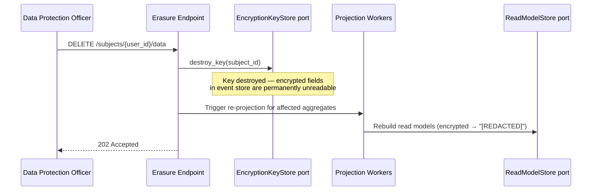

The `EncryptionKeyStore` trait abstracts over where keys are stored (Postgres, Vault, HSM, KMS). The domain only knows: create keys, get keys, destroy keys.

### 11.2 Dead Letter Queue (Abstract Flow)

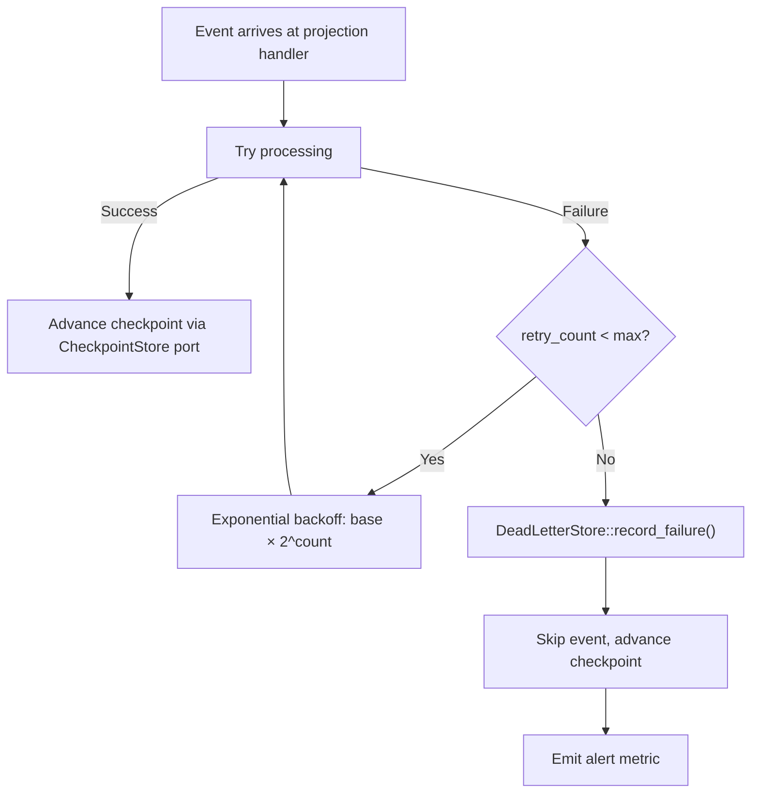

### 11.3 Process Manager / Saga

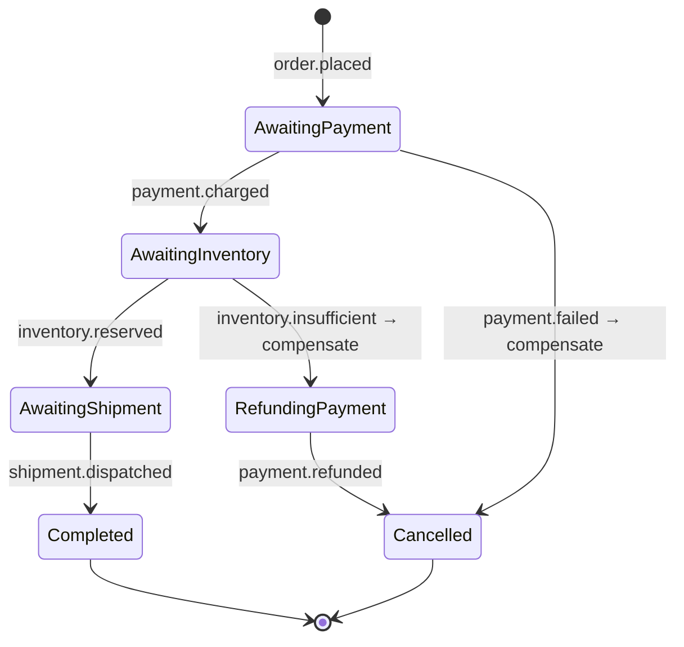

Coordination uses `ProcessManagerStore` trait. The trait abstracts whether process state lives in Postgres, DynamoDB, or Redis.

### 11.4 Domain vs Integration Events

| Aspect           | Domain Event                          | Integration Event                          |
| ---------------- | ------------------------------------- | ------------------------------------------ |
| Scope            | Within bounded context                | Crosses boundaries                         |
| Storage          | EventStore trait (immutable, forever) | OutboxPublisher trait (ephemeral, relayed) |
| Schema ownership | Internal, can change freely           | Public contract, must be versioned         |
| Payload          | Rich, includes internal IDs           | Lean, public-facing identifiers only       |

The `OutboxPublisher` trait + Anti-Corruption Layer pattern abstracts the boundary between internal and external events.

### 11.5 Polyglot Worker Architecture (Language-Agnostic Consumers)

The Rust core owns the event store, command handling, and domain logic. But **workers** — projection builders, process managers, analytics pipelines, notification dispatchers — can be written in **any language**. This section defines the decoupling contracts that make this possible.

#### Design Principle: Rust Core, Polyglot Edge

```
┌──────────────────────────────────────────────────────────────┐
│                    RUST CORE (event-core)                     │
│  EventStore · Aggregates · Command Handlers · Outbox Relay   │
└──────────────┬──────────────────────────┬────────────────────┘
               │                          │
        ┌──────▼───────┐          ┌───────▼────────┐
        │ gRPC Event   │          │ Message Broker  │
        │ Subscription │          │ (Kafka / NATS)  │
        │ API (Proto)  │          │ via Outbox Relay│
        └──────┬───────┘          └───────┬────────┘
               │                          │
    ┌──────────┼──────────┐    ┌──────────┼──────────┐
    │          │          │    │          │          │
  Rust      Python      Go  Python    Node.js    Java
 worker    worker    worker  worker    worker   worker
```

**Two consumption paths** for polyglot workers:

| Path                            | Protocol                       | Best For                                      | Checkpoint                                | Ordering                 |
| ------------------------------- | ------------------------------ | --------------------------------------------- | ----------------------------------------- | ------------------------ |
| **gRPC Subscription API**       | gRPC server streaming (HTTP/2) | Low-latency, direct event store access        | Client-managed (CheckpointStore via gRPC) | Per-stream guaranteed    |
| **Message Broker** (Kafka/NATS) | Broker protocol                | High-throughput, competing consumers, fan-out | Server-managed (consumer groups)          | Per-partition guaranteed |

#### Path 1: gRPC Event Subscription API

The Rust core exposes a **gRPC streaming API** that any language can subscribe to. This is the direct path — workers talk to the event store without an intermediate broker.

**Protocol Buffer contract** (shared across all languages):

```protobuf
syntax = "proto3";
package eventcore.v1;

import "google/protobuf/timestamp.proto";
import "google/protobuf/struct.proto";

// ─── Event Subscription Service ──────────────────────────────

service EventSubscription {
    // Server streaming: subscribe to events after a position.
    // Client sends one request, server streams events indefinitely.
    rpc SubscribeByDomain (SubscribeRequest) returns (stream EventMessage) {}
    rpc SubscribeByEntity (SubscribeByEntityRequest) returns (stream EventMessage) {}
    rpc SubscribeGlobal (SubscribeGlobalRequest) returns (stream EventMessage) {}

    // Checkpoint management (client-managed for exactly-once)
    rpc GetCheckpoint (CheckpointRequest) returns (CheckpointResponse) {}
    rpc SaveCheckpoint (SaveCheckpointRequest) returns (SaveCheckpointResponse) {}
}

// ─── Messages ────────────────────────────────────────────────

message SubscribeRequest {
    string domain = 1;              // "commerce"
    int64 after_position = 2;       // resume from checkpoint
    int32 batch_size = 3;           // max events per batch
}

message SubscribeByEntityRequest {
    string domain = 1;
    string entity = 2;             // "product"
    int64 after_position = 3;
    int32 batch_size = 4;
}

message SubscribeGlobalRequest {
    int64 after_position = 1;
    int32 batch_size = 2;
}

message EventMessage {
    string id = 1;                  // UUIDv7
    int64 global_position = 2;
    string tenant_id = 3;           // UUIDv7
    string stream_domain = 4;       // "commerce"
    string stream_entity = 5;       // "product"
    string stream_id = 6;           // UUIDv7 aggregate instance
    int32 stream_version = 7;
    string event_action = 8;        // "created"
    int32 event_version = 9;        // schema version
    google.protobuf.Struct payload = 10;
    google.protobuf.Struct metadata = 11;
    optional string correlation_id = 12;
    optional string causation_id = 13;
    optional string user_id = 14;
    google.protobuf.Timestamp created_at = 15;
}

message CheckpointRequest {
    string consumer_name = 1;       // "analytics-projection"
}

message CheckpointResponse {
    int64 position = 1;
}

message SaveCheckpointRequest {
    string consumer_name = 1;
    int64 position = 2;
}

message SaveCheckpointResponse {}
```

**Python worker example** (consuming via gRPC):

```python
# workers/analytics_projection.py
import grpc
from eventcore.v1 import event_subscription_pb2 as pb
from eventcore.v1 import event_subscription_pb2_grpc as rpc

channel = grpc.insecure_channel("event-core:50051")
stub = rpc.EventSubscriptionStub(channel)

# Resume from last checkpoint
checkpoint = stub.GetCheckpoint(pb.CheckpointRequest(consumer_name="analytics"))

# Subscribe — server streams events indefinitely
for event in stub.SubscribeByDomain(pb.SubscribeRequest(
    domain="commerce",
    after_position=checkpoint.position,
    batch_size=100,
)):
    process_event(event)  # Python-native analytics logic
    stub.SaveCheckpoint(pb.SaveCheckpointRequest(
        consumer_name="analytics",
        position=event.global_position,
    ))
```

**Why gRPC server streaming**:

| Benefit                  | How                                                                       |
| ------------------------ | ------------------------------------------------------------------------- |
| **Polyglot**             | `protoc` generates clients for Rust, Python, Go, Java, Node.js, C++, etc. |
| **Type-safe**            | Proto schema enforces field types across all languages                    |
| **HTTP/2 multiplexing**  | Hundreds of concurrent subscriptions on one connection                    |
| **Backpressure**         | gRPC flow control prevents overwhelming slow consumers                    |
| **Long-lived**           | Server streaming naturally models event subscriptions                     |
| **No broker dependency** | Direct event store access — fewer moving parts                            |

#### Path 2: Message Broker (Kafka / NATS) via Outbox Relay

For high-throughput fan-out, competing consumers, and full language decoupling, the Rust core relays events to a **message broker** via the Outbox pattern.

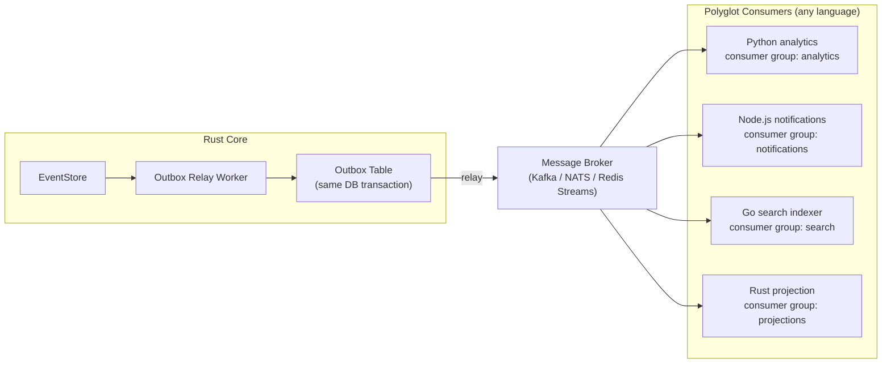

**Outbox Relay port** (updated for broker integration):

```rust
// ─── Port: Event Relay ──────────────────────────────────────────
// Relays domain events to external message brokers for polyglot consumption.
// Adapters: KafkaRelayAdapter, NatsRelayAdapter, RedisStreamsRelayAdapter
//
// The relay reads from the outbox table (written in same transaction as
// event append) and publishes to the broker. Idempotent: same event ID
// published twice produces one message (broker deduplication).

#[async_trait]
pub trait EventRelay: Send + Sync {
    /// Relay pending outbox events to the broker. Returns count relayed.
    async fn relay_pending(&self, limit: i32) -> Result<i32>;

    /// Health check — is the broker reachable?
    async fn health(&self) -> Result<()>;
}
```

**Broker selection**:

| Broker             | Best For                                        | Consumer Groups         | Ordering      | Ops Complexity         |
| ------------------ | ----------------------------------------------- | ----------------------- | ------------- | ---------------------- |
| **Kafka**          | High throughput, enterprise scale, audit trails | Yes (partition-based)   | Per-partition | High (ZooKeeper/KRaft) |
| **NATS JetStream** | Cloud-native, low latency, simpler ops          | Yes (durable consumers) | Per-subject   | Low                    |
| **Redis Streams**  | Low volume, already using Redis for cache       | Yes (XREADGROUP)        | Per-stream    | Lowest                 |

#### Serialization Strategy (Cross-Language Contract)

Events crossing the Rust core boundary must be serialized in a **language-neutral format**. Two layers:

```
┌─────────────────────────────────────────────┐
│ CloudEvents Envelope (CNCF Standard)        │
│ ─────────────────────────────────────────── │
│ id: "019532a0-b73c-7def..."  (UUIDv7)      │
│ source: "event-core/commerce/product"       │
│ type: "commerce.product.created"            │
│ datacontenttype: "application/protobuf"     │
│ dataschema: "buf.build/myorg/events/v2"     │
│ subject: "019532a0-..."  (aggregate ID)     │
│ time: "2026-03-12T14:30:45.123Z"            │
│ ─────────────────────────────────────────── │
│ data: <serialized payload>                  │
└─────────────────────────────────────────────┘
```

| Layer        | Format                                     | Purpose                                                                               |
| ------------ | ------------------------------------------ | ------------------------------------------------------------------------------------- |
| **Envelope** | CloudEvents (CNCF, graduated 2024)         | Language-agnostic metadata. Consumers can route/filter without deserializing payload. |
| **Payload**  | Protobuf (primary) or JSON (compatibility) | Typed, versioned, code-generated in all languages via `protoc` / Buf.                 |

**Why CloudEvents**:

- CNCF graduated project — production-proven across AWS EventBridge, Google Eventarc, Azure Event Grid.
- SDKs in 9 languages (Rust, Python, Go, Java, Node.js, C#, Ruby, PHP, etc.).
- Context attributes can be inspected **without deserializing** the payload — enables broker-level routing.
- `dataschema` field points to the Schema Registry version — consumers know how to deserialize.

**Why Protobuf for payloads**:

- Code generation in all major languages via `protoc`.
- Field IDs enforce schema evolution (add field = safe, remove field = safe if ID preserved).
- Binary format: 3-10x smaller than JSON, faster to parse.
- Combined with Buf Schema Registry for breaking change detection.

#### Schema Registry (Cross-Language Contract Enforcement)

```
┌────────────────────────────────────────────────────────┐
│ Schema Registry (Buf / Confluent)                      │
│ ──────────────────────────────────────────────────────  │
│ commerce.product.created.v1.proto                      │
│ commerce.product.created.v2.proto  ← backward compat  │
│ commerce.order.placed.v1.proto                         │
│ billing.invoice.paid.v1.proto                          │
│ ──────────────────────────────────────────────────────  │
│ Compatibility: BACKWARD (new consumers read old data)  │
│ Breaking change detection: automatic on push           │
└──────────────────┬─────────────────────────────────────┘
                   │
    ┌──────────────┼──────────────┐
    │              │              │
  Rust           Python         Go
  (producer)    (consumer)    (consumer)
  generated     generated     generated
  code          code          code
```

**Compatibility modes**:

| Mode         | Rule                              | Use When                                              |
| ------------ | --------------------------------- | ----------------------------------------------------- |
| **Backward** | New consumers can read old events | Default — consumers upgrade before producers          |
| **Forward**  | Old consumers can read new events | Producers upgrade before consumers                    |
| **Full**     | Both directions work              | Tight coupling between producer and consumer releases |

#### Event Contract Documentation (AsyncAPI)

Every event contract is documented in AsyncAPI format, enabling any team in any language to discover and implement a consumer:

```yaml
# asyncapi/commerce-events.yaml
asyncapi: 3.0.0
info:
  title: Commerce Domain Events
  version: 1.0.0
  description: Events produced by the commerce bounded context

channels:
  commerce.product.created:
    address: commerce.product.created
    messages:
      ProductCreated:
        contentType: application/protobuf
        schemaFormat: protobuf
        payload:
          $ref: "buf.build/myorg/events#commerce.product.created.v2"
        headers:
          type: object
          properties:
            ce_type: { type: string, const: "commerce.product.created" }
            ce_source: { type: string }
            ce_id: { type: string, format: uuid }
            ce_time: { type: string, format: date-time }

  commerce.order.placed:
    address: commerce.order.placed
    messages:
      OrderPlaced:
        contentType: application/protobuf
        payload:
          $ref: "buf.build/myorg/events#commerce.order.placed.v1"

operations:
  onProductCreated:
    action: receive
    channel:
      $ref: "#/channels/commerce.product.created"
    summary: Fired when a new product is created
```

#### Checkpoint Management for Polyglot Workers

Two models, matching the two consumption paths:

| Model                            | Protocol                             | Who Manages State                       | Exactly-Once                          | Best For                       |
| -------------------------------- | ------------------------------------ | --------------------------------------- | ------------------------------------- | ------------------------------ |
| **Client-managed** (gRPC path)   | `CheckpointStore` via gRPC           | Worker saves position after processing  | Yes (same-transaction checkpoint)     | Single consumer per projection |
| **Server-managed** (broker path) | Kafka consumer groups / NATS durable | Broker tracks offset per consumer group | At-least-once (idempotent processing) | Competing consumers, fan-out   |

**Client-managed (gRPC)** — worker controls exactly when to commit:

```go
// Go worker — exact same gRPC contract as Python example above
stream, _ := client.SubscribeByDomain(ctx, &pb.SubscribeRequest{
    Domain: "commerce", AfterPosition: lastCheckpoint, BatchSize: 100,
})
for {
    event, err := stream.Recv()
    if err != nil { break }
    processEvent(event)
    client.SaveCheckpoint(ctx, &pb.SaveCheckpointRequest{
        ConsumerName: "go-search-indexer",
        Position: event.GlobalPosition,
    })
}
```

**Server-managed (Kafka)** — broker tracks offsets automatically:

```python
# Python worker — Kafka consumer group handles checkpoints
consumer = Consumer({'bootstrap.servers': 'kafka:9092', 'group.id': 'analytics'})
consumer.subscribe(['commerce.product.created', 'commerce.order.placed'])

while True:
    msg = consumer.poll(1.0)
    if msg is None: continue
    event = CloudEvent.from_kafka(msg)
    process(event)
    consumer.commit()  # Kafka tracks offset for this consumer group
```

#### Dead Letter Handling for Polyglot Workers

Each consumer owns its own DLQ. A Python worker's poison event is its problem — other consumers are unaffected.

```
Topic: commerce.product.created
  ├─> analytics-service (Python) → DLQ: commerce.product.created.analytics.dlq
  ├─> search-indexer (Go) → DLQ: commerce.product.created.search.dlq
  └─> notifications (Node.js) → DLQ: commerce.product.created.notifications.dlq
```

**DLQ message enrichment** (language-agnostic):

```protobuf
message DeadLetterMessage {
    EventMessage original_event = 1;
    string consumer_name = 2;
    string error_message = 3;
    string error_stack = 4;         // language-native stack trace
    int32 retry_count = 5;
    google.protobuf.Timestamp failed_at = 6;
}
```

**Replay mechanism**: Admin tool moves messages from DLQ back to main topic after the bug is fixed. The worker re-processes them like any new event.

#### Internal vs External Workers (Boundary Summary)

```
┌─────────────────────────────────────────────────────────────────┐
│ INTERNAL (Rust, in-process)                                     │
│ ─────────────────────────────────────────────────────────────── │
│ • Uses Rust port traits directly (Arc<dyn EventStore>)          │
│ • Same binary as the core — deployed together                   │
│ • Checkpoint via CheckpointStore trait (in-process)              │
│ • Example: primary read model projections, inline projections   │
│ • Advantage: lowest latency, strongest consistency              │
├─────────────────────────────────────────────────────────────────┤
│ EXTERNAL (any language, out-of-process)                         │
│ ─────────────────────────────────────────────────────────────── │
│ • Uses gRPC Subscription API or Message Broker                  │
│ • Separate binary/container — deployed independently            │
│ • Checkpoint via gRPC or broker consumer groups                  │
│ • Example: analytics, search indexing, notifications, ML        │
│ • Advantage: language freedom, independent scaling/deployment    │
├─────────────────────────────────────────────────────────────────┤
│ DECISION RULE                                                   │
│ ─────────────────────────────────────────────────────────────── │
│ Use INTERNAL when: projection is critical path, needs strong    │
│   consistency, or latency < 10ms matters.                       │
│ Use EXTERNAL when: team uses a different language, worker needs │
│   independent scaling, or eventual consistency is acceptable.   │
└─────────────────────────────────────────────────────────────────┘
```

### 11.6 Event Notification (Abstract)

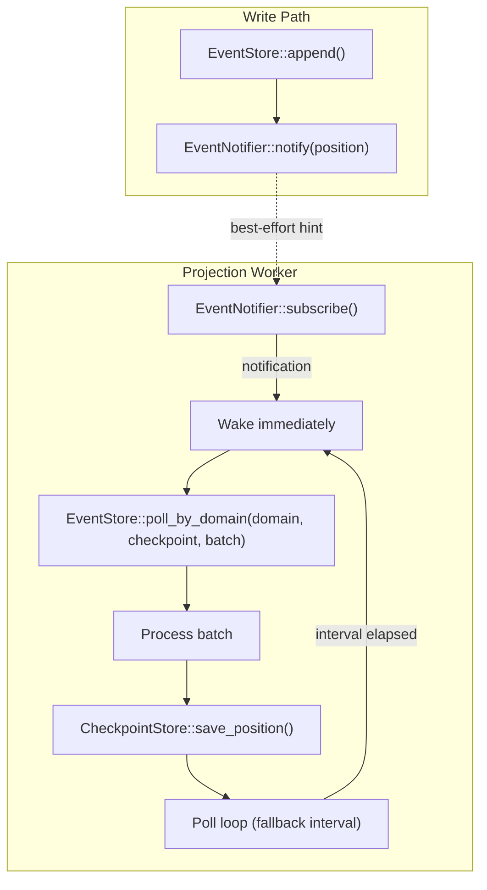

**Critical**: `EventNotifier` is a **hint-only optimization**. The projection worker MUST poll regardless. A `NoOpEventNotifier` that does nothing is a valid adapter — the system degrades to polling-only with slightly higher latency.

---

## 12. Deployment Architecture (Abstract)

### Small Scale

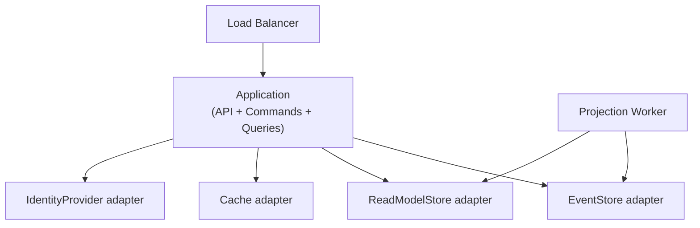

### Production Scale (Polyglot)

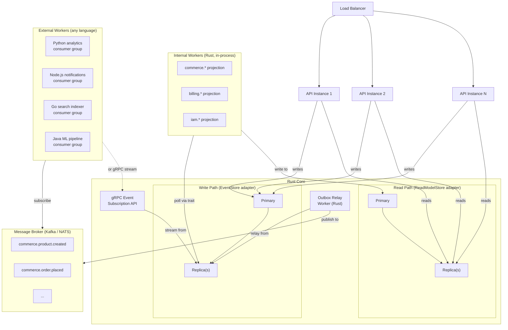

---

## 13. Failure Model

```mermaid
flowchart TD
    subgraph Failures["Failure Scenarios"]
        F1["ReadModelStore adapter crashes"]
        F2["Cache adapter crashes"]
        F3["Projection worker crashes"]
        F4["EventStore adapter crashes"]
        F5["Poison event in stream"]
        F6["OutboxPublisher relay crashes"]
        F7["Process manager stuck"]
        F8["Encryption key lost"]
        F9["External worker crashes"]
        F10["Message broker down"]
        F11["gRPC subscription disconnects"]
    end

    F1 -->|"Recovery"| R1["Rebuild projections\nfrom EventStore"]
    F2 -->|"Recovery"| R2["Warm cache from\nReadModelStore"]
    F3 -->|"Recovery"| R3["Restart from last\nCheckpointStore position"]
    F4 -->|"CRITICAL"| R4["System unavailable\nonly irrecoverable dependency"]
    F5 -->|"Recovery"| R5["DeadLetterStore:\nskip + alert + retry after fix"]
    F6 -->|"Recovery"| R6["Restart relay:\nresumes from last published marker"]
    F7 -->|"Recovery"| R7["ProcessManagerStore timeout scan:\nalert + manual compensation"]
    F8 -->|"CRITICAL"| R8["Affected subject's PII\npermanently unreadable"]
    F9 -->|"Recovery"| R9["Restart: resumes from\nbroker consumer group offset\nor gRPC checkpoint"]
    F10 -->|"Recovery"| R10["Outbox relay pauses.\nEvents buffer in outbox table.\nRelay resumes when broker recovers."]
    F11 -->|"Recovery"| R11["gRPC client reconnects\nwith last checkpoint.\nMissed events replayed\nfrom stored position."]

    style F4 fill:#ff6b6b
    style R4 fill:#ff6b6b
    style F8 fill:#ff6b6b
    style R8 fill:#ff6b6b
```

---

## 14. Complexity Analysis

| Operation                      | Data Structure (Abstract)                | Time Complexity | Notes                       |
| ------------------------------ | ---------------------------------------- | --------------- | --------------------------- |
| Append event                   | Ordered index on (aggregate_id, version) | O(log n)        | n = events in stream        |
| Load aggregate stream          | Ordered index scan                       | O(log n + k)    | k = events to read          |
| Load from snapshot             | Point lookup + stream scan               | O(1) + O(k')    | k' = events since snapshot  |
| Rebuild projection             | Full sequential scan + upsert            | O(N)            | N = total events            |
| Query read model               | Document index                           | O(log n + k)    | k = result set              |
| Document field lookup          | Inverted index                           | O(log n)        | adapter-specific index type |
| Optimistic concurrency check   | Uniqueness constraint check              | O(log n)        | n = events per aggregate    |
| Relation forward/reverse query | Ordered index scan                       | O(log n + k)    | k = result set              |

---

## 15. Testing Strategy (Enabled by Abstractions)

### Given/When/Then with In-Memory Adapters

```rust
#[tokio::test]
async fn test_create_order() {
    // GIVEN: empty event store (in-memory, same trait as production)
    let es: Arc<dyn EventStore> = Arc::new(InMemoryEventStore::new());

    // WHEN: create order command
    let handler = CreateOrderHandler::new(es.clone());
    let result = handler.execute(CreateOrder {
        tenant_id: TENANT, customer_ref: "cust-1".into(), items: vec![...],
    }).await.unwrap();

    // THEN: order.created event was appended
    let events = es.load_stream(TENANT, result.aggregate_id).await.unwrap();
    assert_eq!(events.len(), 1);
    assert_eq!(events[0].stream_domain, "commerce");
    assert_eq!(events[0].stream_entity, "order");
    assert_eq!(events[0].event_action, "created");
}

#[tokio::test]
async fn test_cannot_confirm_cancelled_order() {
    // GIVEN: order was created then cancelled
    let es: Arc<dyn EventStore> = Arc::new(InMemoryEventStore::new());
    // ... setup events ...

    // WHEN: try to confirm → THEN: rejected
    let handler = ConfirmOrderHandler::new(es.clone());
    let err = handler.execute(ConfirmOrder {
        tenant_id: TENANT, order_id: ORDER_ID,
    }).await.unwrap_err();
    assert!(matches!(err, DomainError::InvalidStateTransition { .. }));
}
```

### Test Pyramid

| Layer           | What                                      | Adapter Used                | Speed        | Count              |
| --------------- | ----------------------------------------- | --------------------------- | ------------ | ------------------ |
| **Unit**        | Aggregate decide/evolve, upcasters        | None (pure functions)       | Milliseconds | Many               |
| **Integration** | Command/query handlers                    | In-memory adapters          | Milliseconds | Moderate           |
| **Contract**    | Port compliance, event schema validation  | Both in-memory and Postgres | Seconds      | Per port           |
| **E2E**         | Full command → event → projection → query | Production adapters         | Seconds      | Few critical paths |

### Port Compliance Tests

```rust
// tests/event_store_compliance.rs
// Run these tests against EVERY EventStore implementation.
// Guarantees adapter correctness regardless of technology.

#[async_trait]
trait EventStoreTests {
    async fn make_store(&self) -> Arc<dyn EventStore>;
}

async fn test_append_and_load_roundtrip(store: Arc<dyn EventStore>) {
    // Events appended must be loadable in order
    let version = store.append(TENANT, AGG_ID, "commerce", "commerce.order", 0, &events).await.unwrap();
    let loaded = store.load_stream(TENANT, AGG_ID).await.unwrap();
    assert_eq!(loaded.len(), events.len());
    assert_eq!(version, events.len() as i32);
}

async fn test_optimistic_concurrency_conflict(store: Arc<dyn EventStore>) {
    // Second append with same expected_version must fail
    store.append(TENANT, AGG_ID, "commerce", "commerce.order", 0, &events).await.unwrap();
    let err = store.append(TENANT, AGG_ID, "commerce", "commerce.order", 0, &events).await.unwrap_err();
    assert!(matches!(err, DomainError::ConcurrencyConflict { .. }));
}

async fn test_global_position_is_monotonic(store: Arc<dyn EventStore>) {
    // Positions must be gapless and strictly increasing
    // ...
}

// Run against both implementations:
#[tokio::test] async fn in_memory_roundtrip() { test_append_and_load_roundtrip(InMemoryEventStore::new()).await; }
#[tokio::test] async fn postgres_roundtrip() { test_append_and_load_roundtrip(PgEventStore::new(pg_pool()).await).await; }
```

---

## 16. Implementation Order

```
Phase 1: Domain Core (zero dependencies)
═══════════════════════════════════════════
1. Value objects: TenantId, AggregateId, EventId, Version, Money, etc.
2. Port traits: EventStore, ReadModelStore, RelationStore, etc.
3. Event types: namespaced type validation
4. Aggregate base: decide/evolve pattern + typestate
5. Upcaster framework: pure function pipeline
6. Error code registry: i18n-ready error catalog

Phase 2: In-Memory Adapters + Tests
═══════════════════════════════════════════
7. InMemoryEventStore + compliance tests
8. InMemoryReadModelStore + compliance tests
9. InMemoryRelationStore + compliance tests
10. Fake adapters for auth, payments, cache
11. First aggregate implementation with Given/When/Then tests

Phase 3: Production Adapters
═══════════════════════════════════════════
12. PgEventStore (PL/pgSQL, gapless counter, concurrency)
13. PgReadModelStore (JSONB, GIN indexes)
14. PgRelationStore (forward/reverse indexes)
15. PgTenantIsolation via RLS
16. PgCheckpointStore
17. Run compliance tests against Postgres adapters

Phase 4: Application Layer
═══════════════════════════════════════════
18. Command handlers
19. Query handlers with caching
20. Projection workers (domain-scoped polling)
21. PgEventNotifier (LISTEN/NOTIFY adapter, optional)

Phase 5: External Integrations
═══════════════════════════════════════════
22. IdentityProvider adapter (Zitadel/Keycloak OIDC)
23. AuthorizationPolicy adapter (Cerbos/Cedar)
24. PaymentGateway adapter (Stripe/PayPal)
25. HTTP/gRPC transport adapters (axum/tonic)

Phase 6: Polyglot Worker Infrastructure
═══════════════════════════════════════════
26. Protobuf event contracts (.proto files + Buf schema registry)
27. gRPC Event Subscription API (tonic server streaming)
28. CloudEvents envelope serialization
29. OutboxPublisher + EventRelay adapter (Kafka or NATS)
30. AsyncAPI event documentation

Phase 7: Production Hardening
═══════════════════════════════════════════
31. Process managers + saga coordination
32. Dead letter queue + retry with backoff (internal + per-consumer DLQs)
33. GDPR: EncryptionKeyStore + crypto-shredding
34. Integration events: ACL translators
35. Observability: OpenTelemetry traces, projection lag metrics, consumer group lag alerting
36. Table partitioning (when scale demands it)
```

---

## 17. Risks and Mitigations

| Risk                                             | Mitigation                                                                                                                           |
| ------------------------------------------------ | ------------------------------------------------------------------------------------------------------------------------------------ |
| Event store becomes write bottleneck             | Partition by tenant_id. Connection pooling. At extreme scale, shard by domain.                                                       |
| Projection lag causes stale reads                | Return version in write response. Client polls until projection catches up.                                                          |
| Upcaster chain grows long for ancient events     | Periodic snapshot creation. Optional background copy-and-transform.                                                                  |
| Document query performance degrades              | Adapter uses appropriate indexes (GIN for Postgres, GSI for DynamoDB). Keep read model payloads flat.                                |
| Adapter lock-in via port leakage                 | Port compliance tests catch any adapter-specific assumptions leaking into domain code.                                               |
| Schema_version mismatch between writer/reader    | Upcasters are pure functions tested independently. Version is explicit on every event.                                               |
| Over-abstraction makes debugging harder          | Keep adapter implementations straightforward. Structured logging with correlation_id traces full flow.                               |
| Polyglot schema drift across languages           | Buf Schema Registry enforces backward compatibility. Breaking changes blocked at CI. Proto contracts are the single source of truth. |
| External worker falls behind (consumer lag)      | Monitor consumer group lag via broker metrics. Alert when lag exceeds threshold. Scale consumer instances horizontally.              |
| Message broker becomes SPOF for external workers | Outbox table buffers events if broker is down. Relay resumes on recovery. gRPC path is independent — works without broker.           |
| Serialization mismatch (Protobuf version skew)   | `dataschema` field in CloudEvents envelope points to exact schema version. Consumer fetches correct deserializer from registry.      |
| gRPC subscription overwhelms Rust core           | gRPC flow control (HTTP/2 backpressure). Rate limiting per consumer. Prefer broker path for high-volume consumers.                   |
