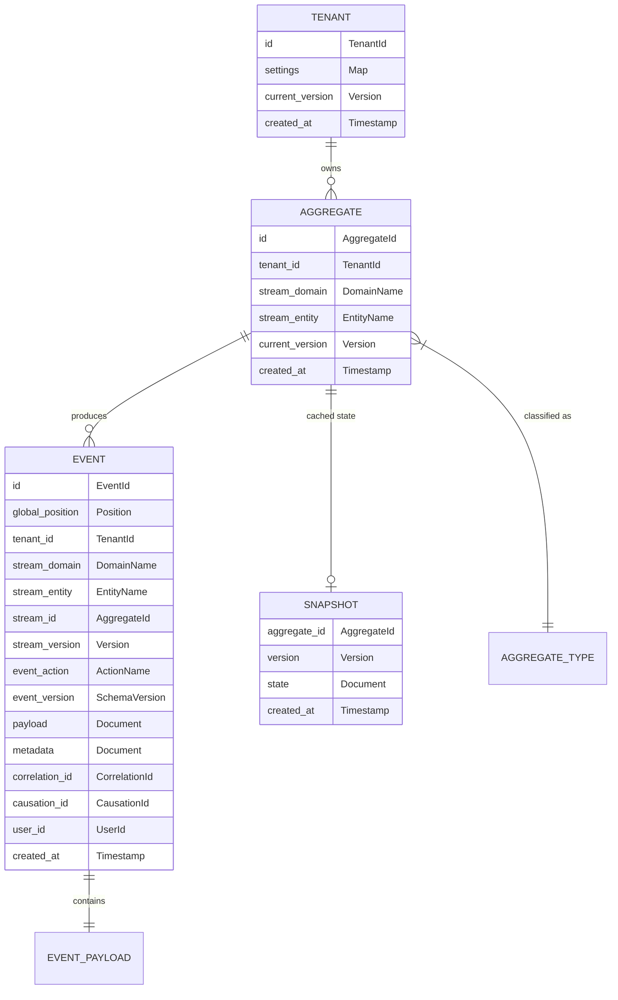

# Domain Core

The domain core contains entities, value objects, and type definitions that have zero infrastructure dependencies. Everything here compiles without any I/O dependency.

---

## Core Entities



> No database-specific types appear here — these are abstract value types backed by ISO/RFC standards. The adapter layer maps them to storage-specific types.

---

## Value Objects (Domain Vocabulary)

Every value type references an ISO or RFC standard. No ad-hoc formats.

```
TenantId        — UUIDv7 (RFC 9562) — time-ordered for index locality
AggregateId     — UUIDv7 (RFC 9562) — time-ordered for index locality
EventId         — UUIDv7 (RFC 9562) — time-ordered, globally unique, 48-bit ms timestamp + 62-bit random
Position        — monotonic, gapless, totally ordered 64-bit integer
Version         — non-negative 32-bit integer, starts at 0
SchemaVersion   — positive 16-bit integer, starts at 1
DomainName      — lowercase ASCII string, single segment ("commerce", "billing", "iam")
EntityName      — lowercase ASCII string, single segment ("product", "order", "invoice")
ActionName      — lowercase ASCII string, single segment ("created", "updated", "paid")
AggregateType   — composite: "<domain>.<entity>" — reconstructed at app layer, never stored as one column
EventType       — composite: "<domain>.<entity>.<action>" — reconstructed at app layer, never stored as one column
Document        — schema-free key-value structure (maps to JSONB, DynamoDB Map, etc.)
Timestamp       — RFC 3339 (profile of ISO 8601) — always UTC, millisecond precision
                  Format: "2026-03-12T14:30:45.123Z" — the trailing "Z" is mandatory (no local offsets)
CorrelationId   — optional UUIDv7 (RFC 9562), traces request/saga across boundaries
CausationId     — optional UUIDv7 (RFC 9562), traces parent event in causal chain
Money           — amount (integer cents, never floating point) + ISO 4217 currency code (e.g. "USD", "EUR")
CountryCode     — ISO 3166-1 alpha-2 (e.g. "US", "GB", "DE") — when needed in domain payloads
LanguageCode    — ISO 639-1 (e.g. "en", "fr", "de") — when needed for i18n
```

---

## ISO/RFC Compliance Matrix

| Value Type      | Standard        | Format Example                | Why This Standard                                                        |
| --------------- | --------------- | ----------------------------- | ------------------------------------------------------------------------ |
| **Identifiers** | RFC 9562 UUIDv7 | `019532a0-b73c-7def-8c1a-...` | Time-ordered — 2-5x faster DB inserts vs UUIDv4, no B-tree fragmentation |
| **Timestamps**  | RFC 3339 (UTC)  | `2026-03-12T14:30:45.123Z`    | Strict ISO 8601 profile, mandatory timezone, unambiguous parsing         |
| **Currency**    | ISO 4217        | `USD`, `EUR`, `GBP`           | 3-letter alpha, universally recognized by payment gateways               |
| **Country**     | ISO 3166-1 a-2  | `US`, `GB`, `DE`              | 2-letter code, used by shipping/tax/compliance systems                   |
| **Language**    | ISO 639-1       | `en`, `fr`, `de`              | 2-letter code, standard for i18n/l10n                                    |

**Critical rules**:

1. **All timestamps are UTC. No exceptions.** Local time conversion happens exclusively at the presentation layer.
2. **UUIDv7 over UUIDv4** for all entity identifiers. UUIDv7 embeds a millisecond Unix timestamp in the high bits, giving natural temporal ordering. Use UUIDv4 only for security tokens where predictability is a concern.
3. **Money is always integer cents** (or smallest currency unit). Never floating point. `$12.99` = `1299` + `"USD"`.
4. **RFC 3339 mandates the `Z` suffix** for UTC. Never store `+00:00`. This ensures byte-level consistency for indexing and equality checks.

---

## Namespaced Type System

```
Format:    <domain>.<entity>           — for aggregate types
           <domain>.<entity>.<action>  — for event types

Validation: lowercase, dot-separated, 2-3 segments max

Valid:     commerce.product
           commerce.product.created
           billing.invoice.paid

Invalid:   Product              (no domain prefix)
           Commerce.Product     (uppercase)
           a.b.c.d.e            (too deep)
```

**Why namespacing matters**:

| Benefit                | How                                                                         |
| ---------------------- | --------------------------------------------------------------------------- |
| **Service ownership**  | Each service owns a domain prefix                                           |
| **Projection routing** | Workers subscribe by domain prefix                                          |
| **Access control**     | Permissions map to domains: `can_read:commerce`                             |
| **Event filtering**    | Port exposes `poll_by_domain(domain, after_position)`                       |
| **Schema registry**    | Upcasters grouped by domain                                                 |
| **Cross-service flow** | `commerce.order.confirmed` -> billing reacts with `billing.invoice.created` |

---

## SOC Storage Column Design — Separation of Concerns

### The Problem with Composite Type Strings

Storing `event_type = "commerce.product.created"` as a single string conflates three independent concerns:

1. **Domain** — which bounded context owns this event
2. **Entity** — which aggregate type produced it
3. **Action** — what happened

If "commerce" is renamed to "shop", every row in the event store must be rewritten — or the code must maintain a growing list of aliases.

### Industry Approaches Compared

| System                    | Stream/Category Naming      | Type Columns                  | Rename Strategy                                           |
| ------------------------- | --------------------------- | ----------------------------- | --------------------------------------------------------- |
| **Marten**                | `stream_id` (string)        | `type` (alias) + CLR type     | Event type mapping — decouples stored name from code type |
| **Eventide / Message DB** | `{category}-{id}` stream    | Type embedded in message body | `category` parsed from stream_id                          |
| **EventStoreDB**          | `{type}-{id}` stream        | `eventType` on each event     | Event migration: emit to new streams. No in-place rename  |
| **Axon Framework**        | Aggregate type + identifier | `payloadType` on events       | Upcaster chain transforms types during deserialization    |

### Key Insight: Stream Type != Event Type

The **stream** (aggregate) has a type ("Order"), and each **event** in that stream has its own type ("OrderPlaced", "OrderShipped"). These are different concepts with different lifecycles:

- Stream type changes when you restructure aggregates (rare)
- Event type changes when you rename domain actions (never — events are immutable facts)
- Domain changes when you reorganize bounded contexts (very rare)

### SOC Column Design

Split the composite namespace into **independent, single-responsibility columns**:

```
EVENT TABLE (abstract schema)
─────────────────────────────────────────────────────
Column              Responsibility          Example Value
─────────────────────────────────────────────────────
id                  Identity                uuid
global_position     Ordering                8042
tenant_id           Isolation               uuid

stream_domain       Bounded context owner   "commerce"
stream_entity       Aggregate type          "product"
stream_id           Aggregate instance      uuid
stream_version      Optimistic concurrency  3

event_action        What happened           "created"
event_version       Payload schema version  2
payload             Business data           { ... }
metadata            Operational baggage     { ... }

correlation_id      Request tracing         uuid | null
causation_id        Causal chain            uuid | null
user_id             Actor                   uuid | null
created_at          Audit timestamp         utc datetime
─────────────────────────────────────────────────────
```

**Why this works**:

| SOC Benefit                  | How                                                                |
| ---------------------------- | ------------------------------------------------------------------ |
| **Rename domain**            | Update `stream_domain` column via type map — no payload changes    |
| **Rename entity**            | Update `stream_entity` via type map — events and actions unchanged |
| **Rename action**            | Never needed — events are immutable historical facts               |
| **Projection routing**       | `WHERE stream_domain = 'commerce'` — no prefix parsing             |
| **Cross-entity queries**     | `WHERE stream_entity = 'product'` — no string splitting            |
| **Index efficiency**         | Equality on short columns instead of `LIKE 'commerce.%'`           |
| **Composite reconstruction** | Concatenate `domain.entity.action` when needed at app layer        |

### StoredEvent (SOC Columns)

```
StoredEvent:
    id:               UUID          — UUIDv7 (RFC 9562), time-ordered
    global_position:  int64
    tenant_id:        UUID          — UUIDv7 (RFC 9562)
    stream_domain:    string        — "commerce" — bounded context (SOC)
    stream_entity:    string        — "product" — aggregate type (SOC)
    stream_id:        UUID          — UUIDv7 (RFC 9562) — aggregate instance
    stream_version:   int32
    event_action:     string        — "created" — what happened (SOC)
    event_version:    int16         — schema version for upcaster dispatch
    payload:          Document
    metadata:         Document
    correlation_id:   UUID?         — UUIDv7 (RFC 9562)
    causation_id:     UUID?         — UUIDv7 (RFC 9562)
    user_id:          UUID?         — UUIDv7 (RFC 9562)
    created_at:       Timestamp     — RFC 3339 UTC

    // Derived (reconstructed at app layer, never stored):
    qualified_event_type()     → "{domain}.{entity}.{action}"
    qualified_aggregate_type() → "{domain}.{entity}"
```

### EventEnvelope (SOC Columns)

```
EventEnvelope:
    event_action:     string        — "created" — just the action (domain/entity come from stream)
    schema_version:   int16         — payload schema version for upcaster dispatch
    payload:          Document      — business data only
    metadata:         Document      — extensible operational baggage
    correlation_id:   UUID?         — UUIDv7 (RFC 9562)
    causation_id:     UUID?         — UUIDv7 (RFC 9562)
    user_id:          UUID?         — UUIDv7 (RFC 9562)
```

### Type Alias Registry (Rename Safety)

Events are immutable facts — you never rewrite them. But code types evolve. A **type alias registry** provides indirection between stored identifiers and runtime types:

```
interface TypeRegistry:
    // Given a stored (domain, entity, action), resolve to current runtime type name.
    resolve_event_type(stored_domain, stored_entity, stored_action) → ResolvedType?
    resolve_aggregate_type(stored_domain, stored_entity) → ResolvedAggregate?

    // Register aliases for renames.
    register_event_alias(old_domain, old_entity, old_action, new_domain, new_entity, new_action)
    register_domain_alias(old_domain, new_domain)
    register_entity_alias(old_domain, old_entity, new_entity)
```

**Rename flow**:

```
1. Domain "commerce" renamed to "shop"
   Old events:  stream_domain="commerce", stream_entity="product", event_action="created"
   TypeRegistry: resolve("commerce", "product", "created") → ("shop", "listing", "created")

   New events:  stream_domain="shop", stream_entity="listing", event_action="created"
   TypeRegistry: resolve("shop", "listing", "created") → identity (no alias)

   Projection query: uses TypeRegistry to accept BOTH old and new names.
   No event rewriting. No migration. Zero downtime.

2. Projection workers use resolved types for routing:
   Worker subscribes to domain="shop"
   → TypeRegistry tells it to ALSO poll domain="commerce" (old alias)
   → Both old and new events are processed correctly
```

### Indexing Strategy (Adapter Concern)

SOC columns enable efficient indexes without text pattern matching hacks:

```
Adapter-level indexes (hidden behind EventStore interface):
─────────────────────────────────────────────────────
(tenant_id, stream_id, stream_version)  — unique, concurrency control
(tenant_id, stream_domain, global_position)  — domain subscription polling
(tenant_id, stream_domain, stream_entity, global_position)  — entity-level polling
(global_position)  — global catch-up subscription
```

Equality matches on short string columns (`stream_domain = 'commerce'`) outperform prefix matching (`aggregate_type LIKE 'commerce.%'`) on every storage engine.
