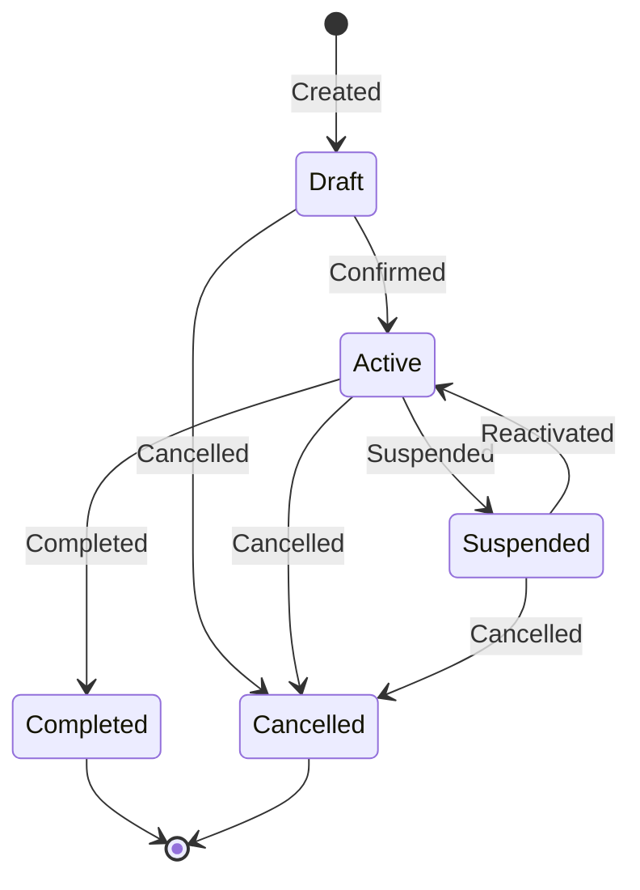
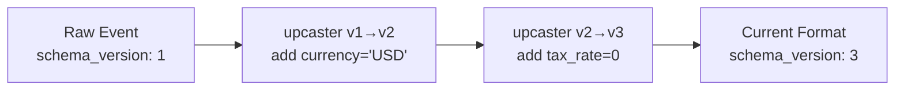
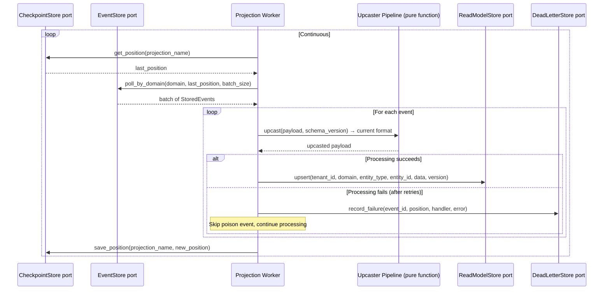
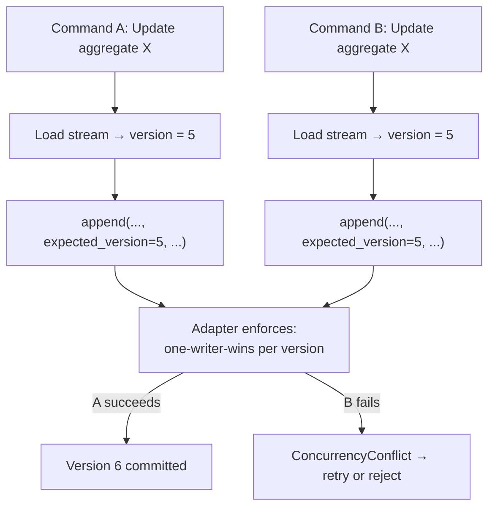

# Event Sourcing

Aggregates are pure state machines driven by the Decider pattern. Events are the source of truth, never mutated. Schema evolution is handled by upcaster pipelines that transform payloads lazily at read time.

---

## Aggregate Design (Pure Domain, Zero Dependencies)

### State Machine



Every aggregate follows this lifecycle pattern. Terminal states (`Completed`, `Cancelled`) are absorbing — no further transitions.

### Decider Pattern

The core aggregate logic is three pure functions — no async, no I/O, no framework:

```
Decider<Command, Event, State>:
    decide:        (command, state) → events[]    — business rule validation
    evolve:        (state, event)   → state       — pure state transition
    initial_state: ()               → state       — starting point
    is_terminal:   (state)          → boolean     — lifecycle completion
```

**Why the Decider outperforms traditional OOP aggregates**:

| Aspect                  | Traditional Aggregate                       | Decider                                                       |
| ----------------------- | ------------------------------------------- | ------------------------------------------------------------- |
| Side effects            | Methods mutate internal state + emit events | `decide` is pure: returns events, mutates nothing             |
| Testing                 | Requires framework, mocking, setup          | Call functions directly: `decide(cmd, state)` → assert events |
| Composition             | Aggregates don't compose                    | Deciders compose: two deciders merge into one                 |
| Infrastructure coupling | Often mixed with persistence                | Zero I/O — `decide` and `evolve` are pure functions           |
| Error handling          | Exceptions from deep inside methods         | Explicit: returns either events or a domain error             |

### State Machine Enforcement

Invalid state transitions should be caught as early as possible — ideally at compile time if the type system supports it, otherwise at runtime via explicit state validation in the `decide` function.

Approaches by type system power:

| Type System Feature           | Enforcement                                                      |
| ----------------------------- | ---------------------------------------------------------------- |
| **Sum types / tagged unions** | State is a variant; each variant has its own allowed transitions |
| **Typestate / phantom types** | Invalid transitions are compile errors — impossible to express   |
| **Class hierarchies**         | Each state is a subclass with only valid transition methods      |
| **Simple enums + switch**     | Runtime check in `decide`: reject commands invalid for state     |

The goal is the same regardless of mechanism: a cancelled order cannot be confirmed, a completed order cannot be cancelled.

### Aggregate Interface

```
interface Aggregate<Command, Event, Error, Services>:
    TYPE: string                          — aggregate type identifier

    handle(command, services, event_sink)  — async, may call ports via services
    apply(event)                           — synchronous, pure state transition

    Default constructor                    — aggregates have a natural initial state
    Serializable                           — snapshots are built-in at the type level
```

Key design decisions:

- `Services` = dependency injection of ports without coupling to concrete implementations
- `apply()` is synchronous and pure — no business logic here
- `handle()` is async — it may call external services via ports
- Default/initial state = aggregates have a natural starting point
- Serializable = snapshots are built-in at the type level

---

## Schema Evolution Strategy

### Payload Versioning

Every event carries `schema_version` as a first-class field (not embedded in payload). The payload contains only business data:

```json
// schema_version = 2 (stored alongside event, not inside payload)
{
  "name": "Widget Pro",
  "price": 2999,
  "currency": "USD"
}
```

### Upcaster Pipeline (Pure Functions)



**Rules**:

- Upcasters are **pure functions**: `(payload, from_version) → payload`
- They run lazily at read time (no rewriting stored events)
- Each upcaster handles exactly one version increment
- Upcasters compose: `v1 → v2 → v3 → ... → current`
- Old events are NEVER mutated in storage

### UpcasterRegistry (SOC-Keyed)

Upcasters are keyed by `(domain, entity, action, from_version)` — each segment independent, matching the SOC column design.

```
UpcasterRegistry:
    registry: Map<(domain, entity, action, from_version), UpcasterFunction>

    register(domain, entity, action, from_version, upcaster_fn) → void

    // Apply upcaster chain from stored version to current version.
    upcast(domain, entity, action, payload, from_version, to_version) → Document:
        current = payload
        for v in from_version..to_version:
            fn = registry.get((domain, entity, action, v))
            if fn is null: error "Missing upcaster"
            current = fn(current)
        return current
```

Example upcasters — pure functions:

```
product_created_v1_to_v2(payload) → payload:
    payload["currency"] = "USD"
    return payload

product_created_v2_to_v3(payload) → payload:
    payload["tax_rate"] = 0
    return payload
```

**Critical insight from Axon Framework**: Upcasters operate on raw serialized form (Document/JSON), not on deserialized domain objects. This avoids needing to maintain old event type definitions.

### Upcasting Strategies

| Strategy               | When Applied              | Storage Cost        | CPU Cost      | Data Safety        |
| ---------------------- | ------------------------- | ------------------- | ------------- | ------------------ |
| **Lazy (on-read)**     | Every stream load         | None                | Per-read      | Original preserved |
| **Lazy-with-cache**    | First read, then snapshot | Snapshot storage    | One-time      | Original preserved |
| **Eager (batch)**      | Background migration job  | Rewritten events    | One-time bulk | Risk if in-place   |
| **Copy-and-transform** | New stream created        | 2x during migration | One-time bulk | Original preserved |

**Default choice: Lazy** — combined with snapshots, the upcaster chain only processes events since last snapshot.

### Projection Pipeline Integration



---

## EventStore Interface (SOC-Aware)

The EventStore is the single source of truth. SOC columns enable fine-grained subscription polling without string parsing. Full interface defined in **02-ports.md** (Port 1).

**Invariants**:

- Events are immutable once appended
- Global position is monotonic and gapless
- Optimistic concurrency via expected_version check
- One writer wins per (aggregate_id, version) pair

---

## Storage Abstraction

The domain layer never sees database-specific operations. Every storage-specific feature hides behind the EventStore interface.

| Storage-Specific Feature                  | Abstract Port Capability                          | What the Adapter Hides                      |
| ----------------------------------------- | ------------------------------------------------- | ------------------------------------------- |
| Stored procedure for atomic append        | `EventStore.append()`                             | Atomic append with gapless position counter |
| Unique constraint on (aggregate, version) | `EventStore.append()` returns ConcurrencyConflict | How concurrency is enforced                 |
| Document column + inverted index          | `ReadModelStore.query(filters)`                   | How document queries are indexed            |
| Row-level security policies               | `TenantIsolation.set_tenant_context()`            | How tenant data is isolated                 |
| Notification trigger                      | `EventNotifier.notify()` / `.subscribe()`         | How event availability is signaled          |
| Monotonic position counter                | `EventStore.append()` returns position            | How monotonic ordering is achieved          |

### Concurrency Model



How the adapter enforces optimistic concurrency varies by storage technology:

- **Postgres**: `UNIQUE(aggregate_id, aggregate_version)` constraint
- **DynamoDB**: Conditional write `attribute_not_exists(version)`
- **In-memory**: Version comparison under mutex

The domain and application layers are identical regardless of adapter. The concurrency guarantee is a port contract, not an implementation detail.

---

## Production Lessons (Event Sourcing Specific)

Compiled from production post-mortems across Marten, EventStoreDB, Eventide, and practitioner blogs.

1. **Keep streams short**. Design aggregates with natural lifecycle boundaries (Draft → Active → Completed). Use "close the books" pattern: periodic lifecycle completion events that cap stream length. Add snapshots only when measured replay time > 100ms.

2. **Don't expose internal events as integration events**. Raw event subscriptions between services create coupling worse than shared databases. Use `OutboxPublisher` + Anti-Corruption Layer. Domain events stay internal; integration events are separate lean contracts.

3. **Handle materialization lag**. After writes, clients query the read model and get stale data. Return `{aggregate_id, version}` from writes. Client polls read model until `version >= expected_version`.

4. **Build a replay debugging tool on day one**. Replay an aggregate's event stream up to a specific point to inspect intermediate state. The Decider pattern makes this trivial: `events.fold(initial_state, evolve)`.

5. **Don't snapshot prematurely**. Snapshots add write amplification and versioning complexity. Most streams have < 100 events. Measure first.
