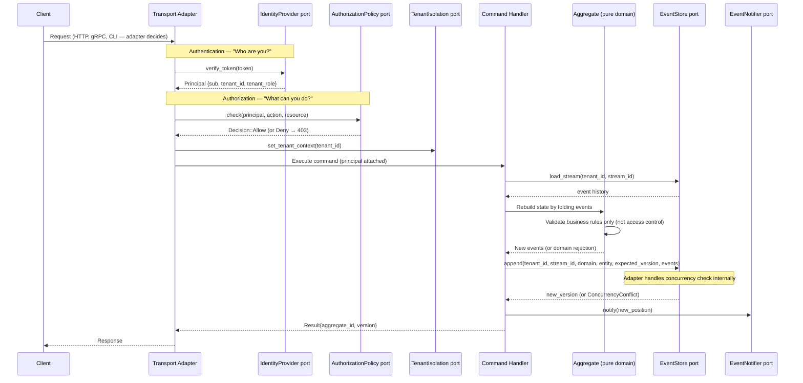
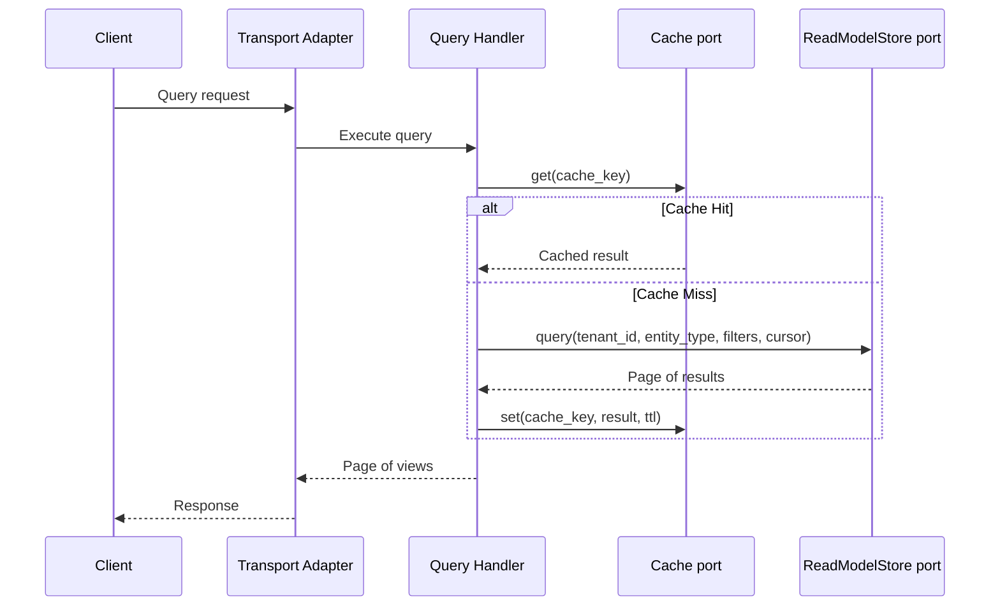
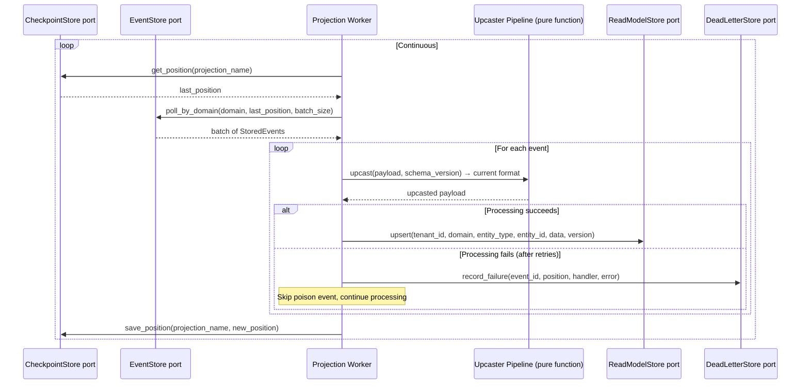

# CQRS Flows

This section defines the system's runtime behavior as technology-free flows. All interactions are described in terms of port interfaces, not specific databases or protocols. The transport layer (HTTP, gRPC, CLI) is an adapter concern and is not specified here.

---

## Write Path (Command Side)

Every state change flows through the command side. The sequence enforces a strict ordering: authenticate, authorize, load, decide, persist, notify.

### Write Path Step-by-Step

1. **Authentication** (transport layer): The transport adapter extracts the bearer token and calls `IdentityProvider.verify_token()`. On failure: 401 Unauthorized. On success: a `Principal` with `sub`, `tenant_id`, and `tenant_role`.

2. **Authorization** (application layer): The command handler calls `AuthorizationPolicy.check(principal, action, resource)`. On `Decision.Deny`: 403 Forbidden. Aggregates never perform authorization checks — they enforce business invariants only.

3. **Tenant context** (infrastructure): `TenantIsolation.set_tenant_context(tenant_id)` activates the tenant boundary (e.g., Postgres RLS). All subsequent queries are scoped.

4. **Load aggregate**: `EventStore.load_stream(tenant_id, stream_id)` retrieves the full event history. The command handler folds events through `aggregate.apply(event)` to rebuild current state.

5. **Execute domain logic**: The aggregate's `decide(command)` method validates business rules and returns new events (or a domain error). This is a pure function — no I/O, no authorization, no infrastructure.

6. **Persist**: `EventStore.append(tenant_id, stream_id, domain, entity, expected_version, events)` atomically writes events. If another writer committed since load, `ConcurrencyConflict` is returned.

7. **Notify**: `EventNotifier.notify(new_position)` sends a best-effort hint to wake projection workers. This is optional — workers also poll.

8. **Response**: The caller receives `{aggregate_id, version}`. Clients can use the version to poll the read model for consistency: wait until `read_model.version >= expected_version`.

---

## Read Path (Query Side)

Queries never touch the event store. They read from pre-built read models, optionally through a cache layer.

### Read Path Step-by-Step

1. **Authentication and authorization** happen at the transport layer, identical to the write path. The query handler receives a trusted `Principal`.

2. **Cache check**: The query handler constructs a cache key from `(tenant_id, domain, entity, filters, cursor)` and calls `Cache.get()`. Cache TTL is an adapter configuration concern.

3. **Read model query**: On cache miss, `ReadModelStore.query()` returns a `Page<Document>` with cursor-based pagination. The read model store knows nothing about events — it serves pre-built documents.

4. **Cache population**: Results are written back to cache with a TTL. Cache invalidation happens via projection workers or event-driven invalidation, not on the read path.

5. **Response**: The `Page` structure includes `items`, `next_cursor`, and `has_more` for client-driven pagination.

---

## Projection Pipeline

Projections transform events into read models. They run as background workers, continuously polling the event store for new events.

### Projection Pipeline Details

1. **Checkpoint recovery**: On startup (or each poll cycle), the worker reads its last-processed position from `CheckpointStore.get_position()`. This enables crash recovery — the worker resumes from where it left off.

2. **Scoped polling**: Workers use `EventStore.poll_by_domain()` to receive only events from their bounded context. This is the SOC columns in action — `stream_domain` enables domain-scoped subscriptions without cross-domain noise.

3. **Upcasting**: Before processing, each event's payload passes through the upcaster pipeline. Upcasters are pure functions: `(payload, from_version) → payload`. They run lazily at read time, transforming old schema versions to the current format without rewriting stored events.

4. **Projection logic**: The worker applies domain-specific projection logic to transform the upcasted event into a read model update. This is where `ReadModelStore.upsert()` writes the denormalized view.

5. **Error handling**: Failed events are recorded in `DeadLetterStore.record_failure()` with the event ID, position, handler name, and error details. The worker skips the poison event and continues processing. Dead letters can be inspected, retried, or resolved.

6. **Checkpoint advance**: After processing a batch, the worker saves its new position. For exactly-once semantics, the checkpoint save and read model upsert should happen in the same database transaction (an adapter concern).

### Projection Types

| Type             | When Applied                     | Consistency | Example                       |
| ---------------- | -------------------------------- | ----------- | ----------------------------- |
| **Inline**       | Same transaction as event append | Strong      | Uniqueness checks, counters   |
| **Async**        | Background daemon                | Eventual    | Most read models, dashboards  |
| **Live**         | On-demand replay                 | Strong      | Short streams, debugging      |
| **Aggregate**    | Single-stream fold               | Both        | Order total, entity state     |
| **Multi-stream** | Cross-stream grouping            | Eventual    | User activity across entities |
| **Flat table**   | Denormalized rows                | Eventual    | Reporting, analytics          |

### Rebuild Capability

Any projection can be fully rebuilt by resetting its checkpoint to position 0 and replaying all events. The read model store's `upsert` is idempotent by design — replaying events produces identical read models.

---

## Concurrency Model

The system uses **optimistic concurrency control**. No locks are held during command processing. Conflicts are detected at write time.

### How It Works

1. The command handler loads the aggregate stream and notes the current version (e.g., `version = 5`).
2. After domain logic produces new events, the handler calls `EventStore.append()` with `expected_version = 5`.
3. The adapter enforces the constraint: if the current stored version is no longer 5 (another writer committed), the append fails with `ConcurrencyConflict`.
4. The caller decides: retry the entire command (reload, re-decide, re-append) or reject with an error to the client.

### Adapter Implementations

How the adapter enforces one-writer-wins varies by storage technology:

- **Postgres**: `UNIQUE(aggregate_id, aggregate_version)` constraint. The first INSERT wins; the second gets a constraint violation.
- **DynamoDB**: Conditional write `attribute_not_exists(version)`. The first PutItem wins.
- **In-memory**: Version comparison under mutex. The first writer increments; the second sees a mismatch.

The domain and application layers are identical regardless of adapter. The concurrency guarantee is a port contract, not an implementation detail.

---

## Domain vs Integration Events

Events in this architecture have two distinct scopes with different contracts, storage, and lifecycles.

| Aspect           | Domain Event                    | Integration Event                    |
| ---------------- | ------------------------------- | ------------------------------------ |
| Scope            | Within bounded context          | Crosses boundaries                   |
| Storage          | EventStore (immutable, forever) | OutboxPublisher (ephemeral, relayed) |
| Schema ownership | Internal, can change freely     | Public contract, must be versioned   |
| Payload          | Rich, includes internal IDs     | Lean, public-facing identifiers only |

**Domain events** are the system's source of truth. They are stored forever in the event store, carry rich internal data, and can evolve freely via the upcaster pipeline. They never leave the bounded context directly.

**Integration events** are public contracts written to the outbox in the same transaction as domain event append. The `OutboxPublisher` port stages them; the `EventRelay` port delivers them to an external broker (Kafka, NATS, Redis Streams). Integration events use CloudEvents envelope format and carry only public-facing data.

The `OutboxPublisher` + Anti-Corruption Layer pattern enforces this boundary. Internal domain model changes never break downstream consumers because integration events are a separate, versioned contract.
