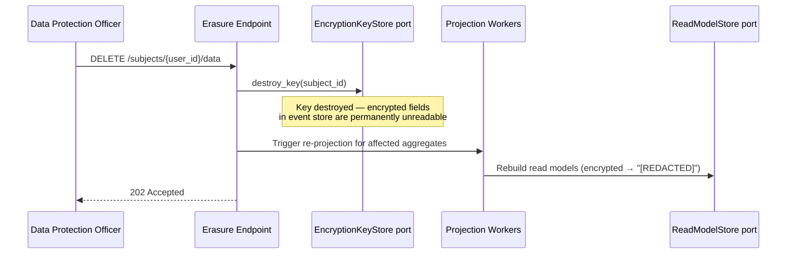
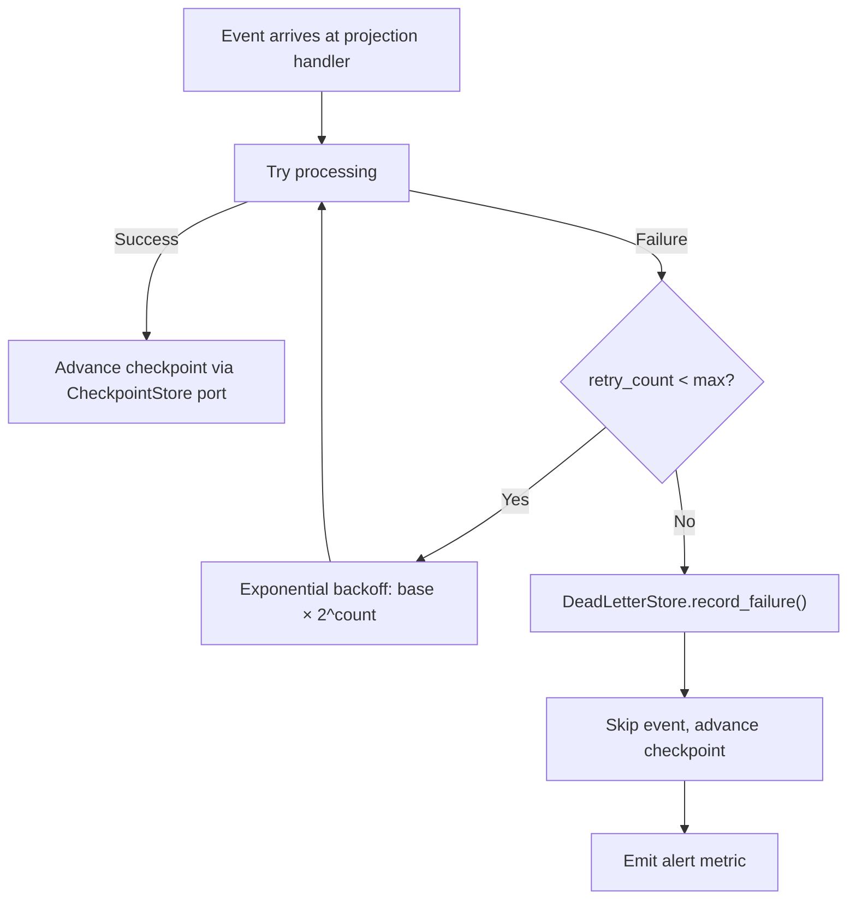
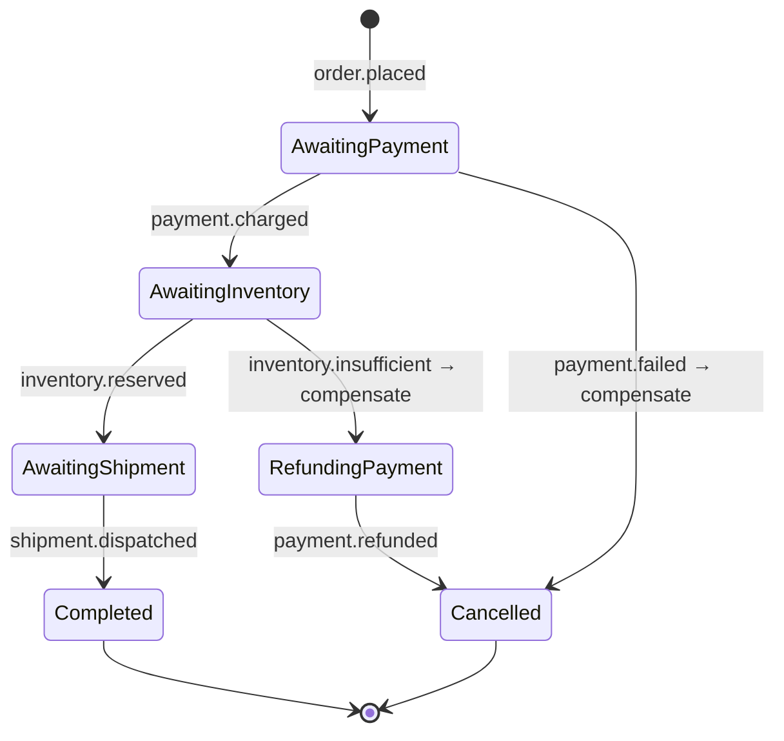
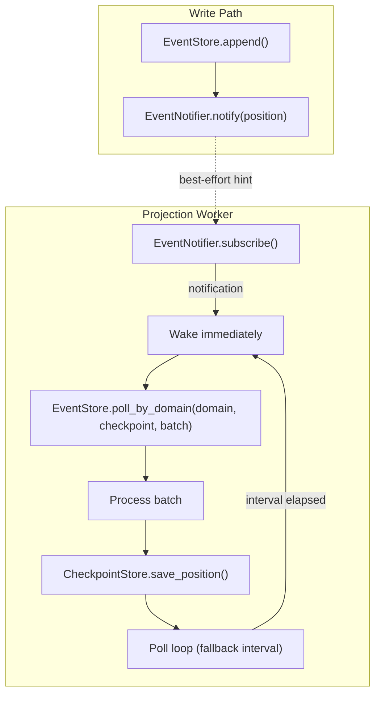
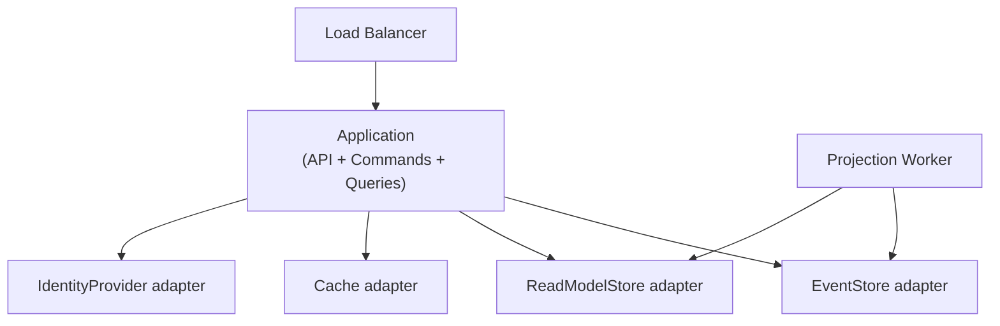
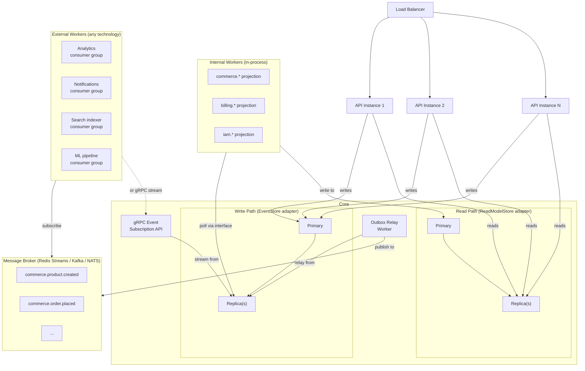

# Production Readiness

## GDPR Compliance: Crypto-Shredding



The `EncryptionKeyStore` interface abstracts over where keys are stored (Postgres, Vault, HSM, KMS). The domain only knows: create keys, get keys, destroy keys.

---

## Dead Letter Queue (Abstract Flow)



Each consumer owns its own DLQ. One worker's poison event is its problem — other consumers are unaffected.

**Replay mechanism**: Admin tool moves messages from DLQ back to main topic after the bug is fixed.

---

## Process Manager / Saga



Coordination uses `ProcessManagerStore` interface. The interface abstracts whether process state lives in Postgres, DynamoDB, or Redis.

---

## Event Notification



**Critical**: `EventNotifier` is a **hint-only optimization**. The projection worker MUST poll regardless. A NoOp implementation that does nothing is a valid adapter — the system degrades to polling-only with slightly higher latency.

---

## Deployment Architecture

### Small Scale



### Production Scale (Polyglot)



**Day 1 simplification**: Replace the "Message Broker" box with Redis Streams (already deployed for Cache port). Polyglot workers consume JSON + CloudEvents envelope — no Protobuf required initially.

---

## Failure Model

```mermaid
flowchart TD
    subgraph Failures["Failure Scenarios"]
        F1["ReadModelStore adapter crashes"]
        F2["Cache adapter crashes"]
        F3["Projection worker crashes"]
        F4["EventStore adapter crashes"]
        F5["Poison event in stream"]
        F6["OutboxPublisher relay crashes"]
        F7["Process manager stuck"]
        F8["Encryption key lost"]
        F9["External worker crashes"]
        F10["Message broker down"]
        F11["gRPC subscription disconnects"]
    end

    F1 -->|"Recovery"| R1["Rebuild projections\nfrom EventStore"]
    F2 -->|"Recovery"| R2["Warm cache from\nReadModelStore"]
    F3 -->|"Recovery"| R3["Restart from last\nCheckpointStore position"]
    F4 -->|"CRITICAL"| R4["System unavailable\nonly irrecoverable dependency"]
    F5 -->|"Recovery"| R5["DeadLetterStore:\nskip + alert + retry after fix"]
    F6 -->|"Recovery"| R6["Restart relay:\nresumes from last published marker"]
    F7 -->|"Recovery"| R7["ProcessManagerStore timeout scan:\nalert + manual compensation"]
    F8 -->|"CRITICAL"| R8["Affected subject's PII\npermanently unreadable"]
    F9 -->|"Recovery"| R9["Restart: resumes from\nbroker consumer group offset\nor gRPC checkpoint"]
    F10 -->|"Recovery"| R10["Outbox relay pauses.\nEvents buffer in outbox table.\nRelay resumes when broker recovers."]
    F11 -->|"Recovery"| R11["gRPC client reconnects\nwith last checkpoint.\nMissed events replayed\nfrom stored position."]
```



**Two irrecoverable failures**: EventStore adapter crash (system unavailable — this is the single source of truth) and encryption key loss (affected subject's PII permanently unreadable). Everything else is recoverable from the event store.

---

## Complexity Analysis

| Operation                      | Data Structure (Abstract)                | Time Complexity | Notes                       |
| ------------------------------ | ---------------------------------------- | --------------- | --------------------------- |
| Append event                   | Ordered index on (aggregate_id, version) | O(log n)        | n = events in stream        |
| Load aggregate stream          | Ordered index scan                       | O(log n + k)    | k = events to read          |
| Load from snapshot             | Point lookup + stream scan               | O(1) + O(k')    | k' = events since snapshot  |
| Rebuild projection             | Full sequential scan + upsert            | O(N)            | N = total events            |
| Query read model               | Document index                           | O(log n + k)    | k = result set              |
| Document field lookup          | Inverted index                           | O(log n)        | adapter-specific index type |
| Optimistic concurrency check   | Uniqueness constraint check              | O(log n)        | n = events per aggregate    |
| Relation forward/reverse query | Ordered index scan                       | O(log n + k)    | k = result set              |

---

## Testing Strategy

### Given/When/Then with In-Memory Adapters

```
// Test: create order
test_create_order():
    // GIVEN: empty event store (in-memory, same interface as production)
    es = InMemoryEventStore()

    // WHEN: create order command
    handler = CreateOrderHandler(es)
    result = handler.execute(CreateOrder {
        tenant_id: TENANT, customer_ref: "cust-1", items: [...]
    })

    // THEN: order.created event was appended
    events = es.load_stream(TENANT, result.aggregate_id)
    assert events.length == 1
    assert events[0].stream_domain == "commerce"
    assert events[0].stream_entity == "order"
    assert events[0].event_action == "created"

// Test: cannot confirm cancelled order
test_cannot_confirm_cancelled_order():
    // GIVEN: order was created then cancelled
    es = InMemoryEventStore()
    // ... setup events ...

    // WHEN: try to confirm → THEN: rejected
    handler = ConfirmOrderHandler(es)
    error = handler.execute(ConfirmOrder { ... })
    assert error is InvalidStateTransition
```

### Test Pyramid

| Layer           | What                                      | Adapter Used                | Speed        | Count              |
| --------------- | ----------------------------------------- | --------------------------- | ------------ | ------------------ |
| **Unit**        | Aggregate decide/evolve, upcasters        | None (pure functions)       | Milliseconds | Many               |
| **Integration** | Command/query handlers                    | In-memory adapters          | Milliseconds | Moderate           |
| **Contract**    | Port compliance, event schema validation  | Both in-memory and Postgres | Seconds      | Per port           |
| **E2E**         | Full command → event → projection → query | Production adapters         | Seconds      | Few critical paths |

### Port Compliance Tests

Run the same tests against EVERY port implementation. Guarantees adapter correctness regardless of technology.

```
// Tests run against both InMemoryEventStore and PgEventStore:

test_append_and_load_roundtrip(store: EventStore):
    // Events appended must be loadable in order
    version = store.append(TENANT, AGG_ID, "commerce", "order", 0, events)
    loaded = store.load_stream(TENANT, AGG_ID)
    assert loaded.length == events.length
    assert version == events.length

test_optimistic_concurrency_conflict(store: EventStore):
    // Second append with same expected_version must fail
    store.append(TENANT, AGG_ID, "commerce", "order", 0, events)
    error = store.append(TENANT, AGG_ID, "commerce", "order", 0, events)
    assert error is ConcurrencyConflict

test_global_position_is_monotonic(store: EventStore):
    // Positions must be gapless and strictly increasing
    ...
```
